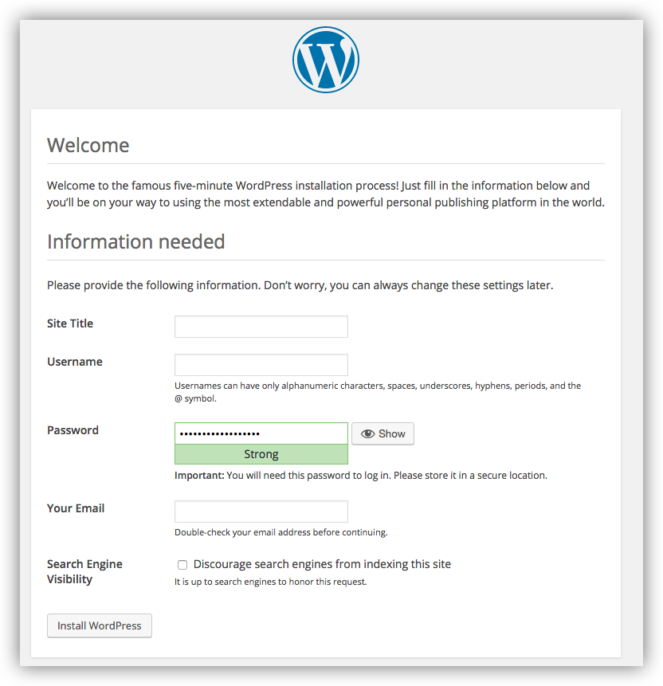

# Quickstart: Docker Compose and WordPress

You can use Docker Compose to easily run WordPress in an isolated environment built
with Docker containers. This quick-start guide demonstrates how to use Compose to set up and run WordPress. Before starting, you'll need to have
[Compose installed](install.md).

### Define the project

1. Create an empty project directory.

    You can name the directory something easy for you to remember. This directory is the context for your application image. The directory should only contain resources to build that image.

    This project directory will contain a `docker-compose.yaml` file which will be complete in itself for a good starter wordpress project.

2. Change directories into your project directory.

    For example, if you named your directory `my_wordpress`:

        $ cd my_wordpress/

3.  Create a `docker-compose.yml` file that will start your
    `Wordpress` blog and a separate `MySQL` instance with a volume
    mount for data persistence:

    ```none
    version: '2'

    services:
       db:
         image: mysql:5.7
         volumes:
           - "./.data/db:/var/lib/mysql"
         restart: always
         environment:
           MYSQL_ROOT_PASSWORD: wordpress
           MYSQL_DATABASE: wordpress
           MYSQL_USER: wordpress
           MYSQL_PASSWORD: wordpress

       wordpress:
         depends_on:
           - db
         image: wordpress:latest
         links:
           - db
         ports:
           - "8000:80"
         restart: always
         environment:
           WORDPRESS_DB_HOST: db:3306
           WORDPRESS_DB_PASSWORD: wordpress
    ```

    **NOTE**: The folder `./.data/db` will be automatically created in the project directory
    alongside the `docker-compose.yml` which will persist any updates made by wordpress to the
    database.

### Build the project

Now, run `docker-compose up -d` from your project directory.

This pulls the needed images, and starts the wordpress and database containers, as shown in the example below.

    $ docker-compose up -d
    Creating network "my_wordpress_default" with the default driver
    Pulling db (mysql:5.7)...
    5.7: Pulling from library/mysql
    efd26ecc9548: Pull complete
    a3ed95caeb02: Pull complete
    ...
    Digest: sha256:34a0aca88e85f2efa5edff1cea77cf5d3147ad93545dbec99cfe705b03c520de
    Status: Downloaded newer image for mysql:5.7
    Pulling wordpress (wordpress:latest)...
    latest: Pulling from library/wordpress
    efd26ecc9548: Already exists
    a3ed95caeb02: Pull complete
    589a9d9a7c64: Pull complete
    ...
    Digest: sha256:ed28506ae44d5def89075fd5c01456610cd6c64006addfe5210b8c675881aff6
    Status: Downloaded newer image for wordpress:latest
    Creating my_wordpress_db_1
    Creating my_wordpress_wordpress_1

### Bring up WordPress in a web browser

If you're using [Docker Machine](/machine/), then `docker-machine ip MACHINE_VM` gives you the machine address and you can open `http://MACHINE_VM_IP:8000` in a browser.

At this point, WordPress should be running on port `8000` of your Docker Host, and you can complete the "famous five-minute installation" as a WordPress administrator.

**NOTE**: The Wordpress site will not be immediately available on port `8000` because the containers are still being initialized and may take a couple of minutes before the first load.





## More Compose documentation

- [User guide](index.md)
- [Installing Compose](install.md)
- [Getting Started](gettingstarted.md)
- [Get started with Django](django.md)
- [Get started with Rails](rails.md)
- [Command line reference](./reference/index.md)
- [Compose file reference](compose-file.md)