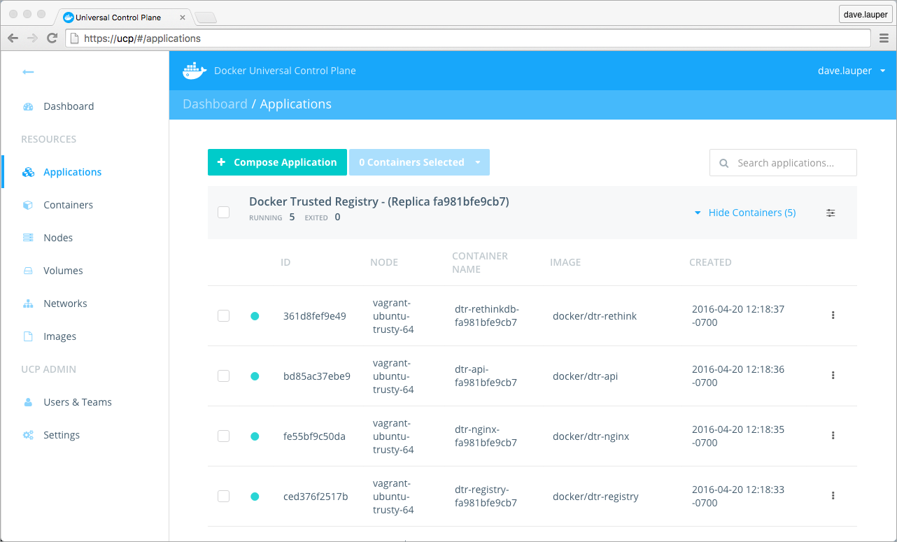
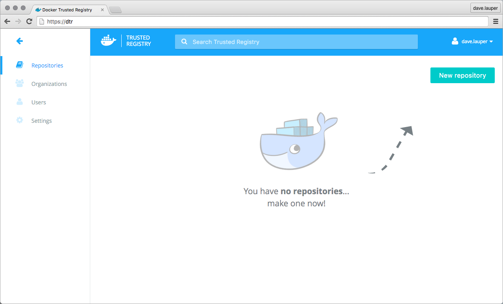

Docker Trusted Registry (DTR) is a containerized application that runs on a
swarm managed by Docker Universal Control Plane (UCP). It can be installed
on-premises or on a cloud infrastructure.

Use these instructions to install DTR.

## Step 1. Validate the system requirements

The first step in installing DTR, is ensuring your
infrastructure has all the [requirements DTR needs to run](system-requirements.md).

## Step 2. Install UCP

Since DTR requires Docker Universal Control Plane (UCP)
to run, you need to install UCP on all the nodes where you plan to install DTR.
[Learn how to install UCP](/datacenter/ucp/2.0/installation/install.md).

Make sure all the nodes you plan on installing DTR are being managed by UCP.

## Step 3. Install DTR

To install DTR you use the `docker/dtr` image. This image has commands to
install, configure, and backup DTR.

Run the following command to install DTR:

```bash
# Pull the latest version of DTR
$ docker pull docker/dtr

# Install DTR
$ docker run -it --rm \
  docker/dtr install \
  --ucp-node <ucp-node-name> \
  --ucp-insecure-tls
```

Where the `--ucp-node` is the hostname of the UCP node where you want to deploy
DTR. `--ucp-insecure-tls` tells the installer to trust the certificates used
by UCP.

The install command has other flags for customizing DTR at install time.
Check the [reference documentation to learn more](../reference/install.md).


## Step 4. Check that DTR is running

In your browser, navigate to the the Docker **Universal Control Plane**
web UI, and navigate to the **Applications** screen. DTR should be listed
as an application.



You can also access the **DTR web UI**, to make sure it is working. In your
browser, navigate to the address were you installed DTR.




## Step 5. Configure DTR

After installing DTR, you should configure:

  * The Domain Name used to access DTR,
  * The certificates used for TLS communication,
  * The storage backend to store the Docker images.

  To perform these configurations, navigate to the **Settings** page of DTR.

  

## Step 6. Test pushing and pulling

Now that you have a working installation of DTR, you should test that you can
push and pull images to it.
[Learn how to push and pull images](../repos-and-images/index.md).

## Step 7. Join replicas to the cluster

This step is optional.

To set up DTR for [high availability](../high-availability/index.md),
you can add more replicas to your DTR cluster. Adding more replicas allows you
to load-balance requests across all replicas, and keep DTR working if a
replica fails.

For high-availability you should set 3, 5, or 7 DTR replicas. The nodes where
you're going to install these replicas also need to be managed by UCP.

To add replicas to a DTR cluster, use the `docker/dtr join` command. To add
replicas:

1. Make sure the DTR images are loaded into the node.

2. Load you UCP user bundle.

3.  Run the join command.

    When you join a replica to a DTR cluster, you need to specify the
    ID of a replica that is already part of the cluster. You can find an
    existing replica ID by going to the **Applications** page on UCP.

    Then run:

    ```bash
    $ docker run -it --rm \
      docker/dtr:2.1.0-beta3 join \
      --ucp-node <ucp-node-name> \
      --ucp-insecure-tls
    ```

4. Check that all replicas are running.

    In your browser, navigate to the the Docker **Universal Control Plane**
    web UI, and navigate to the **Applications** screen. All replicas should
    be displayed.

    

## See also

* [Install DTR offline](install-dtr-offline.md)
* [Upgrade DTR](upgrade/upgrade-major.md)
