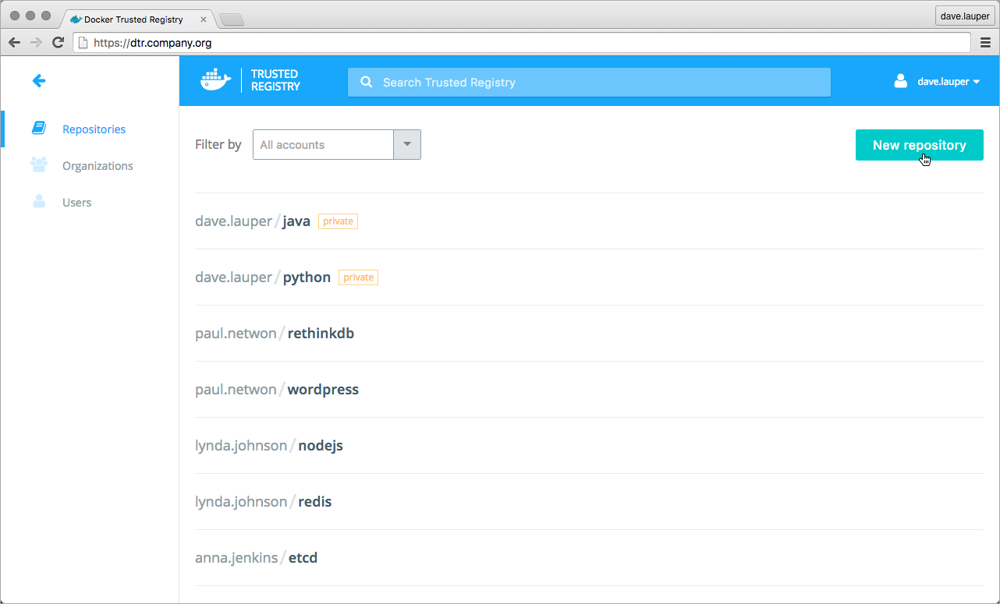
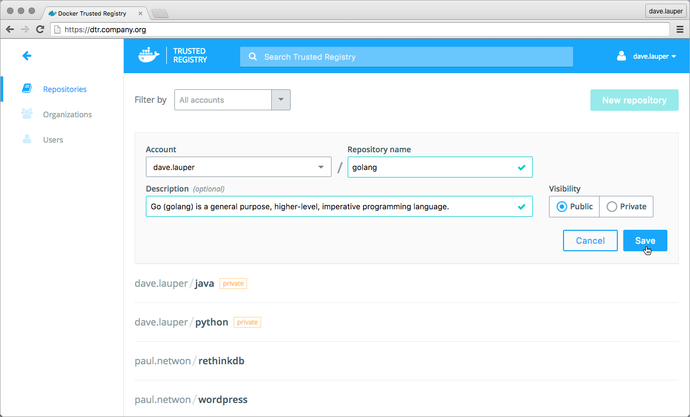
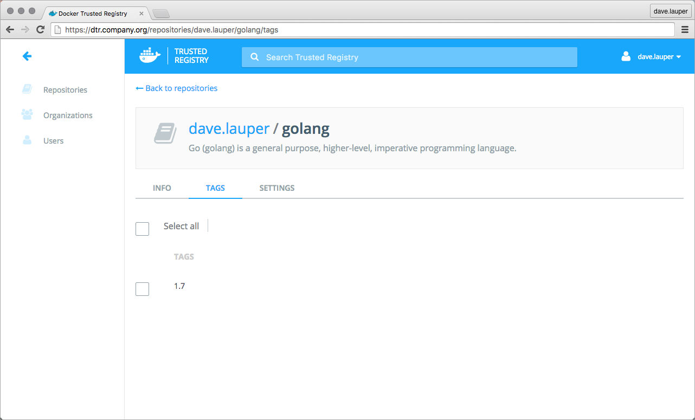

<!-- TODO: review page for v2.2 -->

Pushing an image to Docker Trusted Registry is the same as pushing an image
to Docker Hub.
Since DTR is secure by default, you need to create the image repository before
being able to push the image to DTR.

In this example, we'll create the 'golang' repository in DTR, and push the
Golang 1.7 image to it.

## Create a repository

To create a new repository, navigate to the **DTR web application**, and click
the **New repository** button.



Add a **name and description** for the repository, and choose whether your
repository is public or private:

  * Public repositories are visible to all users, but can only be changed by
  users granted with permission to write them.
  * Private repositories can only be seen by users that have been granted
  permissions to that repository.



Click **Save** to create the repository.

When creating a repository in DTR, the full name of the repository becomes
`<dtr-domain-name>/<user-or-org>/<repository-name>`. In this example, the full
name of our repository will be `dtr.company.org/dave.lauper/golang`.

## Tag the image

Before you can push an image to DTR, you need to tag it with the full
repository name. A tag defines where the image was pulled from, and where
it will be pushed to.

```bash
# Pull from Docker Hub the 1.7 tag of the golang image
$ docker pull golang:1.7

# Tag the golang:1.7 image with the full repository name we've created in DTR
$ docker tag golang:1.7 dtr.company.org/dave.lauper/golang:1.7
```

## Push the image

Now that you have tagged the image, you only need to authenticate and push the
image to DTR.

```bash
$ docker login dtr.company.org
$ docker push dtr.company.org/dave.lauper/golang:1.7
```

Go back to the **DTR web UI** to validate that the tag was successfully pushed.



## Where to go next

* [Pull an image from DTR](pull-an-image.md)
