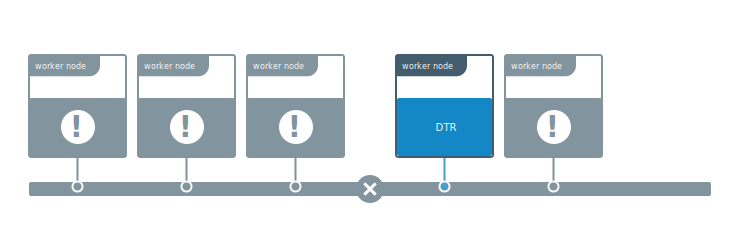
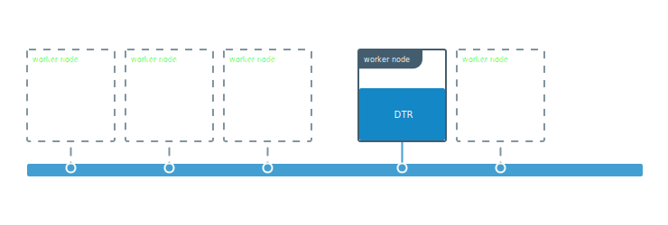

For a DTR cluster to be healthy, a majority of its replicas (n/2 + 1) need to
be healthy and be able to communicate with the other replicas. This is known
as maintaining quorum.

In a scenario where quorum is lost, but at least one replica is still
accessible, you can use that replica to repair the cluster. That replica doesn't
need to be completely healthy. The cluster can still be repaired as the DTR
data volumes are persisted and accessible.



Repairing the cluster from an existing replica minimizes the amount of data lost.
If this procedure doesn't work, you'll have to
[restore from an existing backup](restore-from-backup.md).

## Diagnose an unhealthy cluster

When a majority of replicas are unhealthy, causing the overall DTR cluster to
become unhealthy, operations like `docker login`, `docker pull`, and `docker push`
present `internal server error`.

Accessing the `/_ping` endpoint of any replica also returns the same error.
It's also possible that the DTR web UI is partially or fully unresponsive.

## Perform an emergency repair

Use the `docker/dtr emergency-repair` command to try to repair an unhealthy
DTR cluster, from an existing replica.

This command checks the data volumes for the DTR

This command checks the data volumes for the DTR replica are uncorrupted,
redeploys all internal DTR components and reconfigured them to use the existing
volumes.

It also reconfigures DTR removing all other nodes from the cluster, leaving DTR
as a single-replica cluster with the replica you chose.

Start by finding the ID of the DTR replica that you want to repair from.
You can find the list of replicas by navigating to the UCP web UI, or by using
a UCP client bundle to run:

```

docker ps --format "{{.Names}}" | grep dtr

# The list of DTR containers with <node>/<component>-<replicaID>, e.g.
# node-1/dtr-api-a1640e1c15b6

```

Then, use your UCP client bundle to run the emergency repair command:

```

docker run -it --rm {{ page.dtr_org }}/{{ page.dtr_repo }}:{{ page.dtr_version }} emergency-repair \
  --ucp-insecure-tls \
  --existing-replica-id <replica-id>

```

If the emergency repair procedure is successful, your DTR cluster now has a
single replica. You should now
[join more replicas for high availability](../configure/set-up-high-availability.md).



If the emergency repair command fails, try running it again using a different
replica ID. As a last resort, you can restore your cluster from an existing
backup.

## Where to go next

* [Create a backup](create-a-backup.md)
* [Restore from an existing backup](restore-from-backup.md)
