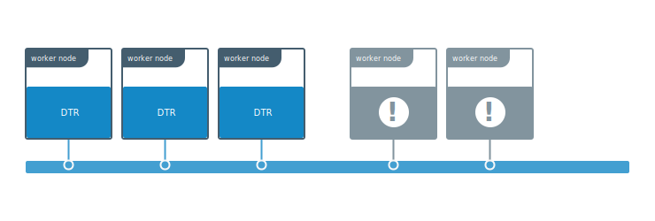
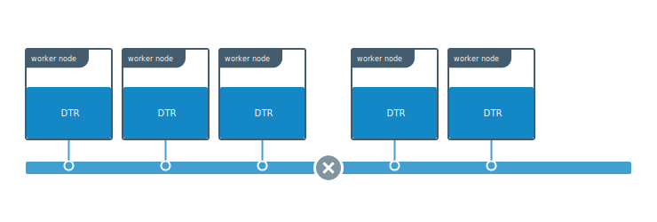
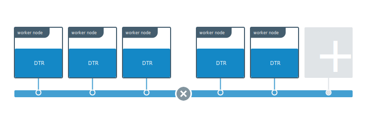
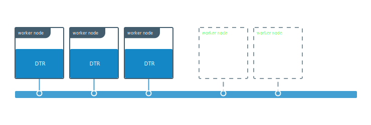



When one or more DTR replicas are unhealthy but the overall majority
(n/2 + 1) is healthy and able to communicate with one another, your DTR
cluster is still functional and healthy.



Given that the DTR cluster is healthy, there's no need to execute any disaster
recovery procedures like restoring from a backup.

Instead, you should:

1. Remove the unhealthy replicas from the DTR cluster.
2. Join new replicas to make DTR highly available.

Since a DTR cluster requires a majority of replicas to be healthy at all times,
the order of these operations is important. If you join more replicas before
removing the ones that are unhealthy, your DTR cluster might become unhealthy.

## Split-brain scenario

To understand why you should remove unhealthy replicas before joining new ones,
imagine you have a five-replica DTR deployment, and something goes wrong with
the overlay network connection the replicas, causing them to be separated in
two groups.



Because the cluster originally had five replicas, it can work as long as
three replicas are still healthy and able to communicate (5 / 2 + 1 = 3).
Even though the network separated the replicas in two groups, DTR is still
healthy.

If at this point you join a new replica instead of fixing the network problem
or removing the two replicas that got isolated from the rest, it's possible
that the new replica ends up in the side of the network partition that has
less replicas.



When this happens, both groups now have the minimum amount of replicas needed
to establish a cluster. This is also known as a split-brain scenario, because
both groups can now accept writes and their histories start diverging, making
the two groups effectively two different clusters.

## Remove replicas

To remove unhealthy replicas, you'll first have to find the replica ID
of one of the replicas you want to keep, and the replica IDs of the unhealthy
replicas you want to remove.

You can find this in the **Stacks** page of the UCP web UI, or by using the UCP
client bundle to run:

```bash

docker ps --format "{{.Names}}" | grep dtr

# The list of DTR containers with <node>/<component>-<replicaID>, e.g.
# node-1/dtr-api-a1640e1c15b6

```

Then use the UCP client bundle to remove the unhealthy replicas:

```bash
docker run -it --rm {{ page.dtr_org }}/{{ page.dtr_repo }}:{{ page.dtr_version }} remove \
  --existing-replica-id <healthy-replica-id> \
  --replica-ids <unhealthy-replica-id> \
  --ucp-insecure-tls \
  --ucp-url <ucp-url> \
  --ucp-username <user> \
  --ucp-password <password>
```

You can remove more than one replica at the same time, by specifying multiple
IDs with a comma.



## Join replicas

Once you've removed the unhealthy nodes from the cluster, you should join new
ones to make sure your cluster is highly available.

Use your UCP client bundle to run the following command which prompts you for
the necessary parameters:

```bash
docker run -it --rm \
  {{ page.dtr_org }}/{{ page.dtr_repo }}:{{ page.dtr_version }} join \
  --ucp-node <ucp-node-name> \
  --ucp-insecure-tls
```

[Learn more about high availability](../configure/set-up-high-availability.md).

