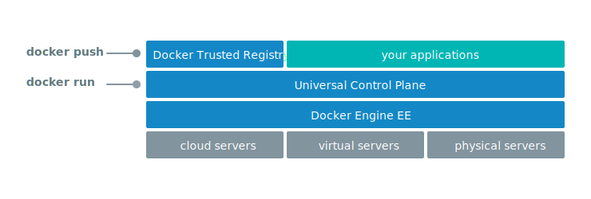
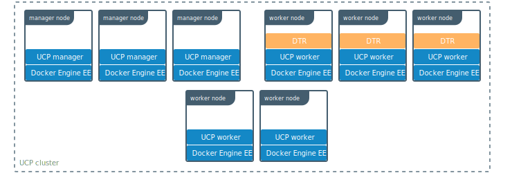
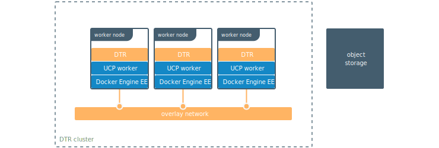
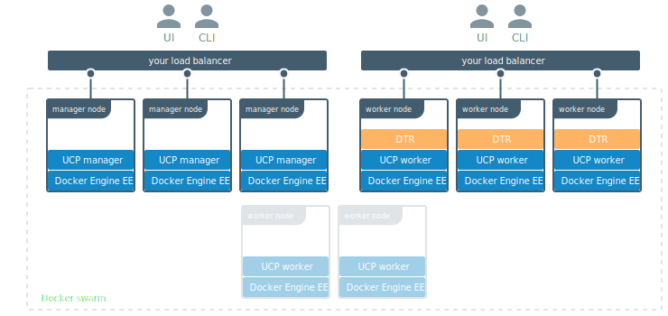



Docker Trusted Registry (DTR) is a containerized application that runs on a
Docker Universal Control Plane cluster.

Once you have DTR deployed, you use your Docker CLI client to login, push, and
pull images.

## Under the hood

For high-availability you can deploy multiple DTR replicas, one on each UCP
worker node.

All DTR replicas run the same set of services and changes to their configuration
are automatically propagated to other replicas.

## DTR internal components

When you install DTR on a node, the following containers are started:

| Name                                 | Description                                                                                                                        |
|:-------------------------------------|:-----------------------------------------------------------------------------------------------------------------------------------|
| dtr-api-&lt;replica_id&gt;           | Executes the DTR business logic. It serves the DTR web application, and API                                                        |
| dtr-garant-&lt;replica_id&gt;        | Manages DTR authentication                                                                                                         |
| dtr-jobrunner-&lt;replica_id&gt;     | Runs cleanup jobs in the background                                                                                                |
| dtr-nginx-&lt;replica_id&gt;         | Receives http and https requests and proxies them to other DTR components. By default it listens to ports 80 and 443 of the host   |
| dtr-notary-server-&lt;replica_id&gt; | Receives, validates, and serves content trust metadata, and is consulted when pushing or pulling to DTR with content trust enabled |
| dtr-notary-signer-&lt;replica_id&gt; | Performs server-side timestamp and snapshot signing for content trust metadata                                                     |
| dtr-registry-&lt;replica_id&gt;      | Implements the functionality for pulling and pushing Docker images. It also handles how images are stored                          |
| dtr-rethinkdb-&lt;replica_id&gt;     | A database for persisting repository metadata                                                                                      |
| dtr-scanningstore-&lt;replica_id&gt; | Stores security scanning data                                                                                                      |

All these components are for internal use of DTR. Don't use them in your applications.

## Networks used by DTR

To allow containers to communicate, when installing DTR the following networks
are created:

| Name   | Type    | Description                                                                            |
|:-------|:--------|:---------------------------------------------------------------------------------------|
| dtr-ol | overlay | Allows DTR components running on different nodes to communicate, to replicate DTR data |

## Volumes used by DTR

DTR uses these named volumes for persisting data:

| Volume name                         | Description                                                                      |
|:------------------------------------|:---------------------------------------------------------------------------------|
| dtr-ca-&lt;replica_id&gt;           | Root key material for the DTR root CA that issues certificates                   |
| dtr-notary-&lt;replica_id&gt;       | Certificate and keys for the Notary components                                   |
| dtr-postgres-&lt;replica_id&gt;     | Vulnerability scans data                                                         |
| dtr-registry-&lt;replica_id&gt;     | Docker images data, if DTR is configured to store images on the local filesystem |
| dtr-rethink-&lt;replica_id&gt;      | Repository metadata                                                              |
| dtr-nfs-registry-&lt;replica_id&gt; | Docker images data, if DTR is configured to store images on NFS                  |

You can customize the volume driver used for these volumes, by creating the
volumes before installing DTR. During the installation, DTR checks which volumes
don't exist in the node, and creates them using the default volume driver.

By default, the data for these volumes can be found at
`/var/lib/docker/volumes/<volume-name>/_data`.

## Image storage

By default, Docker Trusted Registry stores images on the filesystem of the node
where it is running, but you should configure it to use a centralized storage
backend.

DTR supports these storage backends:

* NFS
* Amazon S3
* Cleversafe
* Google Cloud Storage
* OpenStack Swift
* Microsoft Azure

## How to interact with DTR

DTR has a web UI where you can manage settings and user permissions.

You can push and pull images using the standard Docker CLI client or other tools
that can interact with a Docker registry.


