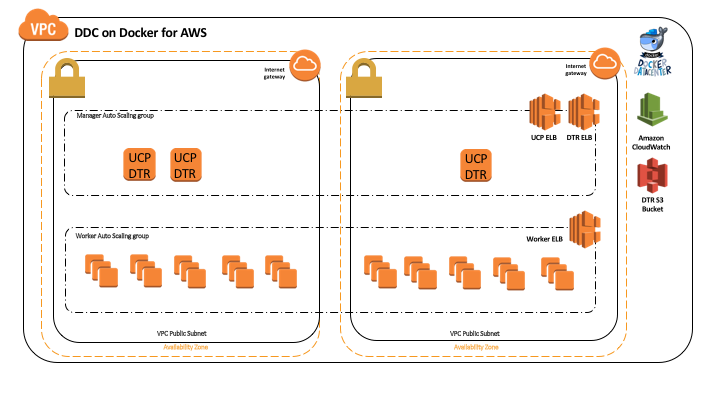
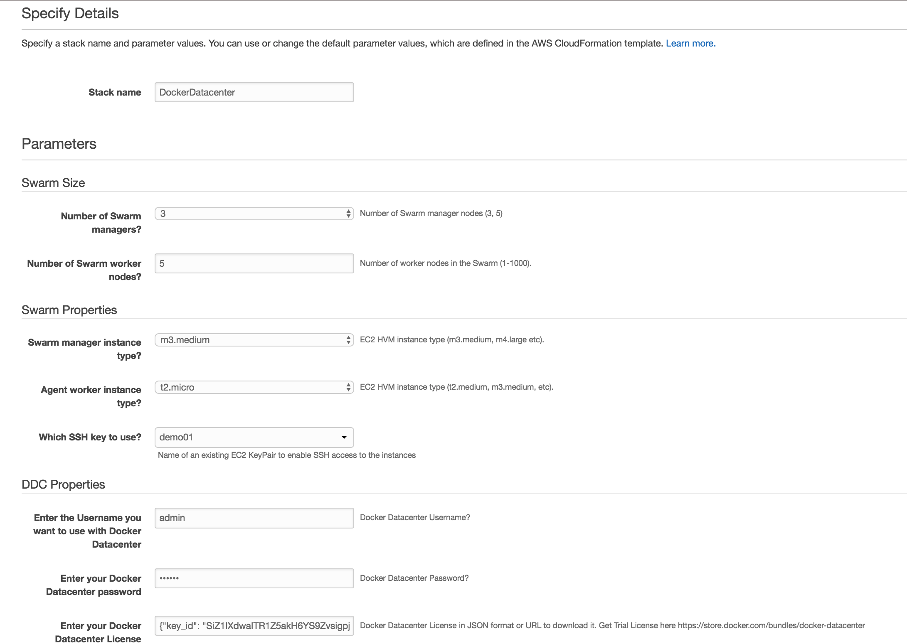
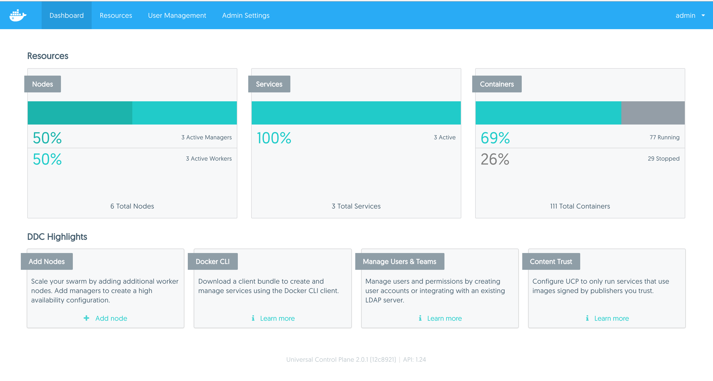
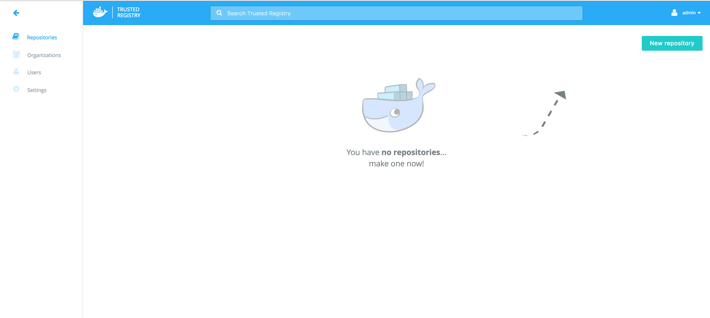
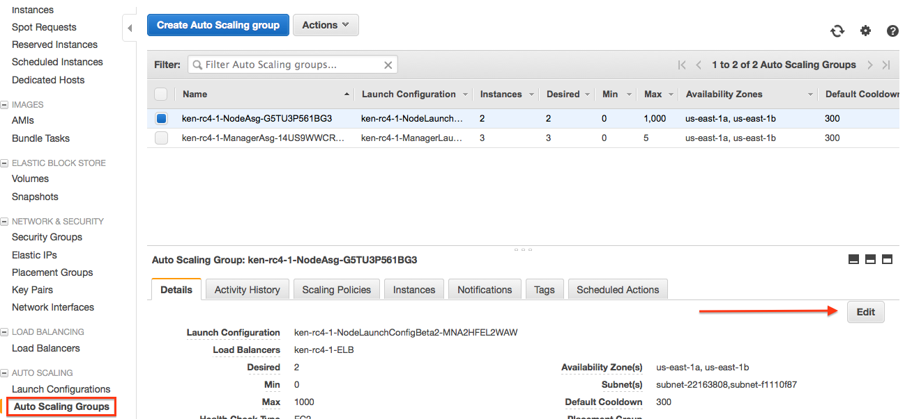
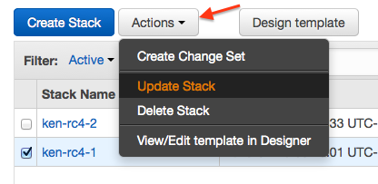

<!--[metadata]>
+++
title = "Docker Datacenter on Docker for AWS"
description = "Docker for AWS"
keywords = ["iaas, aws, azure"]
[menu.main]
identifier="docs-aws-index"
parent = "docs-aws"
name = "Setup & Prerequisites"
weight="100"
+++
<![end-metadata]-->

# Docker Datacenter on Docker for AWS (Beta)

## Solution Overview

Docker Datacenter on Docker for AWS is a one-click deploy of highly-scalable Docker Datacenter (Universal Control Plane and Docker Trusted Registry) based on Docker and AWS best-practices. It is based on [Docker for AWS](https://beta.docker.com/docs/) and currently should be used for evaluation purposes only.



## How it Works

The solution uses cloudformation template to create everything that you need from scratch. The template first starts off by creating a new VPC along with its subnets and security groups. Once the networking is set up, it will create two Auto Scaling groups, one for the managers and one for the workers, and set the desired capacity that was selected in the CloudFormation setup form. The Managers will start up first and create a Swarm manager quorum using Raft. The workers will then start up and join the swarm one by one, until all of the workers are up and running. At this point you will have a number of managers and  workers in your swarm, that are ready to handle your application deployments. It then bootstraps UCP controllers on manager nodes and UCP agents on worker nodes. Next, it installs DTR on the manager nodes and configures it to use an S3 bucket as an image storage backend. Three ELBs, one for UCP, one for DTR and a third for your applications, are launched and automatically configured to provide resilient loadbalancing across multiple AZs. The application ELB gets automatically updated when services are launched or removed. While UCP and DTR ELBs are configured for  HTTPS only. 

Both manager and worker nodes are part of separate ASG groups to allow you to scale your cluster when needed. If you increase the number of instances running in your worker Auto Scaling group (via the AWS console, or updating the CloudFormation configuration), the new nodes that will start up will automatically join the swarm. This architecture ensures that both manager and worker nodes are spread across multiple AZs for resiliency and high-availability. The template is adjustable and upgradeable meaning you can adjust your configuration (e.g instance types or Docker engine version)

## Prerequisites

- Access to an AWS account with permissions to use CloudFormation and creating the following objects
    - EC2 instances + Auto Scaling groups
    - IAM profiles
    - DynamoDB Tables
    - SQS Queue
    - VPC + subnets
    - ELB
    - CloudWatch Log Group
    - S3 Bucket

- SSH key in AWS in the region where you want to deploy (required to access the completed Docker install)
- AWS account that support EC2-VPC 

For more information about adding an SSH key pair to your account, please refer to the [Amazon EC2 Key Pairs docs](http://docs.aws.amazon.com/AWSEC2/latest/UserGuide/ec2-key-pairs.html)


## Cloudformation Parameters

Here are the required configuration parameters for the Cloudformation template:

#### KeyName
SSH key that will be used when you SSH into the manager nodes. The key needs to be configured in same region you launch the Cloudformation template in.

#### InstanceType
The EC2 instance type for your Worker nodes

#### ManagerInstanceType
The EC2 instance type for your Manager nodes. The larger your swarm, the larger the instance size you should use.

#### ClusterSize
The number of Workers you want in your swarm (1-1000)

#### ManagerSize
The number of Managers in your swarm. You can pick either 3 or 5 managers 

#### DDCUsernameSet
Docker Datacenter Username

#### DDCPasswordSet
Docker Datacenter Password

#### License
Docker Datacenter License in JSON format or an S3 URL to download it. You can get a trial license [here](https://store.docker.com/bundles/docker-datacenter)
 

## Installation

There are two ways you can deploy Docker Datacenter on Docker for AWS. You can use the AWS Management Console (browser based), or the AWS CLI. Both have the above configuration options.

**1) AWS Management Console**

- Click on **Launch Stack** below. This link will take you to AWS cloudformation portal.

	[](https://console.aws.amazon.com/cloudformation/home?#/stacks/new?stackName=DockerDatacenter&templateURL=https://s3-us-west-2.amazonaws.com/ddc-on-aws-public/aws/aws-v1.12.3-cs4-beta12-ddc.json)

- Confirm your AWS Region that you'd like to launch this stack in (top right corner)
- Provide the required parameters and click **Next** (see below) 

- **Confirm** and **Launch**
- Once the stack is successfully created (it does take between 10-15 mins), click on **Output** tab to see the URLs of UCP and DTR. 

**2) AWS CLI**


- Upload your Docker Datacenter license to an S3 bucket.
- Run the following Docker container that uses `aws-cli` to launch the Cloudformation stack. Alternatively, if you have `aws-cli` installed you can run the command directly using it.

	```
docker run --env AWS_ACCESS_KEY_ID=<AWS_ACCESS_KEY_ID> \
--env AWS_SECRET_ACCESS_KEY=<AWS_SECRET_ACCESS_KEY> \
--env AWS_DEFAULT_REGION=<AWS_REGION> \
garland/aws-cli-docker aws cloudformation create-stack \
--stack-name <STACK_NAME> \
--capabilities CAPABILITY_IAM \
--parameters \
ParameterKey=KeyName,ParameterValue=<SSH_KEY_NAME> \
ParameterKey=InstanceType,ParameterValue=<INSTANCE_TYPE> \
ParameterKey=ManagerInstanceType,ParameterValue=<INSTANCE_TYPE> \
ParameterKey=ClusterSize,ParameterValue=<CLUSTER_SIZE> \
ParameterKey=ManagerSize,ParameterValue=<MANAGER_SIZE> \
ParameterKey=DDCUsernameSet,ParameterValue=<DDC_USERNAME> \
ParameterKey=DDCPasswordSet,ParameterValue=<DDC_PASSWORD> \
ParameterKey=License,ParameterValue=<YOUR_DDC_LICENSE_S3_URL> \
--template-url https://s3-us-west-2.amazonaws.com/ddc-on-aws-public/aws/aws-v1.12.3-cs4-beta12-ddc.json 
	```
- Once successfully created ( it does take between 10-15 mins), you can get stack outputs such as UCP and DTR URLs directly from CLI as follows:

	```
docker run --env AWS_ACCESS_KEY_ID=<AWS_ACCESS_KEY_ID> \
--env AWS_SECRET_ACCESS_KEY=<AWS_SECRET_ACCESS_KEY> \
--env AWS_DEFAULT_REGION=<AWS_REGION> \
garland/aws-cli-docker aws cloudformation describe-stacks --stack-name <STACK_NAME>
	```
- To fully automate installs, you can use the [AWS Cloudformation API](http://docs.aws.amazon.com/AWSCloudFormation/latest/APIReference/Welcome.html)


## Software Versions

- Docker Commercially Supported Engine: `1.12.3-cs4`
- UCP: `2.0.1`
- DTR: `2.1.0`

## System containers
Each node will have a few system containers running on them to help run your swarm cluster. In order for everything to run smoothly, please keep those containers running, and don't make any changes. If you make any changes, we can't guarantee that Docker for AWS will work correctly.

## Supported Regions

- ap-northeast-1
- ap-northeast-2
- ap-south-1
- ap-southeast-1
- ap-southeast-2
- eu-central-1
- eu-west-1
- sa-east-1
- us-east-1
- us-east-2
- us-west-1
- us-west-2

## AMIs
Docker Datacenter on Docker for AWS currently only supports our custom AMI, which is a highly optimized AMI built specifically for running Docker on AWS

## Accessing Docker Datacenter 

Once the stack is successfully created, you can access UCP and DTR URLs in the output tab as follows:


When accessing UCP and DTR, log in using the username and password that you provided when you launched the cloudformation stack. You should see the below landing pages:





> Note: During the installation process, a self-signed certificate is generated for both UCP and DTR. You can replace these certificates with your own CA-signed certificate after the installation is complete.  When you access UCP and DTR URLs for the first time, you need to proceed insecurely (multiple times) by accepting the provided certificate in the browser.


## Configuring Docker Datacenter DNS and Certificates 	

Most users would want to register their own DNS records with CA signed certificates for both UCP and DTR instead of the randomly generated ELB DNS names. To do that, please follow the instructions below:

1. Create an A or CNAME DNS record for UCP and DTR pointing to the UCP and DTR ELB DNS/IP. You can find the ELB names in the **Output** tab.
2. Login to DTR using the DTR ELB URL and go to **Settings** page.
3. Update the **Domain** section with the your DNS and their respective certificate.  Make sure you click **Save** at the end.
Full documentation for this step is [here](https://docs.docker.com/datacenter/dtr/2.1/guides/configure/).
4. Login to UCP using the UCP ELB URL and go to **Admin Settings** tab.
5. Under the **Cluster Configuration** update **EXTERNAL SERVICE LOAD BALANCER** with your custom UCP DNS name. Then click on **Update Settings**.
6. Under the **Certificates** section, upload or paste your own certificates for UCP. Then click on **Update**. Full documentation for this step is [here](https://docs.docker.com/datacenter/ucp/2.0/guides/configuration/).
7. Final step is to reconfigure DTR to use new UCP DNS and certificates. You need to run a `reconfigure` operation from the CLI. This step can be done from any Docker engine ( local or on the cloud) as long as you have UCP [client bundle](https://docs.docker.com/datacenter/ucp/2.0/guides/access-ucp/cli-based-access/). Once you download the bundle and load it, run the following command:

	```
	UCP_URL=<YOUR_NEW_UCP_DNS>
	DTR_URL=<YOUR_NEW_DTR_DNS>
	USERNAME=<YOUR_DDC_USERNAME>
	PASSWORD=<YOUR_DDC_PASSWORD>
	
	curl -k https://$UCP_URL/ca > ucp-ca.pem
	docker run -it --rm docker/dtr:2.1.0 \
    reconfigure \
    --ucp-url $UCP_URL \
    --ucp-username $USERNAME \
    --ucp-password $PASSWORD \
    --debug \
    --ucp-ca "$(cat ucp-ca.pem)" \
    --dtr-external-url https://$DTR_URL:443
	```
	Once you run this Docker container, you'll be requested to Choose a replica to reconfigure. Press **Enter** to proceed with the chosen one.	
8. Now you may access UCP and DTR with your own custom DNS names!

## Deploy and Access Your Applications on Docker Datacenter

Now that you have configured your custom DNS for both UCP and DTR, you can start deploying your applications via CLI (with the client bundle) or via the UCP web console.

#### Swarm Mode/Services Based Applications (Docker Engine 1.12+)

If you are deploying swarm-mode services, Docker Datacenter on Docker for AWS provides multiple advantages to easily deploy and access your application.

1. **ELB Integration**	
	When you create Swarm-mode services and publish a TCP/UDP port, Docker for AWS automatically reconfigures the application ELB (**DefaultExternalTarget**) listeners setting to allow traffic on these ports to pass to cluster nodes. For example, if you launch a service from CLI using client bundle and publish a TCP port for it, you'll see the ELB's **Listeners** configuration automatically get updated. Please see example below:
	
	a. Creating a service with a published port `8080` using CLI:
	
	```
	$ docker service create --name demo -p 8080:8080 ehazlett/docker-demo:dcus
		6s09w6gxxfz7mkce9ybl6x3cr
	```
	b. Notice the updated ELB configuration:
	
	
	
	c. Access your application using **DefaultExternalTarget** DNS and published port:
	
	


2. **Swarm Mode Routing Mesh**

	Routing mesh is a new feature in Docker 1.12 that combines ipvs and iptables to create a powerful cluster-wide transport-layer (L4) load balancer. It allows all the Swarm nodes to accept connections on the services published ports. When any Swarm node receives traffic destined to the published TCP/UDP port of a running service, it forwards it to service's VIP using a pre-defined overlay network called ingress.

3. **HTTP Routing Mesh**

	UCP now supports HTTP Routing Mesh (HRM) which is a new experimental feature to enable service discovery on the application layer (L7). HRM works with Swarm Mode Routing Mesh to link HTTP vhosts to L4 published services. Please use the [following documentation](https://success.docker.com/Datacenter/Apply/Docker_Reference_Architecture%3A_Universal_Control_Plane_2.0_Service_Discovery_and_Load_Balancing) for more details. 
	
	Once you enable HRM, the ELB will be reconfigured automatically to forward application traffic to the worker nodes. You may use your custom application DNS names and map them to the **DefaultExternalTarget** DNS. For example, if you want to access the previous service using a proper DNS name like `foo.example.com`, all you need to do is enable HRM, create a CNAME records using **DefaultExternalTarget**'s DNS, and launch your service as follows:
	
	```
	docker service create -p 8080 \
    --network ucp-hrm \
    --name demo-hrm-app \
    --label com.docker.ucp.mesh.http=8080=http://foo.example.com \
    ehazlett/docker-demo:dcus
	```
	
	> Note: There is currently a caveat with HRM and Docker Datacenter running on AWS. Before enabling the feature, you need to create a new network named `ucp-hrm`. Please go to **Resources** > **Networks** > **Create Network** and use the below info before clicking **Create**. Once you create the network, you can enable HRM.
	
		

#### Non-Swarm Mode Container Based Applications

If you are deploying non-swarm mode container-based applications, you can follow [UCP docs](https://docs.docker.com/datacenter/ucp/2.0/guides/applications/) to deploy your applications. Once you deploy your application on UCP, you can access them by using the specific worker node's public IP address and exposed port. 

Additionally, you can deploy Interlock on any or all of the worker nodes to dynamically register your applications and loadbalance traffic to them using an L7 reverse proxy (e.g NGINX). Once you successfully deploy Interlock and NGINX, you can create DNS records for your applications using the **DefaultExternalTarget** IP. Full documentations is available [here](https://success.docker.com/Datacenter/Apply/Docker_Reference_Architecture%3A_Universal_Control_Plane_2.0_Service_Discovery_and_Load_Balancing#Non_Swarm_Mode_Containers).


## Scaling Workers

You can scale the worker count using the AWS Auto Scaling group. Docker will automatically join or remove new instances to the Swarm.

There are currently two ways to scale your worker group. You can "update" your stack, and change the number of workers in the CloudFormation template parameters, or you can manually update the Auto Scaling group in the AWS console for EC2 auto scaling groups.

Changing manager count live is **_not_** currently supported.

### AWS Console
Login to the AWS console, and go to the EC2 dashboard. On the lower left hand side select the "Auto Scaling Groups" link.

Look for the Auto Scaling group with the name that looks like $STACK_NAME-NodeASG-* Where `$STACK_NAME` is the name of the stack you created when filling out the CloudFormation template for Docker for AWS. Once you find it, click the checkbox, next to the name. Then Click on the "Edit" button on the lower detail pane.



Change the "Desired" field to the size of the worker pool that you would like, and hit "Save".


This will take a few minutes and add the new workers to your swarm automatically. To lower the number of workers back down, you just need to update "Desired" again, with the lower number, and it will shrink the worker pool until it reaches the new size.

### CloudFormation Update
Go to the CloudFormation management page, and click the checkbox next to the stack you want to update. Then Click on the action button at the top, and select "Update Stack".



Pick "Use current template", and then click "Next". Fill out the same parameters you have specified before, but this time, change your worker count to the new count, click "Next". Answer the rest of the form questions. CloudFormation will show you a preview of the changes it will make. Review the changes and if they look good, click "Update". CloudFormation will change the worker pool size to the new value you specified. It will take a few minutes (longer for a larger increase / decrease of nodes), but when complete you will have your swarm with the new worker pool size.
 

## Upgrades

TBD
 
## Support

TBD


