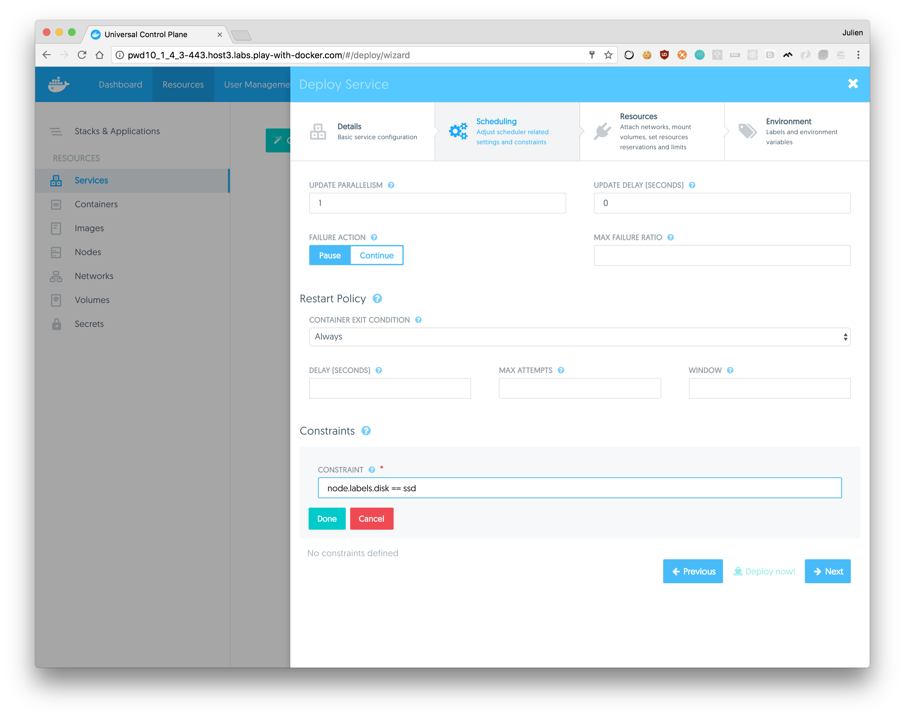

After deploying UCP you can add labels to your nodes. Labels are metadata that
you can use to organize nodes.
You can also use these labels as deployment constraints for your services.

When deploying a service, you can specify constraints, so that the service only
gets scheduled on a node that has a label that fulfills all the constraints
you specify.

As an example, you can apply labels based on their role in the development
lifecycle, or the hardware resources they have.


## Apply labels to a node

Log in with administrator credentials in the **UCP web UI**, navigate to the
**Nodes** page, and choose the node you want to apply labels to.

Click the **Add label** button, and add one or more labels to the node.

{: .with-border}

Once you're done, click **Save Changes**.

You can also do this from the CLI by running:

```none
docker node update --label-add <key>=<value> <node-id>
```

## Add constraint to a service

After adding labels to your nodes you can add deployment constraints on your 
service base on your labels.
When deploying a service, you can specify constraints, so that the service only
gets scheduled on a node that has a label that fulfills all the constraints
you specify

In this example, when users deploy a service they can add constraints for the
service to be scheduled on nodes that have an SSD storage.

You can apply deployment constraints inside the docker-stack.yml or when you are creating a stack


Or you can apply them when you are creating a service.




You can check if a service have deployment constraints, navigate to the **Services** page,
and choose the service your want to check.
Once you're done, click **Scheduling**.


From here, you can add or remove deployment constraint too.

## Where to go next

* [Store logs in an external system](store-logs-in-an-external-system.md)
