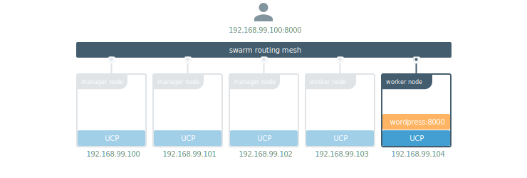

Docker has a transport-layer load balancer, also known as an L4 load balancer.
This allows you to access your services independently of the node where they are
running.

In this example, the WordPress service is being served on port 8000.
Users can access WordPress using the IP address of any node in the cluster
and port 8000. If WordPress is not running in that node, the
request is redirected to a node that is.

UCP extends this and provides an HTTP routing mesh for application-layer
load balancing. This allows you to access services with HTTP and HTTPS
endpoints using a domain name instead of an IP.

In this example, the WordPress service listens on port 8000 and is attached to
the `ucp-hrm` network. There's also a DNS entry mapping `wordpress.example.org`
to the IP addresses of the UCP nodes.

When users access `wordpress.example.org:8000`, the HTTP routing mesh routes
the request to the service running WordPress in a way that is transparent to
the user.

## Enable the HTTP routing mesh

To enable the HTTP routing mesh, Log in as an administrator, go to the
UCP web UI, navigate to the **Admin Settings** page, and click the
**Routing Mesh** option. Check the **Enable routing mesh** option.

{: .with-border}

By default, the HTTP routing mesh service listens on port 80 for HTTP and port
8443 for HTTPS. Change the ports if you already have services that are using
them.

## Under the hood

Once you enable the HTTP routing mesh, UCP deploys:

| Name      | What    | Description                                                                   |
|:----------|:--------|:------------------------------------------------------------------------------|
| `ucp-hrm` | Service | Receive HTTP and HTTPS requests and send them to the right service            |
| `ucp-hrm` | Network | The network used to communicate with the services using the HTTP routing mesh |

You then deploy a service that exposes a port, attach that service to the
`ucp-hrm` network, and create a DNS entry to map a domain name to the IP
address of the UCP nodes.

When a user tries to access an HTTP service from that domain name:

1. The DNS resolution will point them to the IP of one of the UCP nodes
2. The HTTP routing mesh looks at the Hostname header in the HTTP request
3. If there's a service that maps to that hostname, the request is routed to the
port where the service is listening
4. If not, the user receives an `HTTP 503, bad gateway` error.

For services exposing HTTPS things are similar. The HTTP routing mesh doesn't
terminate the TLS connection, and instead leverages an extension to TLS called
Server Name Indication, that allows a client to announce in clear the domain
name it is trying to reach.

When receiving a connection in the HTTPS port, the routing mesh looks at the
Server Name Indication header and routes the request to the right service.
The service is responsible for terminating the HTTPS connection. Note that 
the routing mesh uses the SSL session ID to make sure that a single SSL 
session always goes to the same task for the service. This is done for
performance reasons so that the same SSL session can be maintained across
requests.

## Where to go next

- [Use your own TLS certificates](use-your-own-tls-certificates.md)
- [Run only the images you trust](run-only-the-images-you-trust.md)
