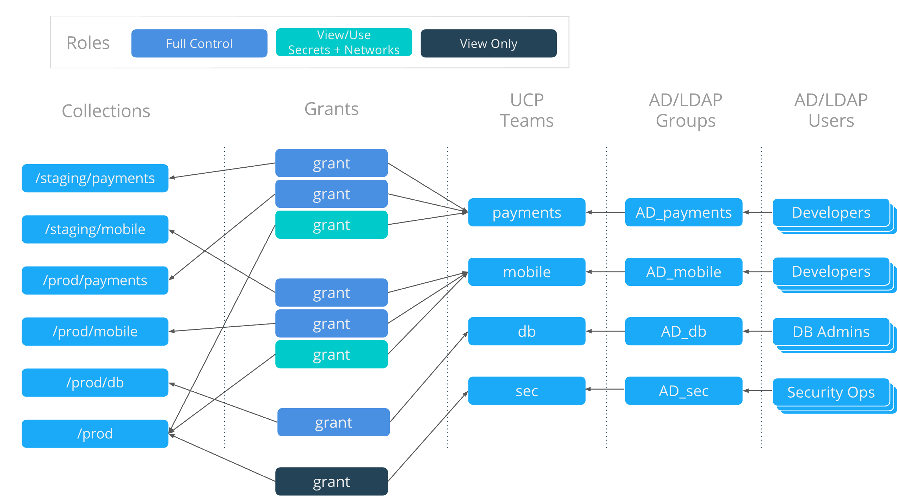
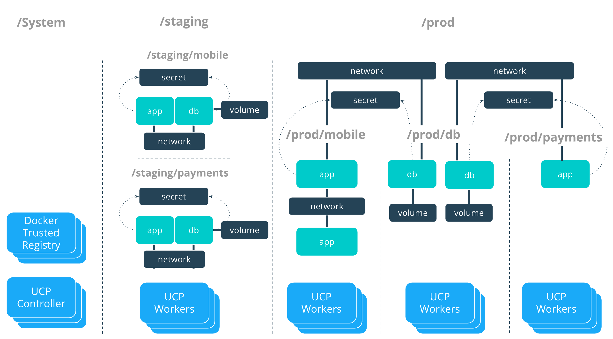
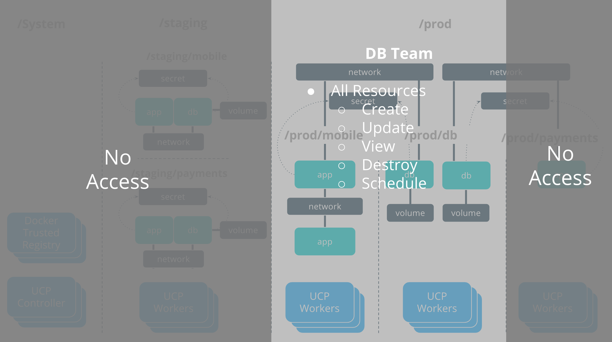
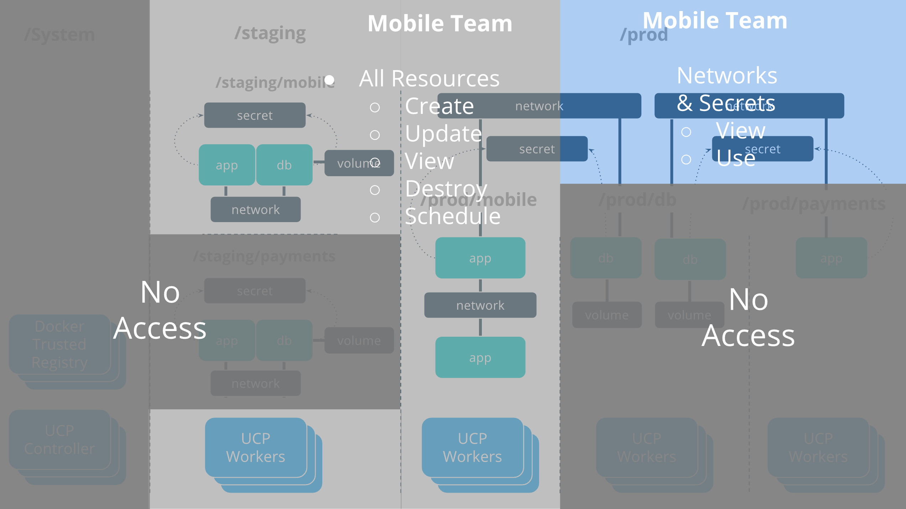

Go through the [Docker Enterprise Standard tutorial](rbac-howto-orcabank1-standard.md),
before continuing here with Docker Enterprise Advanced.

In the first tutorial, the fictional company, OrcaBank, designed an architecture
with role-based access control (RBAC) to meet their organization's security
needs. They assigned multiple grants to fine-tune access to resources across
collection boundaries on a single platform.

In this tutorial, OrcaBank implements new and more stringent security
requirements for production applications:

First, OrcaBank adds staging zone to their deployment model. They will no longer
move developed appliciatons directly in to production. Instead, they will deploy
apps from their dev cluster to staging for testing, and then to production.

Second, production applications are no longer permitted to share any physical
infrastructure with non-production infrastructure. OrcaBank segments the
scheduling and access of applications with [Node Access Control](rbac-howto-isolate-nodes.md).

> [Node Access Control](rbac-howto-isolate-nodes.md) is a feature of Docker EE
> Advanced and provides secure multi-tenancy with node-based isolation. Nodes
> can be placed in different collections so that resources can be scheduled and
> isolated on disparate physical or virtual hardware resources.

## Team access requirements

OrcaBank still has three application teams, `payments`, `mobile`, and `db` with
varying levels of segmentation between them.

Their RBAC redesign is going to organize their UCP cluster into two top-level
collections, staging and production, which are completely separate security
zones on separate physical infrastructure.

OrcaBank's four teams now have different needs in production and staging:

- `security` should have view-only access to all applications in production (but
  not staging).
- `db` should have full access to all database applications and resources in
  production (but not staging). See [DB Team](#db-team).
- `mobile` should have full access to their Mobile applications in both
  production and staging and limited access to shared `db` services. See
  [Mobile Team](#mobile-team).
- `payments` should have full access to their Payments applications in both
  production and staging and limited access to shared `db` services.

## Role composition

OrcaBank has decided to replace their custom `Ops` role with the built-in
`Full Control` role.

- `View Only` (default role) allows users to see but not edit all Swarm
  resources.
- `Full Control` (default role) allows users complete control of all collections
  granted to them. They can also create containers without restriction but
  cannot see the containers of other users.
- `View & Use Networks + Secrets` (custom role) enables users to view/connect
  to networks and view/use secrets used by `db` containers, but prevents them
  from seeing or impacting the `db` applications themselves.

{: .with-border}

## Collection architecture

In the previous tutorial, OrcaBank created separate collections for each
application team and nested them all under `/Shared`.

To meet their new security requirements for production, OrcaBank is redesigning
collections in two ways:

- Adding collections for both the production and staging zones, and nesting a
  set of application collections under each.
- Segmenting nodes. Both the production and staging zones will have dedicated
  nodes; and in production, each application will be on a dedicated node.

The collection architecture now has the following tree representation:

```
/
├── System
├── Shared
├── prod
│   ├── mobile
│   ├── payments
│   └── db
│       ├── mobile
│       └── payments
|
└── staging
    ├── mobile
    └── payments
```

## Grant composition

OrcaBank must now diversify their grants further to ensure the proper division
of access.

The `payments` and `mobile` application teams will have three grants each--one
for deploying to production, one for deploying to staging, and the same grant to
access shared `db` networks and secrets.

{: .with-border}

## OrcaBank access architecture

The resulting access architecture, designed with Docker EE Advanced, provides
physical segmentation between production and staging using node access control.

Applications are scheduled only on UCP worker nodes in the dedicated application
collection. And applications use shared resources across collection boundaries
to access the databases in the `/prod/db` collection.

{: .with-border}

### DB team

The OrcaBank `db` team is responsible for deploying and managing the full
lifecycle of the databases that are in production. They have the full set of
operations against all database resources.

{: .with-border}

### Mobile team

The `mobile` team is responsible for deploying their full application stack in
staging. In production they deploy their own applications but use the databases
that are provided by the `db` team.

{: .with-border}

## Next steps

* [Access control design with Docker EE Standard](rbac-howto-orcabank1-standard.md)
