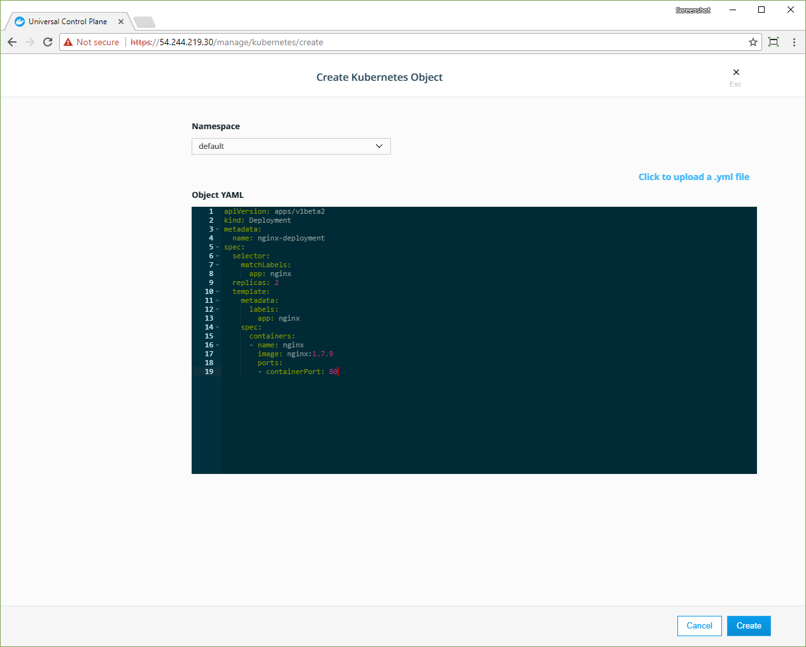
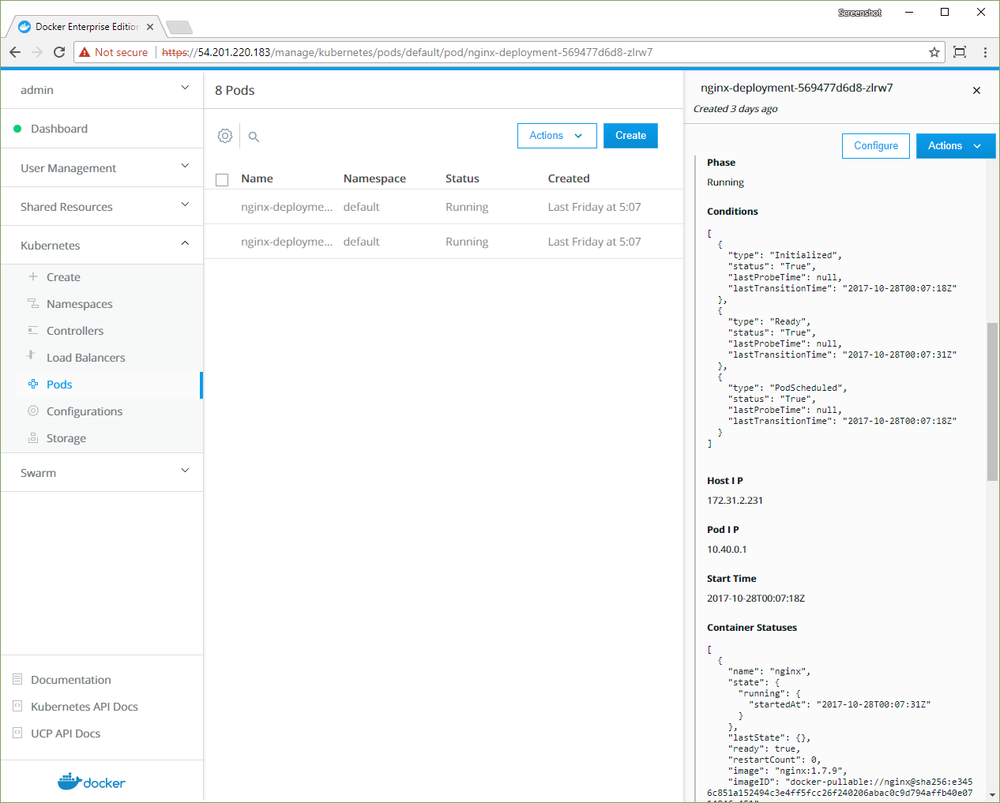


The Docker EE web UI enables deploying your Kubernetes YAML files. In most
cases, no modifications are necessary to deploy on a cluster that's managed by
Docker EE. 

## Deploy an NGINX server

In this example, a simple Kubernetes Deployment object for an NGINX server is
defined in YAML:

```yaml
apiVersion: apps/v1beta2
kind: Deployment
metadata:
  name: nginx-deployment
spec:
  selector:
    matchLabels:
      app: nginx
  replicas: 2
  template:
    metadata:
      labels:
        app: nginx
    spec:
      containers:
      - name: nginx
        image: nginx:1.7.9
        ports:
        - containerPort: 80
```

The YAML specifies an earlier version of NGINX, which will be updated in a
later section.

1. Open the Docker EE web UI, and in the left pane, click **Kubernetes**.
2. Click **Create** to open the **Create Kubernetes Object** page.
3. In the **Namespace** dropdown, select **default**.
4. In the **Object YAML** editor, paste the previous YAML.
5. Click **Create**.

{: .with-border}

## Inspect the deployment

The Docker EE web UI shows the status of your deployment when you click the 
links in the **Kubernetes** section of the left pane.

1. In the left pane. click **Controllers** to see the resource controllers
   that Docker EE created for the NGINX server.
2. Click the **nginx-deployment** controller, and in the details pane, scroll
   to the **Template** section. This shows the values that Docker EE used to 
   create the deployment.
3. In the left pane, click **Pods** to see the pods that are provisioned for
   the NGINX server. Click one of the pods, and in the details pane, scroll to
   the **Status** section to see that pod's phase, IP address, and other 
   properties.

{: .with-border}

## Update the deployment

Update an existing deployment by applying an updated YAML file. In this
example, the server is scaled up to four replicas and updated to a later
version of NGINX. 

```yaml
apiVersion: apps/v1beta2
kind: Deployment
metadata:
  name: nginx-deployment
spec:
  selector:
    matchLabels:
      app: nginx
  replicas: 4
  template:
    metadata:
      labels:
        app: nginx
    spec:
      containers:
      - name: nginx
        image: nginx:1.8
        ports:
        - containerPort: 80
```

1. In the left pane, click **Controllers** and select the **nginx-deployment**
   controller.
2. In the details pane, click **Configure**, and in the **Edit Deployment**
   page, paste the previous YAML.
3. Click **Edit** to update the deployment with the new YAML.




With Docker EE, you deploy your Kubernetes objects on the command line by using
`kubectl`. [Install and set up kubectl](https://kubernetes.io/docs/tasks/tools/install-kubectl/).

Docker EE ensures that communication with the cluster is secure. When you run
`kubectl` commands on a Docker EE node, you need to authenticate your request
with a client certificate bundle. [Get your client bundle by using the Docker EE web UI or the command line](/datacenter/ucp/2.2/guides/user/access-ucp/cli-based-access.md).
If you don't have the client bundle set up, you'll see an error when you run
`kubectl` commands:

```none
The connection to the server localhost:8080 was refused - did you specify the right host or port?
```

When you have `kubectl` and the client bundle installed, you can deploy a
Kubernetes object from YAML.

Save the previous YAML to a file named "deployment.yaml", and use the following
command to deploy the NGINX server: 

```bash
kubectl apply -f deployment.yaml
```
## Inspect the deployment

Use the `describe deployment` option to inspect the deployment: 

```bash
kubectl describe deployment nginx-deployment
```

Also, you can use the Docker EE web UI to see the deployment's pods and
controllers.

## Update the deployment

Update an existing deployment by applying an updated YAML file. 

Save the previous YAML to a file named "update.yaml", and use the following
command to deploy the NGINX server: 

```bash
kubectl apply -f update.yaml
```




