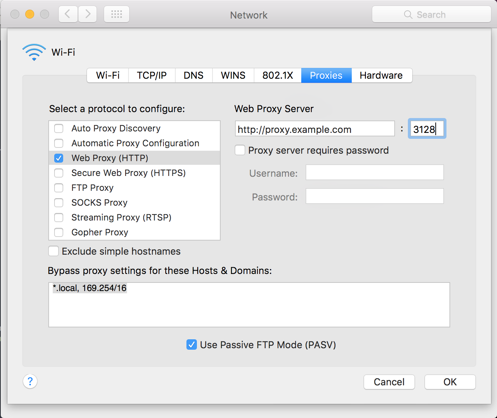

Docker for Mac provides several networking features to make it easier to use.

## Features

### VPN Passthrough

Docker for Mac's networking can work when attached to a VPN. To do this, Docker
for Mac intercepts traffic from the `HyperKit` and injects it into macOS as if
it originated from the Docker application.

### Port Mapping

When you run a container with the `-p` argument, for example:
```
$ docker run -p 80:80 -d nginx
```
Docker for Mac will make the container port available at `localhost`.

### HTTP/HTTPS Proxy Support

Docker for Mac will detect HTTP/HTTPS Proxy Settings from macOS and
automatically propagate these to Docker and to your containers. For example, if
you set your proxy settings to `http://proxy.example.com` in macOS, Docker will
use this proxy when pulling containers.



When you start a container, you will see that your proxy settings propagate into
the containers. For example:

```
$ docker run -it alpine env
PATH=/usr/local/sbin:/usr/local/bin:/usr/sbin:/usr/bin:/sbin:/bin
HOSTNAME=b7edf988b2b5
TERM=xterm
HOME=/root
HTTP_PROXY=http://proxy.example.com:3128
http_proxy=http://proxy.example.com:3128
no_proxy=*.local, 169.254/16
```

You can see from the above output that the `HTTP_PROXY`, `http_proxy` and
`no_proxy` environment variables are set. When your proxy configuration changes,
Docker restarts automatically to pick up the new settings. If you have
containers that you wish to keep running across restarts, you should consider
using [restart policies](/engine/reference/run/#restart-policies-restart)

## Known Limitations, Use Cases, and Workarounds

Following is a summary of current limitations on the Docker for Mac networking
stack, along with some ideas for workarounds.

### There is no docker0 bridge on macOS

Because of the way networking is implemented in Docker for Mac, you cannot see a
`docker0` interface in macOS. This interface is actually within `HyperKit`.

### I cannot ping my containers

Unfortunately, due to limitations in macOS, we're unable to route traffic to
containers, and from containers back to the host.

### Per-container IP addressing is not possible

The docker (Linux) bridge network is not reachable from the macOS host.

### Use cases and workarounds

There are two scenarios that the above limitations will affect:

#### I want to connect from a container to a service on the host

The Mac has a changing IP address (or none if you have no network access). Our
current recommendation is to attach an unused IP to the `lo0` interface on the
Mac; for example: `sudo ifconfig lo0 alias 10.200.10.1/24`, and make sure that
your service is listening on this address or `0.0.0.0` (ie not `127.0.0.1`).
Then containers can connect to this address.

#### I want to connect to a container from the Mac

Port forwarding works for `localhost`; `--publish`, `-p`, or `-P` all work.
Ports exposed from Linux are forwarded to the Mac.

Our current recommendation is to publish a port, or to connect from another
container. Note that this is what you have to do even on Linux if the container
is on an overlay network, not a bridge network, as these are not routed.

The command to run the `nginx` webserver shown in [Getting
Started](index.md#explore-the-application-and-run-examples) is an example of this.

```shell
docker run -d -p 80:80 --name webserver nginx
```

To clarify the syntax, the following two commands both expose port `80` on the
container to port `8000` on the host:

    docker run --publish 8000:80 --name webserver nginx
    docker run --p 8000:80 --name webserver nginx

To expose all ports, use the `-P` flag. For example, the following command
starts a container (in detached mode) and the `-P` exposes all ports on the
container to random ports on the host.

    docker run -d -P --name webserver nginx

See the [run command](/engine/reference/commandline/run.md) for more details on
publish options used with `docker run`.

#### A view into implementation

We understand that these workarounds are not ideal, but there are several
problems. In particular, there is a bug in macOS that is only fixed in 10.12 and
is not being backported as far as we can tell, which means that we could not
support this in all supported macOS versions. In addition, this network setup
would require root access which we are trying to avoid entirely in Docker for
Mac (we currently have a very small root helper that we are trying to remove).
