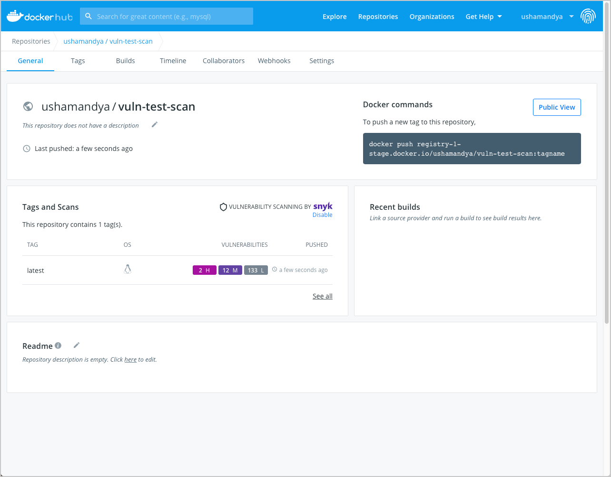
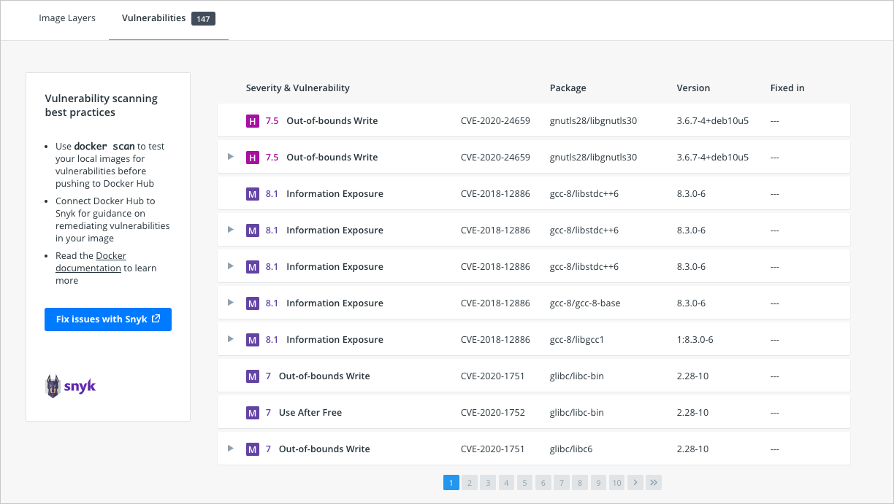



Docker Hub Vulnerability Scanning enables you to automatically scan Docker images for vulnerabilities using Snyk. This uses the same technology as the [docker scan](../engine/scan/index.md) command.

When you push an image to Docker Hub after enabling vulnerability scanning, Docker Hub automatically scans the image to identify vulnerabilities in your container images. Vulnerability Scanning allows developers and development teams to review the security state of the container images and take actions to fix issues identified during the scan, resulting in more secure deployments. The scan result includes the source of the vulnerability, such as OS packages and libraries, version in which it was introduced, and a recommended fixed version (if available) to remediate the vulnerabilities discovered.

## Scan images

Hub Vulnerability scanning allows repository owners and administrators of a Pro or a Team plan to enable and disable scanning.

In addition, repository owners in a Pro plan and team members in a Team plan can view the detailed scan reports. When scanning is enabled on a specific repository, anyone with push access can trigger a scan by pushing an image to Docker Hub.

> **Note**
>
> Docker Hub currently supports scanning images which are of AMD64 architecture, Linux OS, and are less than 10 GB in size.

### Enable vulnerability scanning

Repository owners and administrators can enable vulnerability scanning on a repository. If you are a member of a Team plan, ensure the repository you would like to enable scanning on is part of the Team plan.

To enable vulnerability scanning:

1. Log into your [Docker Hub](https://hub.docker.com){: target="_blank" rel="noopener" class="_"} account.
2. Click **Repositories** from the main menu and select a repository from the list.
3. By default, scanning is disabled for all repositories. You can enable scanning separately for each repository. Go to the **Settings** tab and click **Enable Image Scanning**.

### Scan an image for vulnerabilities

To scan an image for vulnerabilities, push the image to Docker Hub:

1. Ensure you have installed Docker locally. See [Get Docker](../get-docker.md) to download and install Docker on your local machine.
2. Use the command line to log into your Docker account. See [docker login](../engine/reference/commandline/login.md) for more information.
3. Tag the image that you’d like to scan. For example, to tag a Redis image, run:

    ```shell
    docker tag redis <your-Docker-ID>/<your-repo-name>:latest
    ```

4. Push the image to Docker Hub to trigger vulnerability scanning on the image:

    ```shell
    docker push <your-Docker-ID>/<your-repo-name>:latest
    ```

## View the vulnerability report

> **Scan report retention period**
>
> Docker retains the vulnerability scan report for one year. If you'd like a new, up-to-date vulnerability scan report after this period, you can rescan the image by pushing the image to Docker Hub.

To view the vulnerability report:

1. Go to [Docker Hub](https://hub.docker.com){: target="_blank" rel="noopener" class="_"} and open the repository to view a summary of the vulnerability scanning report.

    It can take a couple of minutes for the vulnerability report to appear in your repository.

    {:width="700px"}

2. Click on the **Tags** tab > **Digest** > **Vulnerabilities** to view the detailed scan report.

    The scan report displays vulnerabilities identified by the scan, sorting them according to their severity, with highest severity listed at the top. It displays information about the package that contains the vulnerability, the version in which it was introduced, and whether the vulnerability is fixed in a later version.

    {:width="700px"}

    > **Note**
    >
    > You can also click the ‘open in browser’ icon  on each row to view detailed information about the vulnerability on the Snyk website.

### Disable vulnerability scanning

Repository owners and administrators can disable vulnerability scanning on a repository. To disable scanning:

1. Log into your [Docker Hub](https://hub.docker.com){: target="_blank" rel="noopener" class="_"} account.
2. Click **Repositories** from the main menu and select a repository from the list.
3. Go to the **Settings** tab and click **Disable Image Scanning**.

### Inspect the vulnerabilities

The vulnerability report sorts vulnerabilities based on their severity. It displays information about the package that contains the vulnerability, the version in which it was introduced, and whether the vulnerability has been fixed in a later version.

The vulnerability scan report also allows development teams and security leads to compare the vulnerability counts across tags to see whether the vulnerabilities are decreasing or increasing over time.

### Fixing vulnerabilities

Once a list of vulnerabilities have been identified, there are a couple of actions you can take to remediate the vulnerabilities. For example, you can:

1. Specify an updated base image in the Dockerfile, check your application-level dependencies, rebuild the Docker image and then push the new image to Docker Hub.
2. Rebuild the Docker image, run an update command on the OS packages, and push a newer version of image to Docker Hub.
3. Edit the dockerfile to manually remove or update specific libraries that contain vulnerabilities, rebuild the image, and push the new image to Docker Hub

After you have followed the steps suggested above, browse the new vulnerability report to view the updated scan result.

## Feedback

Thank you for trying out the Hub Vulnerability Scanning feature. Your feedback is very important to us. Let us know your feedback by creating an issue in the [hub-feedback](https://github.com/docker/hub-feedback/issues){: target="_blank" rel="noopener" class="_"} GitHub repository.
