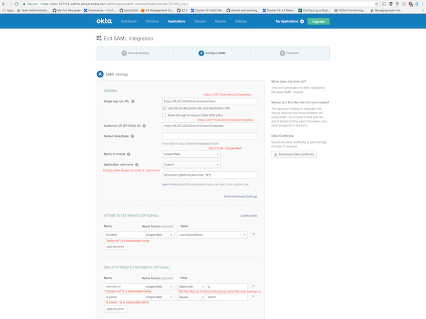
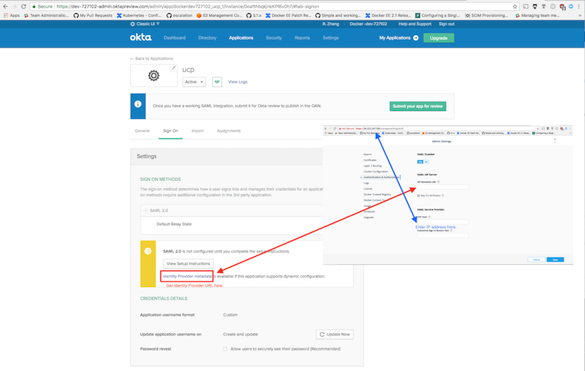
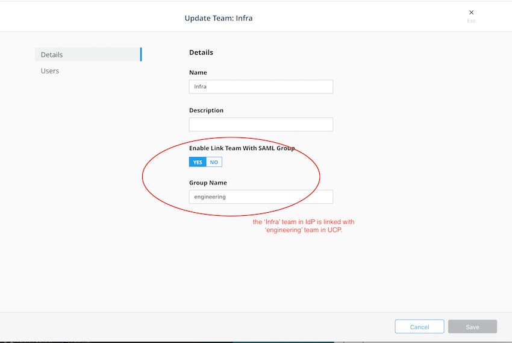

## SAML integration

Security Assertion Markup Language (SAML) is an open standard for exchanging authentication and authorization data between parties. The SAML integration process is described below.

1. Configure the Identity Provider (IdP).
2. Enable SAML and configure UCP as the Service Provider under **Admin Settings > Authentication and Authorization**.
3. Create (Edit) Teams to link with the Group memberships. This updates team membership information when a user signs in with SAML.

### Configure IdP
Service Provider metadata is available at `https://<SP Host>/enzi/v0/saml/metadata`
after SAML is enabled. The metadata link is also labeled as `entityID`.

> Note
>
> Only `POST` binding is supported for the 'Assertion Consumer Service', which is located
at `https://<SP Host>/enzi/v0/saml/acs`.

### Enable SAML and configure UCP
After UCP sends an `AuthnRequest` to the IdP, the following `Assertion` is expected:

- `Subject` includes a `NameID` that is identified as the username for UCP. In `AuthnRequest`, `NameIDFormat` is set to `urn:oasis:names:tc:SAML:1.1:nameid-format:unspecified`. This allows maximum compatibility for various Identity Providers.

```xml
<saml2:Subject>
    <saml2:NameID Format="urn:oasis:names:tc:SAML:1.1:nameid-format:unspecified">mobywhale</saml2:NameID>
    <saml2:SubjectConfirmation Method="urn:oasis:names:tc:SAML:2.0:cm:bearer">
        <saml2:SubjectConfirmationData NotOnOrAfter="2018-09-10T20:04:48.001Z" Recipient="https://18.237.224.122/enzi/v0/saml/acs"/>
    </saml2:SubjectConfirmation>
</saml2:Subject>
```
    
- An optional `Attribute` named `fullname` is mapped to the **Full Name** field in the UCP account.  

> Note
> 
> UCP uses the value of the first occurrence of an `Attribute` with `Name="fullname"` as the **Full Name**.
   
```xml
<saml2:Attribute Name="fullname" NameFormat="urn:oasis:names:tc:SAML:2.0:attrname-format:unspecified">
    <saml2:AttributeValue
        xmlns:xs="http://www.w3.org/2001/XMLSchema"
        xmlns:xsi="http://www.w3.org/2001/XMLSchema-instance" xsi:type="xs:string">user.displayName
    </saml2:AttributeValue>
</saml2:Attribute>
```

- An optional `Attribute` named `member-of` is linked to the UCP team. The values are set in the UCP interface. 

> Note
>
> UCP uses all `AttributeStatements` and `Attributes` in the `Assertion` with `Name="member-of"`.

```xml
<saml2:Attribute Name="member-of" NameFormat="urn:oasis:names:tc:SAML:2.0:attrname-format:unspecified">
    <saml2:AttributeValue
        xmlns:xs="http://www.w3.org/2001/XMLSchema"
        xmlns:xsi="http://www.w3.org/2001/XMLSchema-instance" xsi:type="xs:string">groupName
    </saml2:AttributeValue>
</saml2:Attribute>
```
- An optional `Attribute` with the name `is-admin` is used to identify if the user is an administrator.

> Note
> 
> When there is an `Attribute` with the name `is-admin`, the user is an administrator. The content in the `AttributeValue` is ignored.

```xml
<saml2:Attribute Name="is-admin" NameFormat="urn:oasis:names:tc:SAML:2.0:attrname-format:unspecified">
    <saml2:AttributeValue
        xmlns:xs="http://www.w3.org/2001/XMLSchema"
        xmlns:xsi="http://www.w3.org/2001/XMLSchema-instance" xsi:type="xs:string">value_doe_not_matter
    </saml2:AttributeValue>
</saml2:Attribute>
```

#### Okta configuration
The Okta configuration is shown in the following examples.




When two or more group names are expected to return with the Assertion, use the `regex` filter. For example, use the value `apple|orange` to return groups `apple` and `orange`.


### Service Provider configuration
Enter the Identity Provider's metadata URL to obtain its metadata. To access the URL, you may need to provide the CA certificate that can verify the remote server. 

### Link Group memberships with users
Use the 'edit' or 'create' team dialog to associate SAML group assertion with the UCP team to synchronize user team membership when the user logs in.


