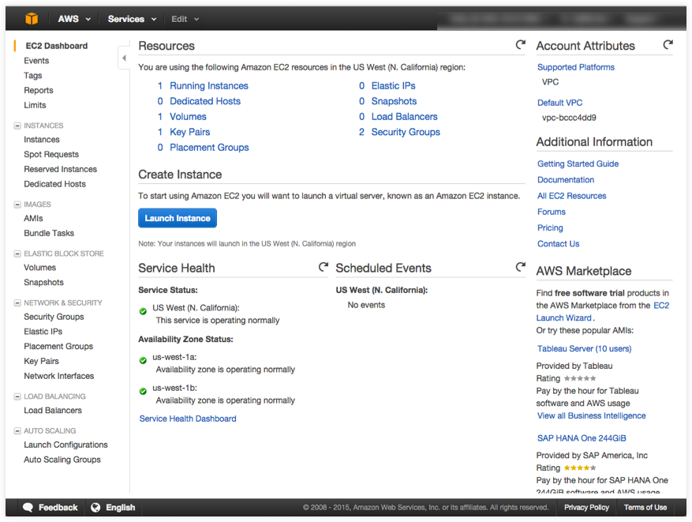
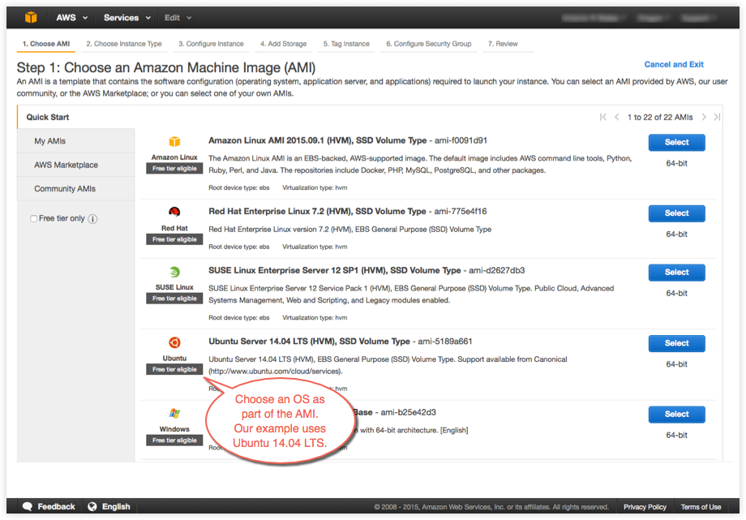
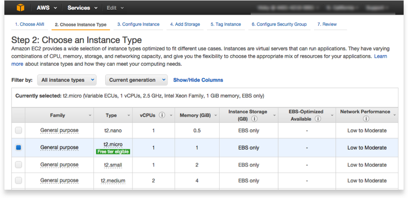
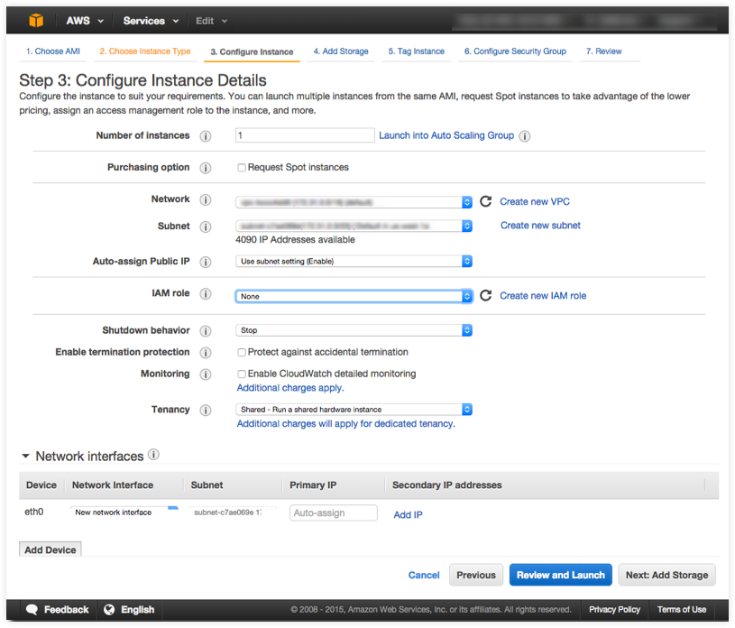

You can install Docker Engine directly to servers you have on cloud providers.  This example shows how to create an <a href="https://aws.amazon.com/" target="_blank"> Amazon Web Services (AWS)</a> EC2 instance, and install Docker Engine on it.

You can use this same general approach to create Dockerized hosts on other cloud providers.

### Step 1. Sign up for AWS

1. If you are not already an AWS user, sign up for <a href="https://aws.amazon.com/" target="_blank"> AWS</a> to create an account and get root access to EC2 cloud computers. If you have an Amazon account, you can use it as your root user account.

2. Create an IAM (Identity and Access Management) administrator user, an admin group, and a key pair associated with a region.

    From the AWS menus, select **Services** > **IAM** to get started.

    See the AWS documentation on <a href="http://docs.aws.amazon.com/AWSEC2/latest/UserGuide/get-set-up-for-amazon-ec2.html" target="_blank">Setting Up with Amazon EC2</a>. Follow the steps for "Create an IAM User" and "Create a Key Pair".

    If you are just getting started with AWS and EC2, you do not need to create a virtual private cloud (VPC) or specify a subnet. The newer EC2-VPC platform (accounts created after 2013-12-04) comes with a default VPC and subnet in each availability zone. When you launch an instance, it automatically uses the default VPC.

### Step 2. Configure and start an EC2 instance

Launch an instance to create a virtual machine (VM) with a specified operating system (OS) as follows.

  1. Log into AWS with your IAM credentials.

      On the AWS home page, click **EC2** to go to the dashboard, then click **Launch Instance**.

      

      AWS EC2 virtual servers are called *instances* in Amazon parlance. Once you set up an account, IAM user and key pair, you are ready to launch an instance. It is at this point that you select the OS for the VM.

  2. Choose an Amazon Machine Image (AMI) with the OS and applications you want. For this example, we select an Ubuntu server.

      

  3. Choose an instance type.

      

  4. Configure the instance.

    You can select the default network and subnet, which are inherently linked to a region and availability zone.

      

  5. Click **Review and Launch**.

  6. Select a key pair to use for this instance.

    When you choose to launch, you need to select a key pair to use. Save the `.pem` file to use in the next steps.

The instance is now up-and-running. The menu path to get back to your EC2 instance on AWS is: **EC2 (Virtual Servers in Cloud)** > **EC2 Dashboard** > **Resources** > **Running instances**.

To get help with your private key file, instance IP address, and how to log into the instance via SSH, click the **Connect** button at the top of the AWS instance dashboard.

### Step 3. Log in from a terminal, configure apt, and get packages

1. Log in to the EC2 instance from a command line terminal.

    Change directories into the directory containing the SSH key and run this command (or give the path to it as part of the command):

        $ ssh -i "YourKey" ubuntu@xx.xxx.xxx.xxx

    For our example:

        $ cd ~/Desktop/keys/amazon_ec2
        $ ssh -i "my-key-pair.pem" ubuntu@xx.xxx.xxx.xxx

    We'll follow the instructions for installing Docker on Ubuntu at https://docs.docker.com/engine/installation/ubuntulinux/. The next few steps reflect those instructions.

2. Check the kernel version to make sure it's 3.10 or higher.

        ubuntu@ip-xxx-xx-x-xxx:~$ uname -r
        3.13.0-48-generic

3. Add the new `gpg` key.

        ubuntu@ip-xxx-xx-x-xxx:~$ sudo apt-key adv --keyserver hkp://p80.pool.sks-keyservers.net:80 --recv-keys 58118E89F3A912897C070ADBF76221572C52609D
        Executing: gpg --ignore-time-conflict --no-options --no-default-keyring --homedir /tmp/tmp.jNZLKNnKte --no-auto-check-trustdb --trust-model always --keyring /etc/apt/trusted.gpg --primary-keyring /etc/apt/trusted.gpg --keyserver hkp://p80.pool.sks-keyservers.net:80 --recv-keys 58118E89F3A912897C070ADBF76221572C52609D
        gpg: requesting key 2C52609D from hkp server p80.pool.sks-keyservers.net
        gpg: key 2C52609D: public key "Docker Release Tool (releasedocker) <docker@docker.com>" imported
        gpg: Total number processed: 1
        gpg:               imported: 1  (RSA: 1)

4. Create a `docker.list` file, and add an entry for our OS, Ubuntu Trusty 14.04 (LTS).

        ubuntu@ip-xxx-xx-x-xxx:~$ sudo vi /etc/apt/sources.list.d/docker.list

    If we were updating an existing file, we'd delete any existing entries.

5. Update the `apt` package index.

        ubuntu@ip-xxx-xx-x-xxx:~$ sudo apt-get update

6. Purge the old repo if it exists.

    In our case the repo doesn't because this is a new VM, but let's run it anyway just to be sure.

        ubuntu@ip-xxx-xx-x-xxx:~$ sudo apt-get purge lxc-docker
        Reading package lists... Done
        Building dependency tree
        Reading state information... Done
        Package 'lxc-docker' is not installed, so not removed
        0 upgraded, 0 newly installed, 0 to remove and 139 not upgraded.

7.  Verify that `apt` is pulling from the correct repository.

        ubuntu@ip-172-31-0-151:~$ sudo apt-cache policy docker-engine
        docker-engine:
        Installed: (none)
        Candidate: 1.9.1-0~trusty
        Version table:
        1.9.1-0~trusty 0
        500 https://apt.dockerproject.org/repo/ ubuntu-trusty/main amd64 Packages
        1.9.0-0~trusty 0
        500 https://apt.dockerproject.org/repo/ ubuntu-trusty/main amd64 Packages
            . . .

    From now on when you run `apt-get upgrade`, `apt` pulls from the new repository.

### Step 4. Install recommended prerequisites for the OS

For Ubuntu Trusty (and some other versions), it’s recommended to install the `linux-image-extra` kernel package, which allows you use the `aufs` storage driver, so we'll do that now.

        ubuntu@ip-xxx-xx-x-xxx:~$ sudo apt-get update
        ubuntu@ip-172-31-0-151:~$ sudo apt-get install linux-image-extra-$(uname -r)

### Step 5. Install Docker Engine on the remote instance

1. Update the apt package index.

        ubuntu@ip-xxx-xx-x-xxx:~$ sudo apt-get update

2. Install Docker Engine.

        ubuntu@ip-xxx-xx-x-xxx:~$ sudo apt-get install docker-engine
        Reading package lists... Done
        Building dependency tree
        Reading state information... Done
        The following extra packages will be installed:
        aufs-tools cgroup-lite git git-man liberror-perl
        Suggested packages:
        git-daemon-run git-daemon-sysvinit git-doc git-el git-email git-gui gitk
        gitweb git-arch git-bzr git-cvs git-mediawiki git-svn
        The following NEW packages will be installed:
        aufs-tools cgroup-lite docker-engine git git-man liberror-perl
        0 upgraded, 6 newly installed, 0 to remove and 139 not upgraded.
        Need to get 11.0 MB of archives.
        After this operation, 60.3 MB of additional disk space will be used.
        Do you want to continue? [Y/n] y
        Get:1 http://us-west-1.ec2.archive.ubuntu.com/ubuntu/ trusty/universe aufs-tools amd64 1:3.2+20130722-1.1 [92.3 kB]
        Get:2 http://us-west-1.ec2.archive.ubuntu.com/ubuntu/ trusty/main liberror-perl all 0.17-1.1 [21.1 kB]
        . . .

3. Start the Docker daemon.

        ubuntu@ip-xxx-xx-x-xxx:~$ sudo service docker start

4. Verify Docker Engine is installed correctly by running `docker run hello-world`.

        ubuntu@ip-xxx-xx-x-xxx:~$ sudo docker run hello-world
        ubuntu@ip-172-31-0-151:~$ sudo docker run hello-world
        Unable to find image 'hello-world:latest' locally
        latest: Pulling from library/hello-world
        b901d36b6f2f: Pull complete
        0a6ba66e537a: Pull complete
        Digest: sha256:8be990ef2aeb16dbcb9271ddfe2610fa6658d13f6dfb8bc72074cc1ca36966a7
        Status: Downloaded newer image for hello-world:latest

        Hello from Docker.
        This message shows that your installation appears to be working correctly.

        To generate this message, Docker took the following steps:
        1. The Docker client contacted the Docker daemon.
        2. The Docker daemon pulled the "hello-world" image from the Docker Hub.
        3. The Docker daemon created a new container from that image which runs the executable that produces the output you are currently reading.
        4. The Docker daemon streamed that output to the Docker client, which sent it to your terminal.

        To try something more ambitious, you can run an Ubuntu container with:
        $ docker run -it ubuntu bash

        Share images, automate workflows, and more with a free Docker Hub account:
        https://hub.docker.com

        For more examples and ideas, visit:
        https://docs.docker.com/userguide/

## Where to go next

_Looking for a quicker way to do Docker cloud installs and provision multiple hosts?_ You can use [Docker Machine](/machine/overview/) to provision hosts.

  * [Use Docker Machine to provision hosts on cloud providers](/machine/get-started-cloud/)

  * [Docker Machine driver reference](/machine/drivers/)

*  [Install Docker Engine](../index.md)

* [Docker User Guide](../../userguide/intro.md)
