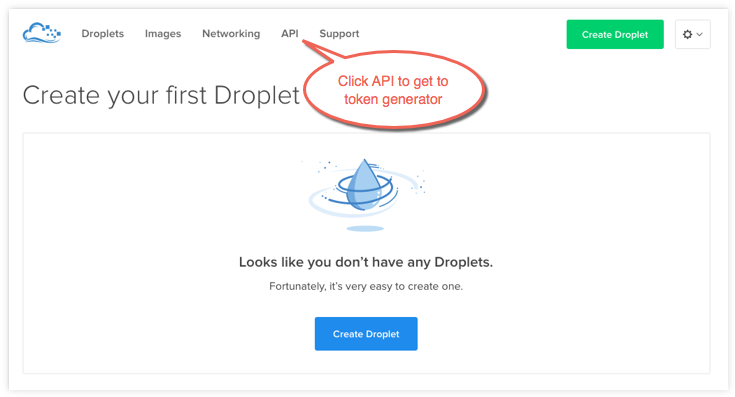
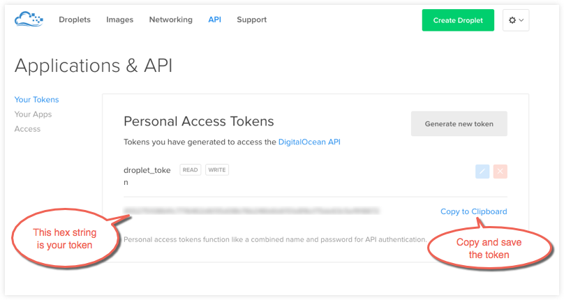

# Example: Use Docker Machine to provision cloud hosts

Docker Machine driver plugins are available for many cloud platforms, so you can use Machine to provision cloud hosts. When you use Docker Machine for provisioning, you create cloud hosts with Docker Engine installed on them.

You'll need to install and run Docker Machine, and create an account with the cloud provider.

Then you provide account verification, security credentials, and configuration options for the providers as flags to `docker-machine create`. The flags are unique for each cloud-specific driver.  For instance, to pass a Digital Ocean access token, you use the `--digitalocean-access-token` flag.

As an example, let's take a look at how to create a Dockerized <a href="https://digitalocean.com" target="_blank">Digital Ocean</a> _Droplet_ (cloud server).

### Step 1. Create a Digital Ocean account and log in

If you have not done so already, go to <a href="https://digitalocean.com" target="_blank">Digital Ocean</a>, create an account, and log in.

### Step 2. Generate a personal access token

To generate your access token:

  1. Go to the Digital Ocean administrator console and click **API** in the header.

    

  2. Click **Generate New Token** to get to the token generator.

    

  3. Give the token a clever name (e.g. "machine"), make sure the **Write (Optional)** checkbox is checked, and click **Generate Token**.

    

  4. Grab (copy to clipboard) the generated big long hex string and store it somewhere safe.

    

    This is the personal access token you'll use in the next step to create your cloud server.

### Step 3. Install Docker Machine

1. If you have not done so already, install Docker Machine on your local host.

  * <a href="https://docs.docker.com/engine/installation/mac/" target="_blank"> How to install Docker Machine on Mac OS X</a>

  * <a href="https://docs.docker.com/engine/installation/windows/" target="_blank">How to install Docker Machine on Windows</a>

  * <a href="https://docs.docker.com/machine/install-machine/" target="_blank">Install Docker Machine directly</a> (e.g., on Linux)

2. At a command terminal, use `docker-machine ls` to get a list of Docker Machines and their status.

        $ docker-machine ls
        NAME      ACTIVE   DRIVER       STATE     URL                         SWARM
        default   *        virtualbox   Running   tcp:////xxx.xxx.xx.xxx:xxxx  

6. Run some Docker commands to make sure that Docker Engine is also up-and-running.

    We'll run `docker run hello-world` again, but you could try `docker ps`,  `docker run docker/whalesay cowsay boo`, or another command to verify that Docker is running.

        $ docker run hello-world

        Hello from Docker.
        This message shows that your installation appears to be working correctly.
        ...

### Step 4. Use Machine to Create the Droplet

1. Run `docker-machine create` with the `digitalocean` driver and pass your key to the `--digitalocean-access-token` flag, along with a name for the new cloud server.

    For this example, we'll call our new Droplet "docker-sandbox".

        $ docker-machine create --driver digitalocean --digitalocean-access-token xxxxx docker-sandbox
        Running pre-create checks...
        Creating machine...
        (docker-sandbox) OUT | Creating SSH key...
        (docker-sandbox) OUT | Creating Digital Ocean droplet...
        (docker-sandbox) OUT | Waiting for IP address to be assigned to the Droplet...
        Waiting for machine to be running, this may take a few minutes...
        Machine is running, waiting for SSH to be available...
        Detecting operating system of created instance...
        Detecting the provisioner...
        Provisioning created instance...
        Copying certs to the local machine directory...
        Copying certs to the remote machine...
        Setting Docker configuration on the remote daemon...
        To see how to connect Docker to this machine, run: docker-machine env docker-sandbox

      When the Droplet is created, Docker generates a unique SSH key and stores it on your local system in `~/.docker/machines`. Initially, this is used to provision the host. Later, it's used under the hood to access the Droplet directly with the `docker-machine ssh` command. Docker Engine is installed on the cloud server and the daemon is configured to accept remote connections over TCP using TLS for authentication.

2. Go to the Digital Ocean console to view the new Droplet.

    

3. At the command terminal, run `docker-machine ls`.

        $ docker-machine ls
        NAME             ACTIVE   DRIVER         STATE     URL                         SWARM
        default          *        virtualbox     Running   tcp://192.168.99.100:2376   
        docker-sandbox   -        digitalocean   Running   tcp://45.55.139.48:2376     

    Notice that the new cloud server is running but is not the active host. Our command shell is still connected to the default machine, which is currently the active host as indicated by the asterisk (*).

4. Run `docker-machine env docker-sandbox` to get the environment commands for the new remote host, then run `eval` as directed to re-configure the shell to connect to `docker-sandbox`.

        $ docker-machine env docker-sandbox
        export DOCKER_TLS_VERIFY="1"
        export DOCKER_HOST="tcp://45.55.222.72:2376"
        export DOCKER_CERT_PATH="/Users/victoriabialas/.docker/machine/machines/docker-sandbox"
        export DOCKER_MACHINE_NAME="docker-sandbox"
        # Run this command to configure your shell:
        # eval "$(docker-machine env docker-sandbox)"

        $ eval "$(docker-machine env docker-sandbox)"

5. Re-run `docker-machine ls` to verify that our new server is the active machine, as indicated by the asterisk (*) in the ACTIVE column.

        $ docker-machine ls
        NAME             ACTIVE   DRIVER         STATE     URL                         SWARM
        default          -        virtualbox     Running   tcp://192.168.99.100:2376   
        docker-sandbox   *        digitalocean   Running   tcp://45.55.222.72:2376     

6. Run some `docker-machine` commands to inspect the remote host. For example, `docker-machine ip <machine>` gets the host IP address and `docker-machine inspect <machine>` lists all the details.

        $ docker-machine ip docker-sandbox
        104.131.43.236

        $ docker-machine inspect docker-sandbox
        {
            "ConfigVersion": 3,
            "Driver": {
            "IPAddress": "104.131.43.236",
            "MachineName": "docker-sandbox",
            "SSHUser": "root",
            "SSHPort": 22,
            "SSHKeyPath": "/Users/samanthastevens/.docker/machine/machines/docker-sandbox/id_rsa",
            "StorePath": "/Users/samanthastevens/.docker/machine",
            "SwarmMaster": false,
            "SwarmHost": "tcp://0.0.0.0:3376",
            "SwarmDiscovery": "",
            ...

7. Verify Docker Engine is installed correctly by running `docker` commands.

    Start with something basic like `docker run hello-world`, or for a more interesting test, run a Dockerized webserver on your new remote machine.

    In this example, the `-p` option is used to expose port 80 from the `nginx` container and make it accessible on port `8000` of the `docker-sandbox` host.

        $ docker run -d -p 8000:80 --name webserver kitematic/hello-world-nginx
        Unable to find image 'kitematic/hello-world-nginx:latest' locally
        latest: Pulling from kitematic/hello-world-nginx
        a285d7f063ea: Pull complete
        2d7baf27389b: Pull complete
        ...
        Digest: sha256:ec0ca6dcb034916784c988b4f2432716e2e92b995ac606e080c7a54b52b87066
        Status: Downloaded newer image for kitematic/hello-world-nginx:latest
        942dfb4a0eaae75bf26c9785ade4ff47ceb2ec2a152be82b9d7960e8b5777e65

    In a web browser, go to `http://<host_ip>:8000` to bring up the webserver home page. You got the `<host_ip>` from the output of the `docker-machine ip <machine>` command you ran in a previous step. Use the port you exposed in the `docker run` command.

    

#### Understand the defaults and options on the create command

For convenience, `docker-machine` will use sensible defaults for choosing settings such as the image that the server is based on, but you override the defaults using the respective flags (e.g. `--digitalocean-image`). This is useful if, for example, you want to create a cloud server with a lot of memory and CPUs (by default `docker-machine` creates a small server). For a full list of the flags/settings available and their defaults, see the output of `docker-machine create -h` at the command line. See also <a href="https://docs.docker.com/machine/drivers/os-base/" target="_blank">Driver options and operating system defaults</a> and information about the <a href="https://docs.docker.com/machine/reference/create/" target="_blank">create</a> command in the Docker Machine documentation.

### Step 5. Use Machine to remove the Droplet

To remove a host and all of its containers and images, first stop the machine, then use `docker-machine rm`:

    $ docker-machine stop docker-sandbox
    $ docker-machine rm docker-sandbox
    Do you really want to remove "docker-sandbox"? (y/n): y
    Successfully removed docker-sandbox

    $ docker-machine ls
    NAME      ACTIVE   DRIVER       STATE     URL                         SWARM
    default   *        virtualbox   Running   tcp:////xxx.xxx.xx.xxx:xxxx

If you monitor the Digital Ocean console while you run these commands, you will see it update first to reflect that the Droplet was stopped, and then removed.

If you create a host with Docker Machine, but remove it through the cloud provider console, Machine will lose track of the server status. So please use the `docker-machine rm` command for hosts you create with `docker-machine --create`.

## Where to go next

* [Docker Machine driver reference](https://docs.docker.com/machine/drivers/)

* [Docker Machine Overview](https://docs.docker.com/machine/overview/)

* [Use Docker Machine to provision hosts on cloud providers](https://docs.docker.com/machine/get-started-cloud/)

*  [Install Docker Engine](../../installation/index.md)

* [Docker User Guide](../../userguide/intro.md)
