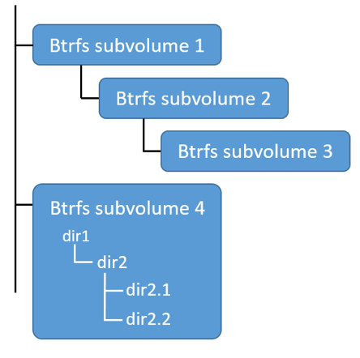
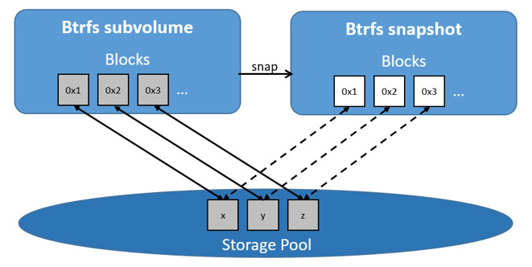
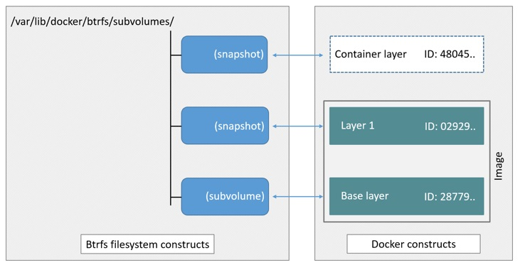
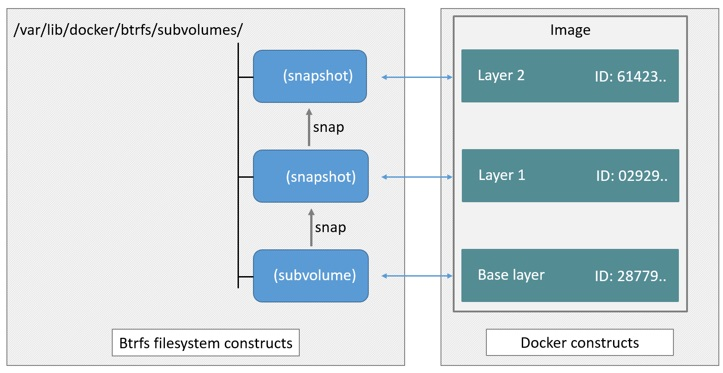

# Docker and Btrfs in practice

Btrfs is a next generation copy-on-write filesystem that supports many advanced
storage technologies that make it a good fit for Docker. Btrfs is included in
the mainline Linux kernel and its on-disk-format is now considered stable.
However, many of its features are still under heavy development and users 
should consider it a fast-moving target.

Docker's `btrfs` storage driver leverages many Btrfs features for image and
container management. Among these features are thin provisioning, 
copy-on-write, and snapshotting.

This article refers to Docker's Btrfs storage driver as `btrfs` and the overall
 Btrfs Filesystem as Btrfs.

>**Note**: The [Commercially Supported Docker Engine (CS-Engine)](https://www.docker.com/compatibility-maintenance) does not currently support the `btrfs` storage driver.

## The future of Btrfs

Btrfs has been long hailed as the future of Linux filesystems. With full 
support in the mainline Linux kernel, a stable on-disk-format, and active 
development with a focus on stability, this is now becoming more of a reality.

As far as Docker on the Linux platform goes, many people see the `btrfs` 
storage driver as a potential long-term replacement for the `devicemapper` 
storage driver. However, at the time of writing, the `devicemapper` storage 
driver should be considered safer, more stable, and more *production ready*. 
You should only consider the `btrfs` driver for production deployments if you 
understand it well and have existing experience with Btrfs.

## Image layering and sharing with Btrfs

Docker leverages Btrfs *subvolumes* and *snapshots* for managing the on-disk 
components of image and container layers.  Btrfs subvolumes look and feel like 
a normal Unix filesystem. As such, they can have their own internal directory 
structure that hooks into the wider Unix filesystem.

Subvolumes are natively copy-on-write and have space allocated to them 
on-demand from an underlying storage pool. They can also be nested and snapped.
 The diagram blow shows 4 subvolumes. 'Subvolume 2' and 'Subvolume 3' are 
nested, whereas 'Subvolume 4' shows its own internal directory tree.

Snapshots are a point-in-time read-write copy of an entire subvolume. They 
exist directly below the subvolume they were created from. You can create 
snapshots of snapshots as shown in the diagram below.

Btfs allocates space to subvolumes and snapshots on demand from an underlying 
pool of storage. The unit of allocation is referred to as a *chunk*, and 
*chunks* are normally ~1GB in size.

Snapshots are first-class citizens in a Btrfs filesystem. This means that they 
look, feel, and operate just like regular subvolumes. The technology required 
to create them is built directly into the Btrfs filesystem thanks to its 
native copy-on-write design. This means that Btrfs snapshots are space 
efficient with little or no performance overhead. The diagram below shows a 
subvolume and its snapshot sharing the same data.

Docker's `btrfs` storage driver stores every image layer and container in its 
own Btrfs subvolume or snapshot. The base layer of an image is stored as a 
subvolume whereas child image layers and containers are stored as snapshots. 
This is shown in the diagram below.

The high level process for creating images and containers on Docker hosts 
running the `btrfs` driver is as follows:

1. The image's base layer is stored in a Btrfs *subvolume* under
`/var/lib/docker/btrfs/subvolumes`.

2. Subsequent image layers are stored as a Btrfs *snapshot* of the parent 
layer's subvolume or snapshot.

    The diagram below shows a three-layer image. The base layer is a subvolume.
 Layer 1 is a snapshot of the base layer's subvolume. Layer 2 is a snapshot of 
Layer 1's snapshot.

    

As of Docker 1.10, image layer IDs no longer correspond to directory names 
under `/var/lib/docker/`.

## Image and container on-disk constructs

Image layers and containers are visible in the Docker host's filesystem at
`/var/lib/docker/btrfs/subvolumes/`. However, as previously stated, directory 
names no longer correspond to image layer IDs. That said, directories for
containers are present even for containers with a stopped status. This is
because the `btrfs` storage driver mounts a default, top-level subvolume at
`/var/lib/docker/subvolumes`. All other subvolumes and snapshots exist below
that as Btrfs filesystem objects and not as individual mounts.

Because Btrfs works at the filesystem level and not the block level, each image
and container layer can be browsed in the filesystem using normal Unix 
commands. The example below shows a truncated output of an `ls -l` command an 
image layer:

    $ ls -l /var/lib/docker/btrfs/subvolumes/0a17decee4139b0de68478f149cc16346f5e711c5ae3bb969895f22dd6723751/

    total 0
    drwxr-xr-x 1 root root 1372 Oct  9 08:39 bin
    drwxr-xr-x 1 root root    0 Apr 10  2014 boot
    drwxr-xr-x 1 root root  882 Oct  9 08:38 dev
    drwxr-xr-x 1 root root 2040 Oct 12 17:27 etc
    drwxr-xr-x 1 root root    0 Apr 10  2014 home
    ...output truncated...

## Container reads and writes with Btrfs

A container is a space-efficient snapshot of an image. Metadata in the snapshot
points to the actual data blocks in the storage pool. This is the same as with 
a subvolume. Therefore, reads performed against a snapshot are essentially the
same as reads performed against a subvolume. As a result, no performance
overhead is incurred from the Btrfs driver.

Writing a new file to a container invokes an allocate-on-demand operation to
allocate new data block to the container's snapshot. The file is then written to
this new space. The allocate-on-demand operation is native to all writes with
Btrfs and is the same as writing new data to a subvolume. As a result, writing
new files to a container's snapshot operate at native Btrfs speeds.

Updating an existing file in a container causes a copy-on-write operation
(technically *redirect-on-write*). The driver leaves the original data and
allocates new space to the snapshot. The updated data is written to this new
space. Then, the driver updates the filesystem metadata in the snapshot to 
point to this new data. The original data is preserved in-place for subvolumes 
and snapshots further up the tree. This behavior is native to copy-on-write
filesystems like Btrfs and incurs very little overhead.

With Btfs, writing and updating lots of small files can result in slow 
performance. More on this later.

## Configuring Docker with Btrfs

The `btrfs` storage driver only operates on a Docker host where 
`/var/lib/docker` is mounted as a Btrfs filesystem. The following procedure 
shows  how to configure Btrfs on Ubuntu 14.04 LTS.

### Prerequisites

If you have already used the Docker daemon on your Docker host and have images 
you want to keep, `push` them to Docker Hub or your private Docker Trusted 
Registry before attempting this procedure.

Stop the Docker daemon. Then, ensure that you have a spare block device at 
`/dev/xvdb`. The device identifier may be different in your environment and you
 should substitute your own values throughout the procedure.

The procedure also assumes your kernel has the appropriate Btrfs modules 
loaded. To verify this, use the following command:

    $ cat /proc/filesystems | grep btrfs

### Configure Btrfs on Ubuntu 14.04 LTS

Assuming your system meets the prerequisites, do the following:

1. Install the "btrfs-tools" package.

        $ sudo apt-get install btrfs-tools

        Reading package lists... Done
        Building dependency tree
        <output truncated>

2. Create the Btrfs storage pool.

    Btrfs storage pools are created with the `mkfs.btrfs` command. Passing 
multiple devices to the `mkfs.btrfs` command creates a pool across all of those
 devices. Here you create a pool with a single device at `/dev/xvdb`.

        $ sudo mkfs.btrfs -f /dev/xvdb

        WARNING! - Btrfs v3.12 IS EXPERIMENTAL
        WARNING! - see http://btrfs.wiki.kernel.org before using

        Turning ON incompat feature 'extref': increased hardlink limit per file to 65536
        fs created label (null) on /dev/xvdb
            nodesize 16384 leafsize 16384 sectorsize 4096 size 4.00GiB
        Btrfs v3.12

    Be sure to substitute `/dev/xvdb` with the appropriate device(s) on your
    system.

    > **Warning**: Take note of the warning about Btrfs being experimental. As
    noted earlier, Btrfs is not currently recommended for production deployments
    unless you already have extensive experience.

3. If it does not already exist, create a directory for the Docker host's local
 storage area at `/var/lib/docker`.

        $ sudo mkdir /var/lib/docker

4. Configure the system to automatically mount the Btrfs filesystem each time the system boots.

    a. Obtain the Btrfs filesystem's UUID.

        $ sudo blkid /dev/xvdb

        /dev/xvdb: UUID="a0ed851e-158b-4120-8416-c9b072c8cf47" UUID_SUB="c3927a64-4454-4eef-95c2-a7d44ac0cf27" TYPE="btrfs"

    b. Create an `/etc/fstab` entry to automatically mount `/var/lib/docker` 
each time the system boots. Either of the following lines will work, just 
remember to substitute the UUID value with the value obtained from the previous
 command.

        /dev/xvdb /var/lib/docker btrfs defaults 0 0
        UUID="a0ed851e-158b-4120-8416-c9b072c8cf47" /var/lib/docker btrfs defaults 0 0

5. Mount the new filesystem and verify the operation.

        $ sudo mount -a

        $ mount

        /dev/xvda1 on / type ext4 (rw,discard)
        <output truncated>
        /dev/xvdb on /var/lib/docker type btrfs (rw)

    The last line in the output above shows the `/dev/xvdb` mounted at 
`/var/lib/docker` as Btrfs.

Now that you have a Btrfs filesystem mounted at `/var/lib/docker`, the daemon 
should automatically load with the `btrfs` storage driver.

1. Start the Docker daemon.

        $ sudo service docker start

        docker start/running, process 2315

    The procedure for starting the Docker daemon may differ depending on the
    Linux distribution you are using.

    You can force the Docker daemon to start with the `btrfs` storage 
driver by either passing the `--storage-driver=btrfs` flag to the `docker 
daemon` at startup, or adding it to the `DOCKER_OPTS` line to the Docker config
 file.

2. Verify the storage driver with the `docker info` command.

        $ sudo docker info

        Containers: 0
        Images: 0
        Storage Driver: btrfs
        [...]

Your Docker host is now configured to use the `btrfs` storage driver.

## Btrfs and Docker performance

There are several factors that influence Docker's performance under the `btrfs`
 storage driver.

- **Page caching**. Btrfs does not support page cache sharing. This means that 
*n* containers accessing the same file require *n* copies to be cached. As a 
result, the `btrfs` driver may not be the best choice for PaaS and other high 
density container use cases.

- **Small writes**. Containers performing lots of small writes (including 
Docker hosts that start and stop many containers) can lead to poor use of Btrfs
 chunks. This can ultimately lead to out-of-space conditions on your Docker 
host and stop it working. This is currently a major drawback to using current 
versions of Btrfs.

    If you use the `btrfs` storage driver, closely monitor the free space on 
your Btrfs filesystem using the `btrfs filesys show` command. Do not trust the 
output of normal Unix commands such as `df`; always use the Btrfs native 
commands.

- **Sequential writes**. Btrfs writes data to disk via journaling technique. 
This can impact sequential writes, where performance can be up to half.

- **Fragmentation**. Fragmentation is a natural byproduct of copy-on-write 
filesystems like Btrfs. Many small random writes can compound this issue. It 
can manifest as CPU spikes on Docker hosts using SSD media and head thrashing 
on Docker hosts using spinning media. Both of these result in poor performance.

    Recent versions of Btrfs allow you to specify `autodefrag` as a mount 
option. This mode attempts to detect random writes and defragment them. You 
should perform your own tests before enabling this option on your Docker hosts.
 Some tests have shown this option has a negative performance impact on Docker 
hosts performing lots of small writes (including systems that start and stop 
many containers).

- **Solid State Devices (SSD)**. Btrfs has native optimizations for SSD media. 
To enable these, mount with the `-o ssd` mount option. These optimizations 
include enhanced SSD write performance by avoiding things like *seek 
optimizations* that have no use on SSD media.

    Btfs also supports the TRIM/Discard primitives. However, mounting with the 
`-o discard` mount option can cause performance issues. Therefore, it is 
recommended you perform your own tests before using this option.

- **Use Data Volumes**. Data volumes provide the best and most predictable 
performance. This is because they bypass the storage driver and do not incur 
any of the potential overheads introduced by thin provisioning and 
copy-on-write. For this reason, you should place heavy write workloads on data 
volumes.

## Related Information

* [Understand images, containers, and storage drivers](imagesandcontainers.md)
* [Select a storage driver](selectadriver.md)
* [AUFS storage driver in practice](aufs-driver.md)
* [Device Mapper storage driver in practice](device-mapper-driver.md)
