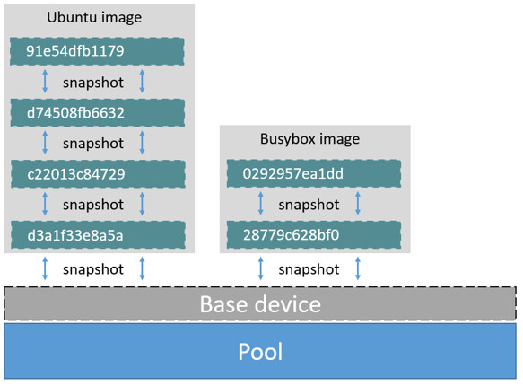
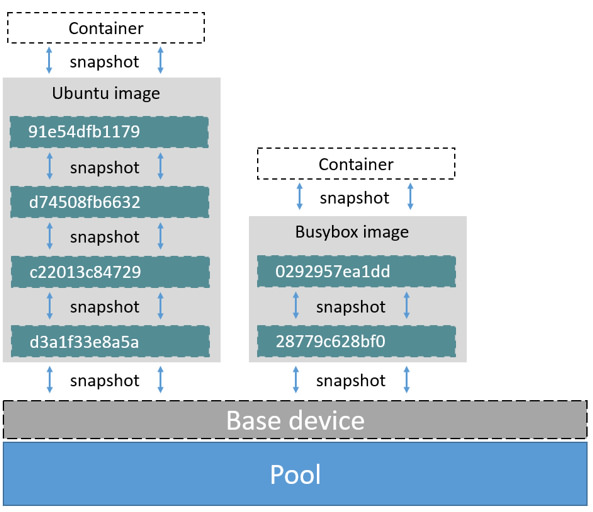
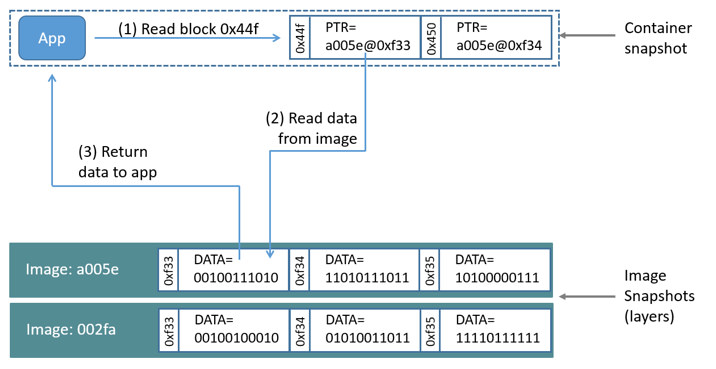
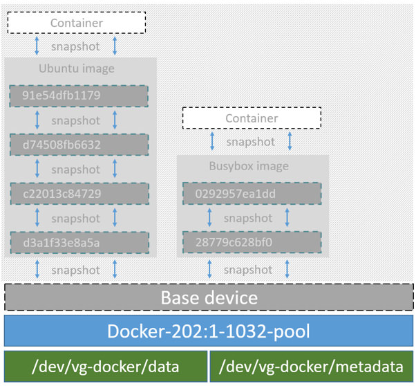

Device Mapper is a kernel-based framework that underpins many advanced
volume management technologies on Linux. Docker's `devicemapper` storage driver
leverages the thin provisioning and snapshotting capabilities of this framework
for image and container management. This article refers to the Device Mapper
storage driver as `devicemapper`, and the kernel framework as `Device Mapper`.

>**Note**: The [Commercially Supported Docker Engine (CS-Engine) running on RHEL
and CentOS Linux](https://www.docker.com/compatibility-maintenance) requires
that you use the `devicemapper` storage driver.

## An alternative to AUFS

Docker originally ran on Ubuntu and Debian Linux and used AUFS for its storage
backend. As Docker became popular, many of the companies that wanted to use it
were using Red Hat Enterprise Linux (RHEL). Unfortunately, because the upstream
mainline Linux kernel did not include AUFS, RHEL did not use AUFS either.

To correct this Red Hat developers investigated getting AUFS into the mainline
kernel. Ultimately, though, they decided a better idea was to develop a new
storage backend. Moreover, they would base this new storage backend on existing
`Device Mapper` technology.

Red Hat collaborated with Docker Inc. to contribute this new driver. As a result
of this collaboration, Docker's Engine was re-engineered to make the storage
backend pluggable. So it was that the `devicemapper` became the second storage
driver Docker supported.

Device Mapper has been included in the mainline Linux kernel since version
2.6.9. It is a core part of RHEL family of Linux distributions. This means that
the `devicemapper` storage driver is based on stable code that has a lot of
real-world production deployments and strong community support.


## Image layering and sharing

The `devicemapper` driver stores every image and container on its own virtual
device. These devices are thin-provisioned copy-on-write snapshot devices.
Device Mapper technology works at the block level rather than the file level.
This means that `devicemapper` storage driver's thin provisioning and
copy-on-write operations work with blocks rather than entire files.

>**Note**: Snapshots are also referred to as *thin devices* or *virtual
>devices*. They all mean the same thing in the context of the `devicemapper`
>storage driver.

With `devicemapper` the high level process for creating images is as follows:

1. The `devicemapper` storage driver creates a thin pool.

	The pool is created from block devices or loop mounted sparse files (more
	on this later).

2. Next it creates a *base device*.

	A base device is a thin device with a filesystem. You can see which
	filesystem is in use by running the `docker info` command and checking the
	`Backing filesystem` value.

3. Each new image (and image layer) is a snapshot of this base device.

	These are thin provisioned copy-on-write snapshots. This means that they
	are initially empty and only consume space from the pool when data is written
	to them.

With `devicemapper`, container layers are snapshots of the image they are
created from. Just as with images, container snapshots are thin provisioned
copy-on-write snapshots. The container snapshot stores all updates to the
container. The `devicemapper` allocates space to them on-demand from the pool
as and when data is written to the container.

The high level diagram below shows a thin pool with a base device and two
images.



If you look closely at the diagram you'll see that it's snapshots all the way
down. Each image layer is a snapshot of the layer below it. The lowest layer of
 each image is a snapshot of the base device that exists in the pool. This
base device is a `Device Mapper` artifact and not a Docker image layer.

A container is a snapshot of the image it is created from. The diagram below
shows two containers - one based on the Ubuntu image and the other based on the
 Busybox image.




## Reads with the devicemapper

Let's look at how reads and writes occur using the `devicemapper` storage
driver. The diagram below shows the high level process for reading a single
block (`0x44f`) in an example container.



1.  An application makes a read request for block `0x44f` in the container.

    Because the container is a thin snapshot of an image it does not have the
    data. Instead, it has a pointer (PTR) to where the data is stored in the image
    snapshot lower down in the image stack.

2.  The storage driver follows the pointer to block `0xf33` in the snapshot
    relating to image layer `a005...`.

3.  The `devicemapper` copies the contents of block `0xf33` from the image
    snapshot to memory in the container.

4.  The storage driver returns the data to the requesting application.

## Write examples

With the `devicemapper` driver, writing new data to a container is accomplished
by an *allocate-on-demand* operation. Updating existing data uses a
copy-on-write operation. Because Device Mapper is a block-based technology
these operations occur at the block level.

For example, when making a small change to a large file in a container, the
`devicemapper` storage driver does not copy the entire file. It only copies the
blocks to be modified. Each block is 64KB.

### Writing new data

To write 56KB of new data to a container:

1.  An application makes a request to write 56KB of new data to the container.

2.  The allocate-on-demand operation allocates a single new 64KB block to the
    container's snapshot.

    If the write operation is larger than 64KB, multiple new blocks are
    allocated to the container's snapshot.

3.  The data is written to the newly allocated block.

### Overwriting existing data

To modify existing data for the first time:

1.  An application makes a request to modify some data in the container.

2.  A copy-on-write operation locates the blocks that need updating.

3.  The operation allocates new empty blocks to the container snapshot and
    copies the data into those blocks.

4.  The modified data is written into the newly allocated blocks.

The application in the container is unaware of any of these
allocate-on-demand and copy-on-write operations. However, they may add latency
to the application's read and write operations.

## Configure Docker with devicemapper

The `devicemapper` is the default Docker storage driver on some Linux
distributions. This includes RHEL and most of its forks. Currently, the
following distributions support the driver:

* RHEL/CentOS/Fedora
* Ubuntu 12.04
* Ubuntu 14.04
* Debian
* Arch Linux

Docker hosts running the `devicemapper` storage driver default to a
configuration mode known as `loop-lvm`. This mode uses sparse files to build
the thin pool used by image and container snapshots. The mode is designed to
work out-of-the-box with no additional configuration. However, production
deployments should not run under `loop-lvm` mode.

You can detect the mode by viewing the `docker info` command:

```bash
$ sudo docker info

Containers: 0
Images: 0
Storage Driver: devicemapper
 Pool Name: docker-202:2-25220302-pool
 Pool Blocksize: 65.54 kB
 Backing Filesystem: xfs
 [...]
 Data loop file: /var/lib/docker/devicemapper/devicemapper/data
 Metadata loop file: /var/lib/docker/devicemapper/devicemapper/metadata
 Library Version: 1.02.93-RHEL7 (2015-01-28)
 [...]
```

The output above shows a Docker host running with the `devicemapper` storage
driver operating in `loop-lvm` mode. This is indicated by the fact that the
`Data loop file` and a `Metadata loop file` are on files under
`/var/lib/docker/devicemapper/devicemapper`. These are loopback mounted sparse
files.

### Configure direct-lvm mode for production

The preferred configuration for production deployments is `direct-lvm`. This
mode uses block devices to create the thin pool. The following procedure shows
you how to configure a Docker host to use the `devicemapper` storage driver in
a `direct-lvm` configuration.

> **Caution:** If you have already run the Docker daemon on your Docker host
> and have images you want to keep, `push` them to Docker Hub or your private
> Docker Trusted Registry before attempting this procedure.

The procedure below will create a logical volume configured as a thin pool to
use as backing for the storage pool. It assumes that you have a spare block
device at `/dev/xvdf` with enough free space to complete the task. The device
identifier and volume sizes may be different in your environment and you
should substitute your own values throughout the procedure. The procedure also
assumes that the Docker daemon is in the `stopped` state.

1.  Log in to the Docker host you want to configure and stop the Docker daemon.

2.  Install the LVM2 and `thin-provisioning-tools` packages.

    The LVM2 package includes the userspace toolset that provides logical volume
    management facilities on linux.

    The `thin-provisioning-tools` package allows you to activate and manage your
    pool.
    
    ```bash
    $ sudo yum install -y lvm2
    ```

3.  Create a physical volume replacing `/dev/xvdf` with your block device.

    ```bash
    $ pvcreate /dev/xvdf
    ```

4.  Create a `docker` volume group.

    ```bash
    $ vgcreate docker /dev/xvdf
    ```

5.  Create a logical volume named `thinpool` and `thinpoolmeta`.

    In this example, the data logical is 95% of the 'docker' volume group size.
    Leaving this free space allows for auto expanding of either the data or
    metadata if space runs low as a temporary stopgap.

    ```bash
    $ lvcreate --wipesignatures y -n thinpool docker -l 95%VG
    $ lvcreate --wipesignatures y -n thinpoolmeta docker -l 1%VG
    ```

6.  Convert the pool to a thin pool.

    ```bash
    $ lvconvert -y --zero n -c 512K --thinpool docker/thinpool --poolmetadata docker/thinpoolmeta
    ```

7.  Configure autoextension of thin pools via an `lvm` profile.

    ```bash
    $ vi /etc/lvm/profile/docker-thinpool.profile
    ```

8.  Specify `thin_pool_autoextend_threshold` value.

    The value should be the percentage of space used before `lvm` attempts
    to autoextend the available space (100 = disabled).

    ```none
    thin_pool_autoextend_threshold = 80
    ```

9.  Modify the `thin_pool_autoextend_percent` for when thin pool autoextension occurs.

    The value's setting is the percentage of space to increase the thin pool (100 =
    disabled)

    ```none
    thin_pool_autoextend_percent = 20
    ```

10. Check your work, your `docker-thinpool.profile` file should appear similar to the following:

    An example `/etc/lvm/profile/docker-thinpool.profile` file:

    ```none
    activation {
	thin_pool_autoextend_threshold=80
	thin_pool_autoextend_percent=20
    }
    ```

11. Apply your new lvm profile

    ```bash
    $ lvchange --metadataprofile docker-thinpool docker/thinpool
    ```

12. Verify the `lv` is monitored.

    ```bash
    $ lvs -o+seg_monitor
    ```

13. If the Docker daemon was previously started, move your existing graph driver
    directory out of the way.

    Moving the graph driver removes any images, containers, and volumes in your
    Docker installation. These commands move the contents of the
    `/var/lib/docker` directory to a new directory named `/var/lib/docker.bk`.
    If any of the following steps fail and you need to restore, you can remove
    `/var/lib/docker` and replace it with `/var/lib/docker.bk`.

    ```bash
    $ mkdir /var/lib/docker.bk
    $ mv /var/lib/docker/* /var/lib/docker.bk
    ```

14. Configure the Docker daemon with specific devicemapper options.

    Now that your storage is configured, configure the Docker daemon to use it.
    There are two ways to do this. You can set options on the command line if
    you start the daemon there:

    > **Note**: The deferred deletion option, `dm.use_deferred_deletion=true`, is not yet supported
    > on CentOS, RHEL, or Ubuntu 14.04 when using the default kernel.  Support was added in the
    > upstream kernel version 3.18.

    ```none
    --storage-driver=devicemapper \
    --storage-opt=dm.thinpooldev=/dev/mapper/docker-thinpool \
    --storage-opt=dm.use_deferred_removal=true \
    --storage-opt=dm.use_deferred_deletion=true
    ```

    You can also set them for startup in the
    [daemon configuration file](/engine/reference/commandline/dockerd/#daemon-configuration-file),
    which defaults to `/etc/docker/daemon.json` configuration, for example:

    ```none
    {
      "storage-driver": "devicemapper",
       "storage-opts": [
         "dm.thinpooldev=/dev/mapper/docker-thinpool",
         "dm.use_deferred_removal=true",
         "dm.use_deferred_deletion=true"
       ]
    }
    ```

15. If using systemd and modifying the daemon configuration via unit or drop-in file, reload systemd to scan for changes.

    ```bash
    $ systemctl daemon-reload
    ```

16. Start the Docker daemon.

    ```bash
    $ systemctl start docker
    ```

After you start the Docker daemon, ensure you monitor your thin pool and volume
group free space. While the volume group will auto-extend, it can still fill
up. To monitor logical volumes, use `lvs` without options or `lvs -a` to see the
data and metadata sizes. To monitor volume group free space, use the `vgs` command.

Logs can show the auto-extension of the thin pool when it hits the threshold, to
view the logs use:

```bash
$ journalctl -fu dm-event.service
```

After you have verified that the configuration is correct, you can remove the
`/var/lib/docker.bk` directory which contains the previous configuration.

```bash
$ rm -rf /var/lib/docker.bk
```

If you run into repeated problems with thin pool, you can use the
`dm.min_free_space` option to tune the Engine behavior. This value ensures that
operations fail with a warning when the free space is at or near the minimum.
For information, see <a
href="/engine/reference/commandline/dockerd/#storage-driver-options"
target="_blank">the storage driver options in the Engine daemon reference</a>.


### Examine devicemapper structures on the host

You can use the `lsblk` command to see the device files created above and the
`pool` that the `devicemapper` storage driver creates on top of them.

```bash
$ sudo lsblk
NAME			   MAJ:MIN RM  SIZE RO TYPE MOUNTPOINT
xvda			   202:0	0	 8G  0 disk
└─xvda1			   202:1	0	 8G  0 part /
xvdf			   202:80	0	10G  0 disk
├─vg--docker-data		   253:0	0	90G  0 lvm
│ └─docker-202:1-1032-pool 253:2	0	10G  0 dm
└─vg--docker-metadata	   253:1	0	 4G  0 lvm
  └─docker-202:1-1032-pool 253:2	0	10G  0 dm
```

The diagram below shows the image from prior examples updated with the detail
from the `lsblk` command above.



In the diagram, the pool is named `Docker-202:1-1032-pool` and spans the `data`
and `metadata` devices created earlier. The `devicemapper` constructs the pool
name as follows:

```none
Docker-MAJ:MIN-INO-pool
```

`MAJ`, `MIN` and `INO` refer to the major and minor device numbers and inode.

Because Device Mapper operates at the block level it is more difficult to see
diffs between image layers and containers. Docker 1.10 and later no longer
matches image layer IDs with directory names in `/var/lib/docker`. However,
there are two key directories. The `/var/lib/docker/devicemapper/mnt` directory
 contains the mount points for image and container layers. The
`/var/lib/docker/devicemapper/metadata` directory contains one file for every
image layer and container snapshot. The files contain metadata about each
snapshot in JSON format.

## Increase capacity on a running device

You can increase the capacity of the pool on a running thin-pool device. This is
useful if the data's logical volume is full and the volume group is at full
capacity.

### For a loop-lvm configuration

In this scenario, the thin pool is configured to use `loop-lvm` mode. To show
the specifics of the existing configuration use `docker info`:

```bash
$ sudo docker info

Containers: 0
 Running: 0
 Paused: 0
 Stopped: 0
Images: 2
Server Version: 1.11.0
Storage Driver: devicemapper
 Pool Name: docker-8:1-123141-pool
 Pool Blocksize: 65.54 kB
 Base Device Size: 10.74 GB
 Backing Filesystem: ext4
 Data file: /dev/loop0
 Metadata file: /dev/loop1
 Data Space Used: 1.202 GB
 Data Space Total: 107.4 GB
 Data Space Available: 4.506 GB
 Metadata Space Used: 1.729 MB
 Metadata Space Total: 2.147 GB
 Metadata Space Available: 2.146 GB
 Udev Sync Supported: true
 Deferred Removal Enabled: false
 Deferred Deletion Enabled: false
 Deferred Deleted Device Count: 0
 Data loop file: /var/lib/docker/devicemapper/devicemapper/data
 WARNING: Usage of loopback devices is strongly discouraged for production use. Use `--storage-opt dm.thinpooldev` to specify a custom block storage device.
 Metadata loop file: /var/lib/docker/devicemapper/devicemapper/metadata
 Library Version: 1.02.90 (2014-09-01)
Logging Driver: json-file
[...]
```

The `Data Space` values show that the pool is 100GB total. This example extends the pool to 200GB.

1.  List the sizes of the devices.

    ```bash
    $ sudo ls -lh /var/lib/docker/devicemapper/devicemapper/

    total 1175492
    -rw------- 1 root root 100G Mar 30 05:22 data
    -rw------- 1 root root 2.0G Mar 31 11:17 metadata
    ```

2.  Truncate `data` file to the size of the `metadata` file (approximately 200GB).

    ```bash
    $ sudo truncate -s 214748364800 /var/lib/docker/devicemapper/devicemapper/data
    ```

3.  Verify the file size changed.

    ```bash
    $ sudo ls -lh /var/lib/docker/devicemapper/devicemapper/

    total 1.2G
    -rw------- 1 root root 200G Apr 14 08:47 data
    -rw------- 1 root root 2.0G Apr 19 13:27 metadata
    ```

4.  Reload data loop device

    ```bash
    $ sudo blockdev --getsize64 /dev/loop0

    107374182400

    $ sudo losetup -c /dev/loop0

    $ sudo blockdev --getsize64 /dev/loop0

    214748364800
    ```

5.  Reload devicemapper thin pool.

    a.  Get the pool name first.

        ```bash
        $ sudo dmsetup status | grep pool

        docker-8:1-123141-pool: 0 209715200 thin-pool 91
        422/524288 18338/1638400 - rw discard_passdown queue_if_no_space -
        ```

        The name is the string before the colon.

    b.  Dump the device mapper table first.

        ```bash
        $ sudo dmsetup table docker-8:1-123141-pool

        0 209715200 thin-pool 7:1 7:0 128 32768 1 skip_block_zeroing
        ```

    c.  Calculate the real total sectors of the thin pool now.

        Change the second number of the table info (i.e. the disk end sector) to
        reflect the new number of 512 byte sectors in the disk. For example, as the
        new loop size is 200GB, change the second number to 419430400.


    d.  Reload the thin pool with the new sector number

        ```bash
        $ sudo dmsetup suspend docker-8:1-123141-pool \
        && sudo dmsetup reload docker-8:1-123141-pool --table '0 419430400 thin-pool 7:1 7:0 128 32768 1 skip_block_zeroing' \
        && sudo dmsetup resume docker-8:1-123141-pool
        ```

#### The device_tool

The Docker's projects `contrib` directory contains not part of the core
distribution. These tools that are often useful but can also be out-of-date. <a
href="https://goo.gl/wNfDTi">In this directory, is the `device_tool.go`</a>
which you can also resize the loop-lvm thin pool.

To use the tool, compile it first. Then, do the following to resize the pool:

```bash
$ ./device_tool resize 200GB
```

### For a direct-lvm mode configuration

In this example, you extend the capacity of a running device that uses the
`direct-lvm` configuration. This example assumes you are using the `/dev/sdh1`
disk partition.

1.  Extend the volume group (VG) `vg-docker`.

    ```bash
    $ sudo vgextend vg-docker /dev/sdh1

    Volume group "vg-docker" successfully extended
    ```

    Your volume group may use a different name.

2.  Extend the `data` logical volume (LV) `vg-docker/data`

    ```bash
    $ sudo lvextend  -l+100%FREE -n vg-docker/data

    Extending logical volume data to 200 GiB
    Logical volume data successfully resized
    ```

3.  Reload devicemapper thin pool.

    a.  Get the pool name.

        ```bash
        $ sudo dmsetup status | grep pool

        docker-253:17-1835016-pool: 0 96460800 thin-pool 51593 6270/1048576 701943/753600 - rw no_discard_passdown queue_if_no_space
        ```

        The name is the string before the colon.

    b.  Dump the device mapper table.

        ```bash
        $ sudo dmsetup table docker-253:17-1835016-pool

        0 96460800 thin-pool 252:0 252:1 128 32768 1 skip_block_zeroing
        ```

    c.  Calculate the real total sectors of the thin pool now. we can use `blockdev`
        to get the real size of data lv.

        Change the second number of the table info (i.e. the number of sectors) to
        reflect the new number of 512 byte sectors in the disk. For example, as the
        new data `lv` size is `264132100096` bytes, change the second number to
        `515883008`.

        ```bash
        $ sudo blockdev --getsize64 /dev/vg-docker/data

        264132100096
        ```

    d.  Then reload the thin pool with the new sector number.

        ```bash
        $ sudo dmsetup suspend docker-253:17-1835016-pool \
          && sudo dmsetup reload docker-253:17-1835016-pool --table  '0 515883008 thin-pool 252:0 252:1 128 32768 1        skip_block_zeroing' \
          && sudo dmsetup resume docker-253:17-1835016-pool
        ```

## Device Mapper and Docker performance

It is important to understand the impact that allocate-on-demand and
copy-on-write operations can have on overall container performance.

### Allocate-on-demand performance impact

The `devicemapper` storage driver allocates new blocks to a container via an
allocate-on-demand operation. This means that each time an app writes to
somewhere new inside a container, one or more empty blocks has to be located
from the pool and mapped into the container.

All blocks are 64KB. A write that uses less than 64KB still results in a single
 64KB block being allocated. Writing more than 64KB of data uses multiple 64KB
blocks. This can impact container performance, especially in containers that
perform lots of small writes. However, once a block is allocated to a container
 subsequent reads and writes can operate directly on that block.

### Copy-on-write performance impact

Each time a container updates existing data for the first time, the
`devicemapper` storage driver has to perform a copy-on-write operation. This
copies the data from the image snapshot to the container's snapshot. This
process can have a noticeable impact on container performance.

All copy-on-write operations have a 64KB granularity. As a result, updating
32KB of a 1GB file causes the driver to copy a single 64KB block into the
container's snapshot. This has obvious performance advantages over file-level
copy-on-write operations which would require copying the entire 1GB file into
the container layer.

In practice, however, containers that perform lots of small block writes
(<64KB) can perform worse with `devicemapper` than with AUFS.

### Other device mapper performance considerations

There are several other things that impact the performance of the
`devicemapper` storage driver.

- **The mode.** The default mode for Docker running the `devicemapper` storage
  driver is `loop-lvm`. This mode uses sparse files and suffers from poor
  performance. It is **not recommended for production**. The recommended mode for
  production environments is `direct-lvm` where the storage driver writes
  directly to raw block devices.

- **High speed storage.** For best performance you should place the `Data file`
  and `Metadata file` on high speed storage such as SSD. This can be direct
  attached storage or from a SAN or NAS array.

- **Memory usage.** `devicemapper` is not the most memory efficient Docker
  storage driver. Launching *n* copies of the same container loads *n* copies of
  its files into memory. This can have a memory impact on your Docker host. As a
  result, the `devicemapper` storage driver may not be the best choice for PaaS
  and other high density use cases.

One final point, data volumes provide the best and most predictable
performance. This is because they bypass the storage driver and do not incur
any of the potential overheads introduced by thin provisioning and
copy-on-write. For this reason, you should place heavy write workloads on
data volumes.

## Related Information

* [Understand images, containers, and storage drivers](imagesandcontainers.md)
* [Select a storage driver](selectadriver.md)
* [AUFS storage driver in practice](aufs-driver.md)
* [Btrfs storage driver in practice](btrfs-driver.md)
* [daemon reference](../../reference/commandline/dockerd.md#storage-driver-options)
