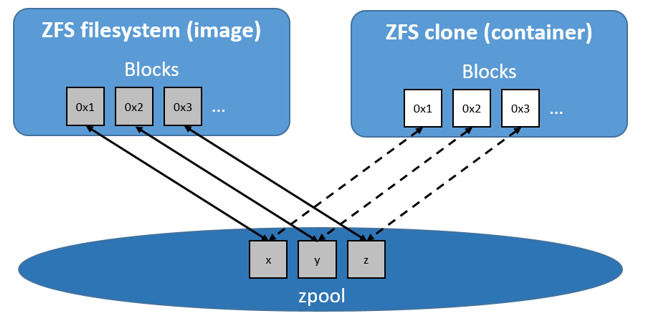

ZFS is a next generation filesystem that supports many advanced storage
technologies such as volume management, snapshots, checksumming, compression
and deduplication, replication and more.

It was created by Sun Microsystems (now Oracle Corporation) and is open sourced
 under the CDDL license. Due to licensing incompatibilities between the CDDL
and GPL, ZFS cannot be shipped as part of the mainline Linux kernel. However,
the ZFS On Linux (ZoL) project provides an out-of-tree kernel module and
userspace tools which can be installed separately.

The ZFS on Linux (ZoL) port is healthy and maturing. However, at this point in
time it is not recommended to use the `zfs` Docker storage driver for
production use unless you have substantial experience with ZFS on Linux.

> **Note:** There is also a FUSE implementation of ZFS on the Linux platform.
> This should work with Docker but is not recommended. The native ZFS driver
> (ZoL) is more tested, more performant, and is more widely used. The remainder
>  of this document will relate to the native ZoL port.

## Image layering and sharing with ZFS

The Docker `zfs` storage driver makes extensive use of three ZFS datasets:

- filesystems
- snapshots
- clones

ZFS filesystems are thinly provisioned and have space allocated to them from a
ZFS pool (zpool) via allocate on demand operations. Snapshots and clones are
space-efficient point-in-time copies of ZFS filesystems. Snapshots are
read-only. Clones are read-write. Clones can only be created from snapshots.
This simple relationship is shown in the diagram below.

The solid line in the diagram shows the process flow for creating a clone. Step
 1 creates a snapshot of the filesystem, and step two creates the clone from
the snapshot. The dashed line shows the relationship between the clone and the
filesystem, via the snapshot. All three ZFS datasets draw space form the same
underlying zpool.

On Docker hosts using the `zfs` storage driver, the base layer of an image is a
 ZFS filesystem. Each child layer is a ZFS clone based on a ZFS snapshot of the
 layer below it. A container is a ZFS clone based on a ZFS Snapshot of the top
layer of the image it's created from. All ZFS datasets draw their space from a
common zpool. The diagram below shows how this is put together with a running
container based on a two-layer image.

The following process explains how images are layered and containers created.
The process is based on the diagram above.

1. The base layer of the image exists on the Docker host as a ZFS filesystem.

    This filesystem consumes space from the zpool used to create the Docker
host's local storage area at `/var/lib/docker`.

2. Additional image layers are clones of the dataset hosting the image layer
directly below it.

    In the diagram, "Layer 1" is added by making a ZFS snapshot of the base
layer and then creating a clone from that snapshot. The clone is writable and
consumes space on-demand from the zpool. The snapshot is read-only, maintaining
 the base layer as an immutable object.

3. When the container is launched, a read-write layer is added above the image.

    In the diagram above, the container's read-write layer is created by making
 a snapshot of the top layer of the image (Layer 1) and creating a clone from
that snapshot.

    As changes are made to the container, space is allocated to it from the
zpool via allocate-on-demand operations. By default, ZFS will allocate space in
 blocks of 128K.

This process of creating child layers and containers from *read-only* snapshots
 allows images to be maintained as immutable objects.

## Container reads and writes with ZFS

Container reads with the `zfs` storage driver are very simple. A newly launched
 container is based on a ZFS clone. This clone initially shares all of its data
 with the dataset it was created from. This means that read operations with the
 `zfs` storage driver are fast &ndash; even if the data being read was not
copied into the container yet. This sharing of data blocks is shown in the
diagram below.

Writing new data to a container is accomplished via an allocate-on-demand
operation. Every time a new area of the container needs writing to, a new block
 is allocated from the zpool. This means that containers consume additional
space as new data is written to them. New space is allocated to the container
(ZFS Clone) from the underlying zpool.

Updating *existing data* in a container is accomplished by allocating new
blocks to the containers clone and storing the changed data in those new
blocks. The original blocks are unchanged, allowing the underlying image
dataset to remain immutable. This is the same as writing to a normal ZFS
filesystem and is an implementation of copy-on-write semantics.

## Configure Docker with the ZFS storage driver

The `zfs` storage driver is only supported on a Docker host where
`/var/lib/docker` is mounted as a ZFS filesystem. This section shows you how to
 install and configure native ZFS on Linux (ZoL) on an Ubuntu 14.04 system.

### Prerequisites

If you have already used the Docker daemon on your Docker host and have images
you want to keep, `push` them Docker Hub or your private Docker Trusted
Registry before attempting this procedure.

Stop the Docker daemon. Then, ensure that you have a spare block device at
`/dev/xvdb`. The device identifier may be different in your environment and
you should substitute your own values throughout the procedure.

### Install Zfs on Ubuntu 16.04 LTS

1. If it is running, stop the Docker `daemon`.

2. Install the `zfs` package.

        $ sudo apt-get install -y zfs

        Reading package lists... Done
        Building dependency tree
        <output truncated>

3. Verify that the `zfs` module is loaded correctly.

        $ lsmod | grep zfs

        zfs                  2813952  3
        zunicode              331776  1 zfs
        zcommon                57344  1 zfs
        znvpair                90112  2 zfs,zcommon
        spl                   102400  3 zfs,zcommon,znvpair
        zavl                   16384  1 zfs

### Install Zfs on Ubuntu 14.04 LTS

1. If it is running, stop the Docker `daemon`.

1. Install the `software-properties-common` package.

    This is required for the `add-apt-repository` command.

        $ sudo apt-get install -y software-properties-common

        Reading package lists... Done
        Building dependency tree
        <output truncated>

2. Add the `zfs-native` package archive.

        $ sudo add-apt-repository ppa:zfs-native/stable

         The native ZFS filesystem for Linux. Install the ubuntu-zfs package.
        <output truncated>
        gpg: key F6B0FC61: public key "Launchpad PPA for Native ZFS for Linux" imported
        gpg: Total number processed: 1
        gpg:               imported: 1  (RSA: 1)
        OK

3. Get the latest package lists for all registered repositories and package
archives.

        $ sudo apt-get update

        Ign http://us-west-2.ec2.archive.ubuntu.com trusty InRelease
        Get:1 http://us-west-2.ec2.archive.ubuntu.com trusty-updates InRelease [64.4 kB]
        <output truncated>
        Fetched 10.3 MB in 4s (2,370 kB/s)
        Reading package lists... Done

4. Install the `ubuntu-zfs` package.

        $ sudo apt-get install -y ubuntu-zfs

        Reading package lists... Done
        Building dependency tree
        <output truncated>

5. Load the `zfs` module.

        $ sudo modprobe zfs

6. Verify that it loaded correctly.

        $ lsmod | grep zfs

        zfs                  2768247  0
        zunicode              331170  1 zfs
        zcommon                55411  1 zfs
        znvpair                89086  2 zfs,zcommon
        spl                    96378  3 zfs,zcommon,znvpair
        zavl                   15236  1 zfs

## Configure ZFS for Docker

Once ZFS is installed and loaded, you're ready to configure ZFS for Docker.

1. Create a new `zpool`.

        $ sudo zpool create -f zpool-docker /dev/xvdb

    The command creates the `zpool` and gives it the name "zpool-docker". The name is arbitrary.

2. Check that the `zpool` exists.

        $ sudo zfs list

        NAME            USED  AVAIL    REFER  MOUNTPOINT
        zpool-docker    55K   3.84G    19K    /zpool-docker

3. Create and mount a new ZFS filesystem to `/var/lib/docker`.

        $ sudo zfs create -o mountpoint=/var/lib/docker zpool-docker/docker

4. Check that the previous step worked.

        $ sudo zfs list -t all

        NAME                 USED  AVAIL  REFER  MOUNTPOINT
        zpool-docker         93.5K  3.84G    19K  /zpool-docker
        zpool-docker/docker  19K    3.84G    19K  /var/lib/docker

    Now that you have a ZFS filesystem mounted to `/var/lib/docker`, the daemon
 should automatically load with the `zfs` storage driver.

5. Start the Docker daemon.

        $ sudo service docker start

        docker start/running, process 2315

    The procedure for starting the Docker daemon may differ depending on the
    Linux distribution you are using. It is possible to force the Docker daemon
    to start with the `zfs` storage driver by passing the
    `--storage-driver=zfs`flag to the `dockerd` command, or to the
    `DOCKER_OPTS` line in the Docker config file.

6. Verify that the daemon is using the `zfs` storage driver.

        $ sudo docker info

        Containers: 0
        Images: 0
        Storage Driver: zfs
         Zpool: zpool-docker
         Zpool Health: ONLINE
         Parent Dataset: zpool-docker/docker
         Space Used By Parent: 27648
         Space Available: 4128139776
         Parent Quota: no
         Compression: off
        Execution Driver: native-0.2
        [...]

    The output of the command above shows that the Docker daemon is using the
    `zfs` storage driver and that the parent dataset is the
    `zpool-docker/docker` filesystem created earlier.

Your Docker host is now using ZFS to store to manage its images and containers.

## ZFS and Docker performance

There are several factors that influence the performance of Docker using the
`zfs` storage driver.

- **Memory**. Memory has a major impact on ZFS performance. This goes back to
the fact that ZFS was originally designed for use on big Sun Solaris servers
with large amounts of memory. Keep this in mind when sizing your Docker hosts.

- **ZFS Features**. Using ZFS features, such as deduplication, can
significantly increase the amount of memory ZFS uses. For memory consumption
and performance reasons it is recommended to turn off ZFS deduplication.
However, deduplication at other layers in the stack (such as SAN or NAS arrays)
 can still be used as these do not impact ZFS memory usage and performance. If
using SAN, NAS or other hardware RAID technologies you should continue to
follow existing best practices for using them with ZFS.

- **ZFS Caching**. ZFS caches disk blocks in a memory structure called the
adaptive replacement cache (ARC). The *Single Copy ARC* feature of ZFS allows a
 single cached copy of a block to be shared by multiple clones of a filesystem.
 This means that multiple running containers can share a single copy of cached
block. This means that ZFS is a good option for PaaS and other high density use
 cases.

- **Fragmentation**. Fragmentation is a natural byproduct of copy-on-write
filesystems like ZFS. However, ZFS writes in 128K blocks and allocates *slabs*
(multiple 128K blocks) to CoW operations in an attempt to reduce fragmentation.
 The ZFS intent log (ZIL) and the coalescing of writes (delayed writes) also
help to reduce fragmentation.

- **Use the native ZFS driver for Linux**. Although the Docker `zfs` storage
driver supports the ZFS FUSE implementation, it is not recommended when high
performance is required. The native ZFS on Linux driver tends to perform better
 than the FUSE implementation.

The following generic performance best practices also apply to ZFS.

- **Use of SSD**. For best performance it is always a good idea to use fast
storage media such as solid state devices (SSD). However, if you only have a
limited amount of SSD storage available it is recommended to place the ZIL on
SSD.

- **Use Data Volumes**. Data volumes provide the best and most predictable
performance. This is because they bypass the storage driver and do not incur
any of the potential overheads introduced by thin provisioning and
copy-on-write. For this reason, you should place heavy write workloads on data
volumes.

## Limiting your container's writable storage quota

If you want to use quota on a per docker image/zfs dataset basis, you can use
the `--storage-opt` option:

    --storage-opt size=256M

which limits the space your container can write/change (implemented with the
ZFS attribute `available`). This means that if you have e.g. a database docker
image of 256 MB and you use the aforementioned option, you end up with a
container of size 512 MB and 256 MB free.
