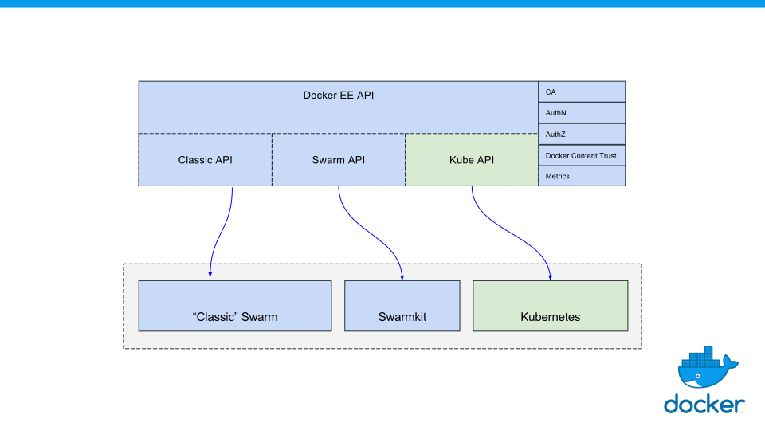
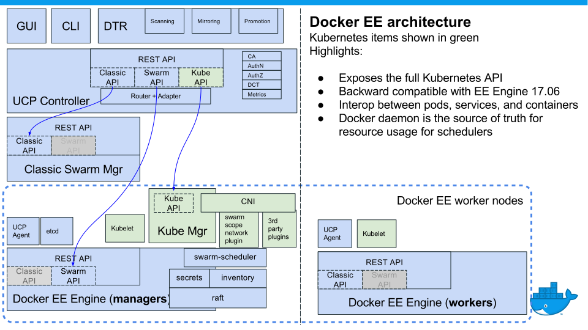
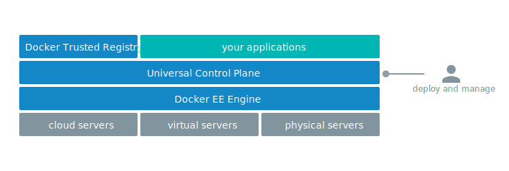

Docker Enterprise Edition (EE) enables deploying your workloads for high
availability (HA) onto the orchestrator of your choice. Docker EE system
components can run on multiple manager nodes in the cluster, and if one manager
node fails, another takes its place automatically, without impact to the
cluster.

## Choose your orchestrator

Docker EE provides access to the full API sets of three popular orchestrators:

- Kubernetes: Full YAML object support
- SwarmKit: Service-centric, Compose file version 3
- "Classic" Swarm: Container-centric, Compose file version 2

{: .with-border}

Docker EE proxies the underlying API of each orchestrator, giving you access
to all of the capabilities of each orchestrator, along with the benefits of
Docker EE, like role-based access control and Docker Content Trust. 

## Docker EE components

Docker EE has three major components, which together enable a full software
supply chain, from image creation, to secure image storage, to secure image
deployment.

- **Docker EE Engine**: The commercially supported Docker engine for creating
  images and running them in Docker containers.

- **Docker Trusted Registry (DTR)**: The production-grade image storage solution
  from Docker.
  
  DTR is designed to scale horizontally as your usage increases.
  You can add more replicas to make DTR scale to your demand and for high
  availability.
  
  All DTR replicas run the same set of services, and changes to
  their configuration are propagated automatically to other replicas.

- **Universal Control Plane (UCP)**: Deploys applications from images, by
  managing orchestrators, like Kubernetes and Swarm.
  
  UCP is designed for high availability (HA). You can join multiple UCP manager
  nodes to the cluster, and if one manager node fails, another takes its place
  automatically without impact to the cluster.
  
  Changes to the configuration of one UCP manager node are propagated
  automatically to other nodes.

{: .with-border}

### Universal Control Plane (UCP)

Docker UCP is a containerized application that runs on [Docker EE Engine](../index.md)
and extends its functionality to make it easier to deploy, configure, and
monitor your applications at scale.

Docker UCP provides a web UI and a CLI for deploying images from Kubernetes
YAML or Compose files. Once your workload is deployed, UCP enables monitoring
containers and pods across your Docker cluster.

UCP also secures Docker with role-based access control so that only authorized
users can make changes and deploy applications to your cluster.

{: .with-border}

Once a UCP instance is deployed, you don't interact with Docker EE Engine
directly. Instead, you interact with UCP. Since UCP exposes the standard
Docker API and the full Kubernetes API transparently, you can use the tools
you already know and love, like `kubectl`, the Docker CLI client, and Docker
Compose.
[Learn about UCP architecture](ucp-architecture.md).

{: .with-border}

### Docker Trusted Registry (DTR)

Docker Trusted Registry (DTR) is a containerized application that runs on a
Docker UCP cluster.

{: .with-border}

Once you have DTR deployed, you use your Docker CLI client to login, push, and
pull images.

For high-availability, you can deploy multiple DTR replicas, one on each UCP
worker node.

{: .with-border}

All DTR replicas run the same set of services, and changes to their configuration
are automatically propagated to other replicas.
[Learn about DTR architecture](dtr-architecture.md).

## Where to go next

- [UCP architecture](ucp-architecture.md)
- [DTR architecture](dtr-architecture.md)

    