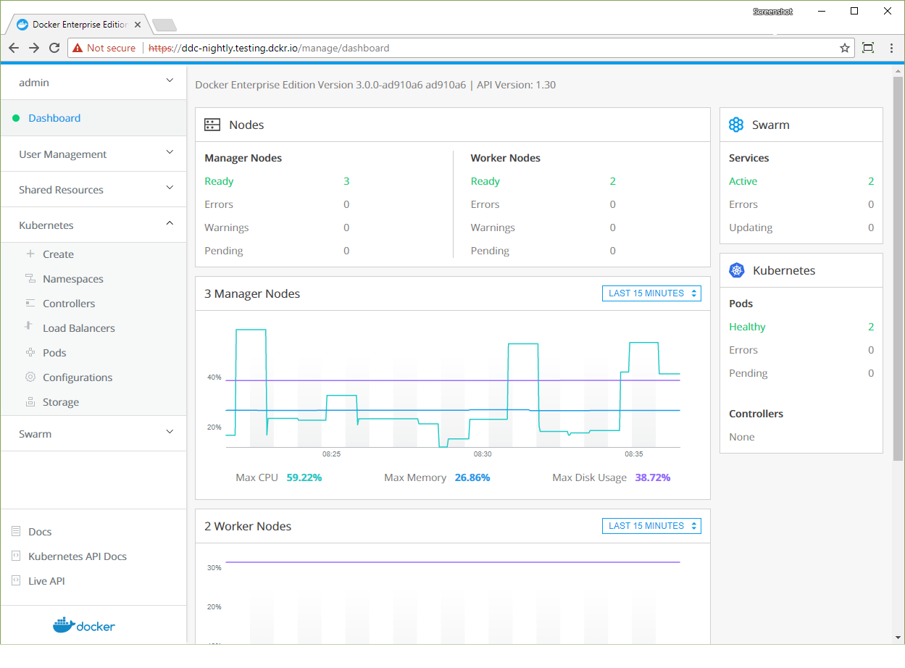
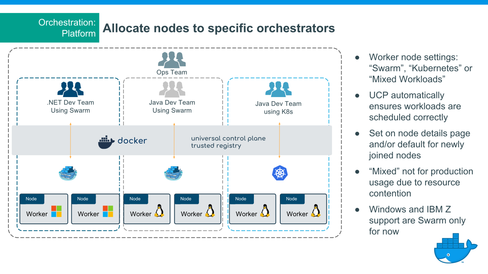
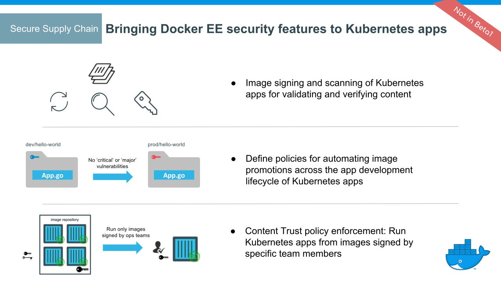
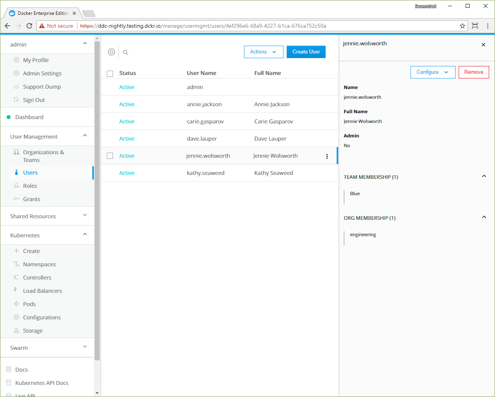



Docker Enterprise Edition Platform 2.0 (*Docker EE*) is a
Containers-as-a-Service (CaaS) platform that enables a secure software supply
chain and deploys diverse applications for high availability across disparate
infrastructure, both on-premises and in the cloud.

Docker Enterprise Edition is a secure, scalable, and supported container
platform for building and orchestrating applications across multi-tenant Linux,
Windows Server 2016, and IBM z Systems environments.

Docker EE enables deploying your workloads for high availability (HA) onto the
orchestrator of your choice. Docker EE automates many of the tasks that
orchestration requires, like provisioning pods, containers, and cluster
resources. Self-healing components ensure that Docker EE clusters remain highly
available.

Role-based access control applies to Kubernetes and Swarm orchestrators, and
communication within the cluster is secured with TLS.
[Docker Content Trust](/engine/security/trust/content_trust/) is enforced
for images on all of the orchestrators.

Docker EE Platform includes Docker Universal Control Plane (UCP), the
enterprise-grade cluster management solution from Docker. You install it
on-premises or in your virtual private cloud, and it helps you manage your
cluster and applications through a single interface.

{: .with-border}

## Docker Enterprise Edition features

Docker EE Platform provides multi-architecture orchestration for Kubernetes and
Swarm workloads. Docker EE enables a secure software supply chain, with image
promotion, mirroring between registries, and signing/scanning enforcement for
Kubernetes images.

### Kubernetes support

Kubernetes in Docker EE fully supports all Docker EE features, including
role-based access control, LDAP/AD integration, scanning, signing enforcement,
and security policies.

Kubernetes features on Docker EE include:

- Kubernetes orchestration full feature set
- CNCF Certified Kubernetes conformance
- Kubernetes app deployment by using web UI or CLI
- Compose stack deployment for Swarm and Kubernetes apps
- Role-based access control for Kubernetes workloads
- Pod-based autoscaling, to increase and decrease pod count based on CPU usage
- Blue-Green deployments, for load balancing to different app versions
- Ingress Controllers with Kubernetes L7 routing
- Interoperability between Swarm and Kubernetes workloads for networking and
  storage

The default Docker EE installation includes both  Kubernetes and Swarm
components across the cluster, so every newly joined worker node is ready
to schedule Kubernetes or Swarm workloads.

> IBM z Systems
>
> Kubernetes workloads aren't supported on IBM z Systems clusters. On a mixed
> cluster with z Systems, Docker EE won't schedule Kubernetes workloads
> on z Systems nodes.
{: .important}

### Orchestration platform features

{: .with-border}

- Docker EE manager nodes are both Swarm managers and Kubernetes masters,
  to enable high availability
- Allocate nodes for Swarm and Kubernetes workloads
- Single pane of glass for monitoring apps
- Enhanced Swarm hostname routing mesh with Interlock 2.0
- One platform-wide management plane: secure software supply chain, secure
  multi-tenancy, and secure and highly available node management

### Secure supply chain

{: .with-border}

- Image signing and scanning of Kubernetes apps for validating and verifying content
- Image promotion with mirroring between registries (not in Beta1)
- Define policies for automating image promotions across the app development
  lifecycle of Kubernetes apps (not in Beta1)

## Centralized cluster management

With Docker, you can join up to thousands of physical or virtual machines
together to create a container cluster, allowing you to deploy your
applications at scale. Docker EE extends the functionality provided by Docker
Engine to make it easier to manage your cluster from a centralized place.

You can manage and monitor your container cluster using a graphical web UI.

## Deploy, manage, and monitor

With Docker EE, you can manage from a centralized place all of the computing
resources you have available, like nodes, volumes, and networks.

You can also deploy and monitor your applications and services.

## Built-in security and access control

Docker EE has its own built-in authentication mechanism with role-based access
control (RBAC), so that you can control who can access and make changes to your
swarm and applications. Also, Docker EE authentication integrates with LDAP
services.
[Learn about role-based access control](access-control/index.md).

{: .with-border}

Docker EE integrates with Docker Trusted Registry so that you can keep the
Docker images you use for your applications behind your firewall, where they
are safe and can't be tampered with.

You can also enforce security policies and only allow running applications
that use Docker images you know and trust.







## Docker EE and the CLI

Docker EE exposes the standard Docker API, so you can continue using the tools
that you already know, including the Docker CLI client, to deploy and manage your
applications.

For example, you can use the `docker info` command to check the
status of a Swarm managed by Docker EE:

```bash
docker info
```

Which produces output similar to the following:

```bash
Containers: 38
Running: 23
Paused: 0
Stopped: 15
Images: 17
Server Version: 17.06
...
Swarm: active
NodeID: ocpv7el0uz8g9q7dmw8ay4yps
Is Manager: true
ClusterID: tylpv1kxjtgoik2jnrg8pvkg6
Managers: 1
…
```



Docker EE exposes the standard Kubernetes API, and it installs the command-line
tool, `kubectl`, by default, so you can use the usual Kubernetes commands, like
`kubectl cluster-info`:

```bash
kubectl cluster-info
```

Which produces output similar to the following:

```bash
Kubernetes master is running at https://54.200.115.43:6443
KubeDNS is running at https://54.200.115.43:6443/api/v1/namespaces/kube-system/services/kube-dns:dns/proxy

To further debug and diagnose cluster problems, use 'kubectl cluster-info dump'.
```


