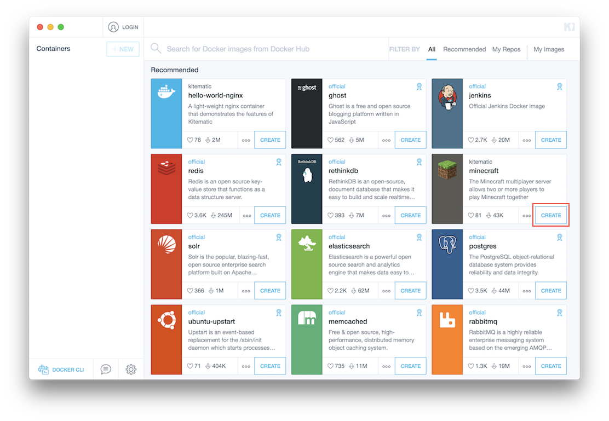
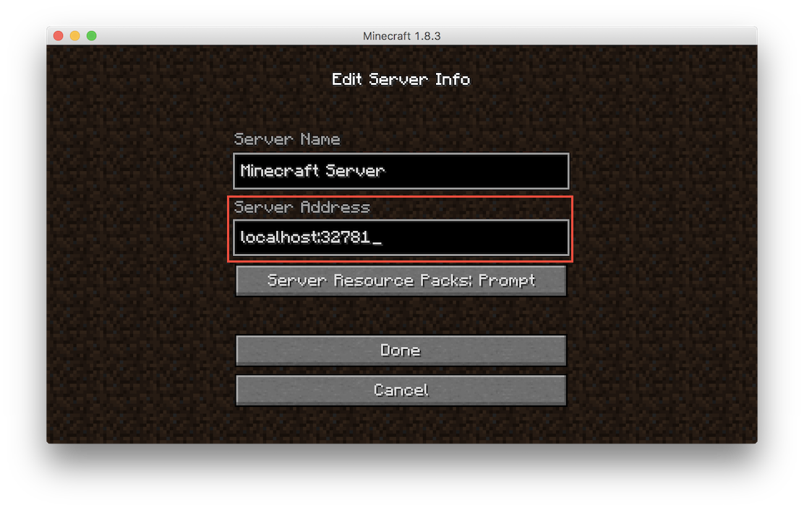
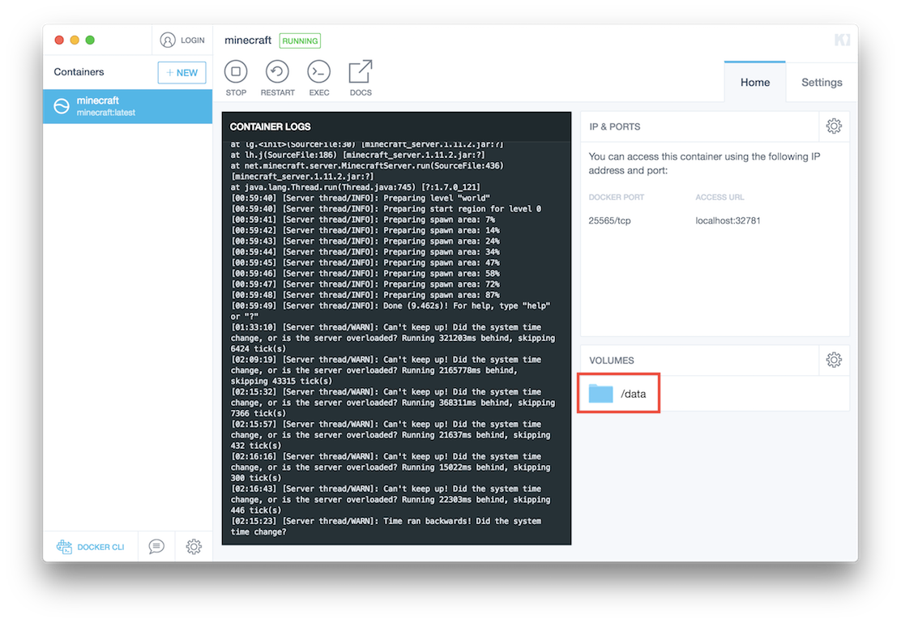
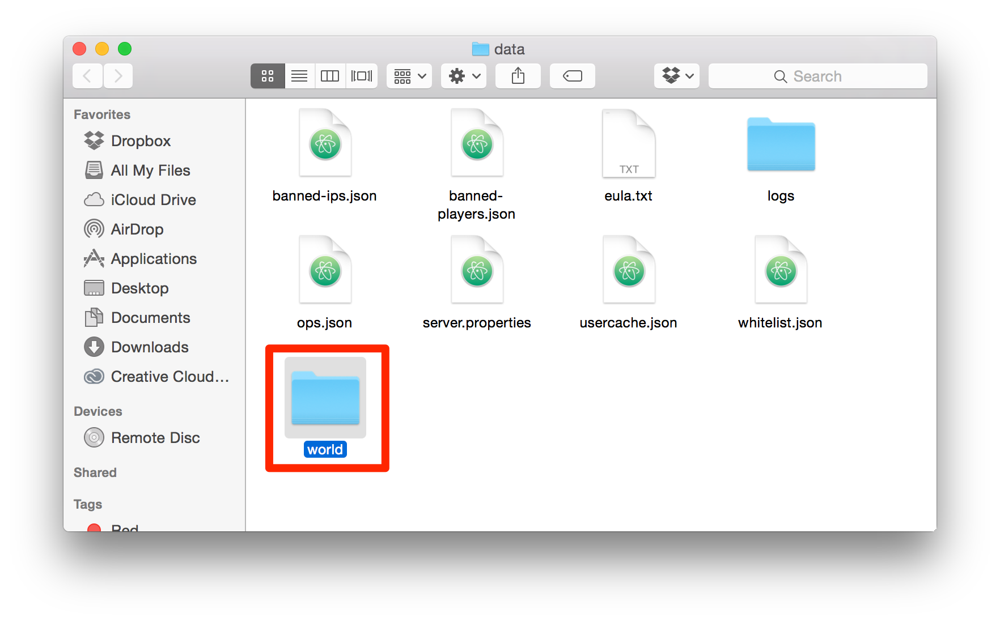
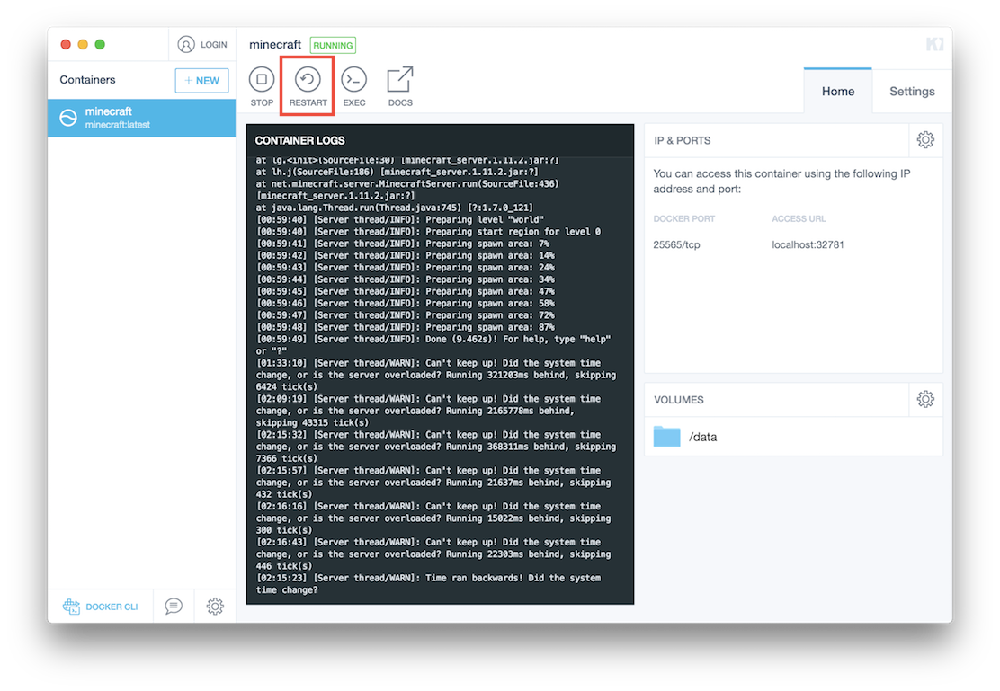

This is a quick tutorial demonstrating how to set up a local Minecraft server
using Kitematic and Docker.

### Create Minecraft Server Container

First, if you haven't yet done so, [download and start
Kitematic](index.md). Once installed and running, the app should look like this:

Create a container from the recommended Minecraft image by clicking the "Create"
button.

After the image finishes downloading, you'll see the home screen for the
Minecraft container. Your Minecraft server is now up and running inside a Docker
container. Note that we've marked the IP and port you can use to connect to
your Minecraft server in red (your IP and port may be different from what's
shown).

### Connect to Minecraft server

Open your Minecraft client, log in with your Minecraft account and click on the
"Multiplayer" button.

Click the "Add Server" button to add the Minecraft server you want to connect
to.

Fill in the "Server Address" text box with the marked IP and port from Kitematic
you saw earlier.

Click on the play button to connect to your Minecraft server and enjoy!

### Change map using Docker volume

Open the "data" folder from Kitematic (You'll need to "Enable all volumes to edit
files via Finder"). We use Docker Volume to map the folder from the Minecraft
Docker container onto your computer.

The Finder will open, allowing you to replace your current map with the new one
you desire.

Restart your container by clicking the "Restart" button.

Go back to your Minecraft client and join your server. The new map should load.

## Next Steps

For an example using Kitematic to run Nginx, take a look at the [Nginx web
server](./nginx-web-server.md) page.
