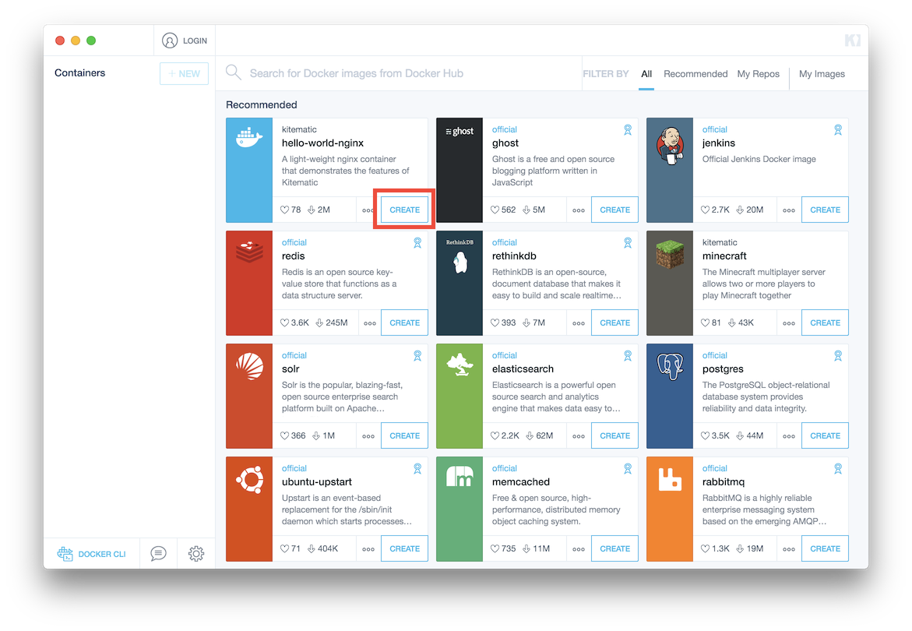
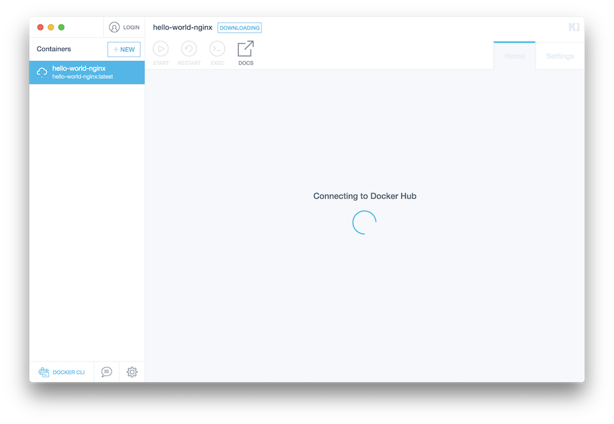
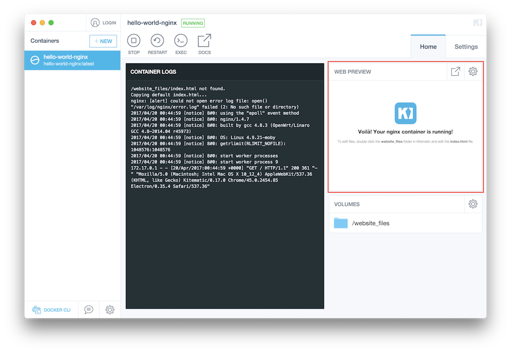
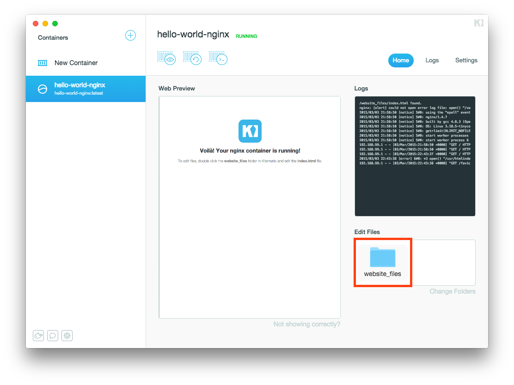
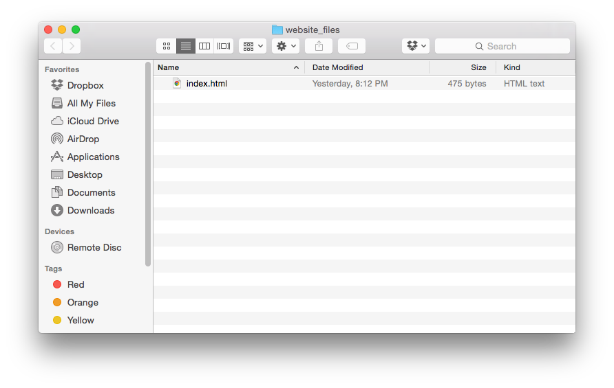
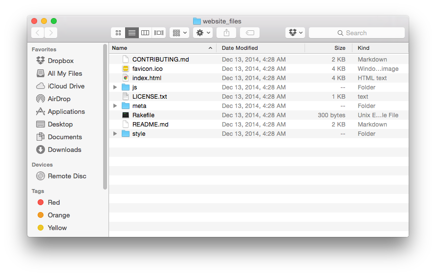
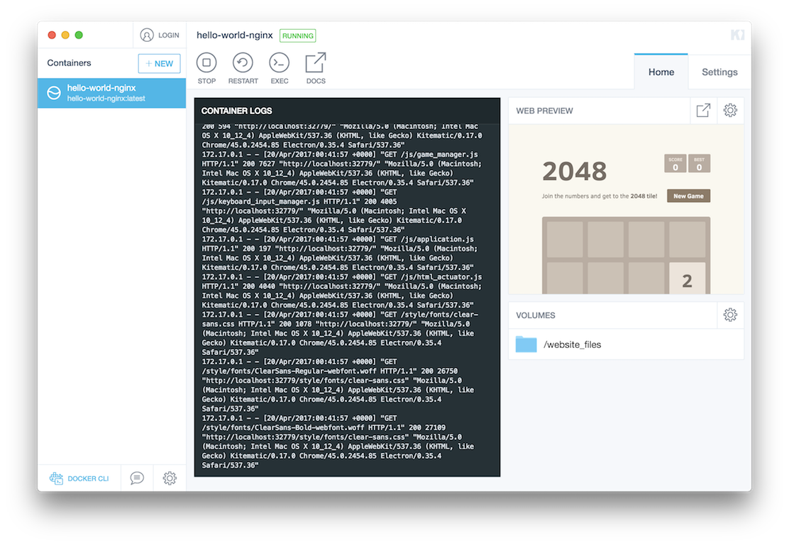

In this tutorial, you will:

- Download and run a web server container
- Explore the container's website data natively on your Mac
- Use volumes to modify the website data

In this example website we'll be serving the popular 2048 game, as shown below.
Let's get to it!

#### Running the Nginx Web Server Container

First, if you haven't yet done so, [download and start
Kitematic](index.md). Once installed and running, the app should look like this:

Click on the _Create_ button of the `hello-world-nginx` listing as shown above.
Kitematic will download (also known as pull the image) and then run a tiny Nginx web server
in a Docker container, allowing it to serve website data to your Mac.

Once it's done downloading you should see a quick preview of the example website
that comes with the container, as shown below. Click on the preview to see the
result in your own browser.

**What just happened?** Kitematic downloaded the `kitematic/hello-world-nginx`
image from the Docker Hub and then created and ran a Docker Nginx container from
this image.

#### Viewing the Website Data in Finder

This container exposes website data via a _Docker volume_. Kitematic makes
managing Docker volumes easy - you can edit the data in Finder or with your
favorite text editor. By default, Kitematic places volumes under `~/Kitematic`
but you can change this in the container settings. To access the files via
finder, click on the in-app folder icon for a container and "Enable all volumes
to edit via Finder":

A Finder window of the folder should open containing the index.html file we see
being served by the container.

#### Serving Your Own Website Data

Now let's try serving a more interesting website. [Download the zipped
files](https://github.com/gabrielecirulli/2048/archive/master.zip) for 2048, a
popular (and addictive) web-based tile game. Extract this zip file into the
folder you just opened:

Switch back to Kitematic and restart the container by clicking the "Restart"
button as shown below. Your Nginx container should now be serving 2048.

**What just happened?**

Kitematic can map Docker container volumes to directories on your
Mac. In this case you changed the container's volume data via the Finder to
serve a website we downloaded.

## Next Steps

For an example using Kitematic to run a Local RethinkDB database, take a look at
the [RethinkDB development Database](./rethinkdb-dev-database.md) example.