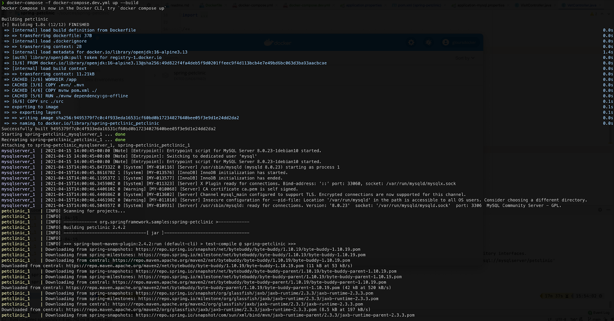
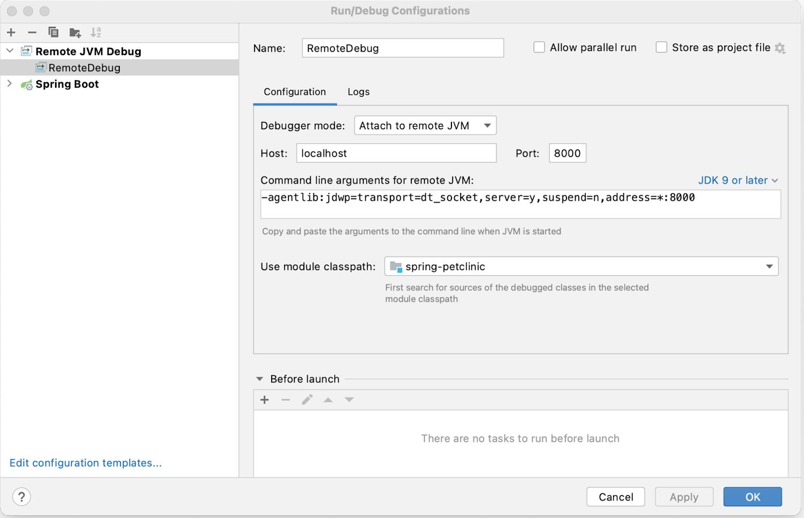
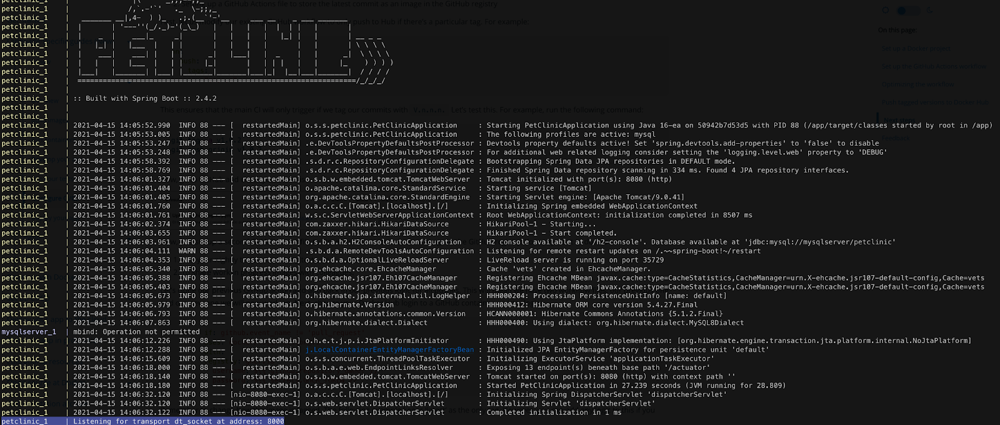
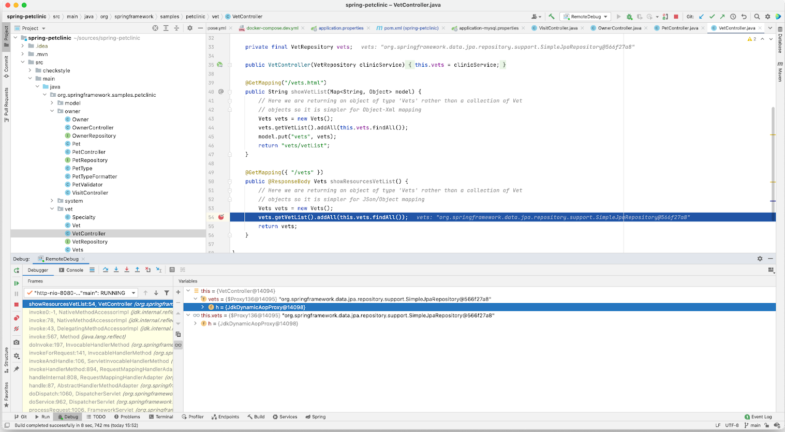



## Prerequisites

Work through the steps to build an image and run it as a containerized application in [Run your image as a container](run-containers.md).

## Introduction

In this module, we’ll walk through setting up a local development environment for the application we built in the previous modules. We’ll use Docker to build our images and Docker Compose to make everything a whole lot easier.

## Run a database in a container

First, we’ll take a look at running a database in a container and how we use volumes and networking to persist our data and allow our application to talk with the database. Then we’ll pull everything together into a Compose file which allows us to setup and run a local development environment with one command. Finally, we’ll take a look at connecting a debugger to our application running inside a container.

Instead of downloading MySQL, installing, configuring, and then running the MySQL database as a service, we can use the Docker Official Image for MySQL and run it in a container.

Before we run MySQL in a container, we'll create a couple of volumes that Docker can manage to store our persistent data and configuration. Let’s use the managed volumes feature that Docker provides instead of using bind mounts. You can read all about [Using volumes](../../storage/volumes.md) in our documentation.

Let’s create our volumes now. We’ll create one for the data and one for configuration of MySQL.

```console
$ docker volume create mysql
$ docker volume create mysql_config
```

Now we’ll create a network that our application and database will use to talk to each other. The network is called a user-defined bridge network and gives us a nice DNS lookup service which we can use when creating our connection string.

```console
$ docker network create mysqlnet
```

Now, let's run MySQL in a container and attach to the volumes and network we created above. Docker pulls the image from Hub and runs it locally.

```console
$ docker run -it --rm -d -v mysql_data:/var/lib/mysql \
-v mysql_config:/etc/mysql/conf.d \
--network mysqlnet \
--name mysqlserver \
-e MYSQL_USER=petclinic -e MYSQL_PASSWORD=petclinic \
-e MYSQL_ROOT_PASSWORD=root -e MYSQL_DATABASE=petclinic \
-p 3306:3306 mysql:8.0.23
```

Okay, now that we have a running MySQL, let’s update our Dockerfile to activate the MySQL Spring profile defined in the application and switch from an in-memory H2 database to the MySQL server we just created.

We only need to add the MySQL profile as an argument to the `CMD` definition.

```dockerfile
CMD ["./mvnw", "spring-boot:run", "-Dspring-boot.run.profiles=mysql"]
```

Let's build our image

```console
$ docker build --tag java-docker .
```

Now, let’s run our container. This time, we need to set the `MYSQL_URL` environment variable so that our application knows what connection string to use to access the database. We’ll do this using the `docker run` command.

```console
$ docker run --rm -d \
--name springboot-server \
--network mysqlnet \
-e MYSQL_URL=jdbc:mysql://mysqlserver/petclinic \
-p 8080:8080 java-docker
```

Let’s test that our application is connected to the database and is able to list Veterinarians.

```console
$ curl  --request GET \
  --url http://localhost:8080/vets \
  --header 'content-type: application/json'
```

You should receive the following json back from our service.

```json
{"vetList":[{"id":1,"firstName":"James","lastName":"Carter","specialties":[],"nrOfSpecialties":0,"new":false},{"id":2,"firstName":"Helen","lastName":"Leary","specialties":[{"id":1,"name":"radiology","new":false}],"nrOfSpecialties":1,"new":false},{"id":3,"firstName":"Linda","lastName":"Douglas","specialties":[{"id":3,"name":"dentistry","new":false},{"id":2,"name":"surgery","new":false}],"nrOfSpecialties":2,"new":false},{"id":4,"firstName":"Rafael","lastName":"Ortega","specialties":[{"id":2,"name":"surgery","new":false}],"nrOfSpecialties":1,"new":false},{"id":5,"firstName":"Henry","lastName":"Stevens","specialties":[{"id":1,"name":"radiology","new":false}],"nrOfSpecialties":1,"new":false},{"id":6,"firstName":"Sharon","lastName":"Jenkins","specialties":[],"nrOfSpecialties":0,"new":false}]}
```

## Use Compose to develop locally

In this section, we’ll create a Compose file to start our `java-docker` and the MySQL database using a single command. We’ll also set up the Compose file to start the `java-docker` application in debug mode so that we can connect a debugger to the running Java process.

Open the `petclinic` in your IDE or a text editor and create a new file named `docker-compose.dev.yml`. Copy and paste the following commands into the file.

```yaml
version: '3.8'
services:
  petclinic:
    build:
      context: .
    ports:
      - 8000:8000
      - 8080:8080
    environment:
      - SERVER_PORT=8080
      - MYSQL_URL=jdbc:mysql://mysqlserver/petclinic
    volumes:
      - ./:/app
    command: ./mvnw spring-boot:run -Dspring-boot.run.profiles=mysql -Dspring-boot.run.jvmArguments="-agentlib:jdwp=transport=dt_socket,server=y,suspend=n,address=*:8000"

  mysqlserver:
    image: mysql:8.0.23
    ports:
      - 3306:3306
    environment:
      - MYSQL_ROOT_PASSWORD=
      - MYSQL_ALLOW_EMPTY_PASSWORD=true
      - MYSQL_USER=petclinic
      - MYSQL_PASSWORD=petclinic
      - MYSQL_DATABASE=petclinic
    volumes:
      - mysql_data:/var/lib/mysql
      - mysql_config:/etc/mysql/conf.d
volumes:
  mysql_data:
  mysql_config:
```

This Compose file is super convenient as we do not have to type all the parameters to pass to the `docker run` command. We can declaratively do that using a Compose file.

We expose port 8000 and declare the debug configuration for the JVM so that we can attach a debugger.

Another really cool feature of using a Compose file is that we have service resolution set up to use the service names. Therefore, we are now able to use `mysqlserver` in our connection string. The reason we use `mysqlserver` is because that is what we've named our MySQL service as in the Compose file.

Now, to start our application and to confirm that it is running properly.

```console
$ docker-compose -f docker-compose.dev.yml up --build
```

We pass the `--build` flag so Docker will compile our image and then starts the containers. You should see similar output if it runs successfully:



Now let’s test our API endpoint. Run the following curl commands:

```console
$ curl  --request GET \
  --url http://localhost:8080/vets \
  --header 'content-type: application/json'
```

You should receive the following response:

```json
{"vetList":[{"id":1,"firstName":"James","lastName":"Carter","specialties":[],"nrOfSpecialties":0,"new":false},{"id":2,"firstName":"Helen","lastName":"Leary","specialties":[{"id":1,"name":"radiology","new":false}],"nrOfSpecialties":1,"new":false},{"id":3,"firstName":"Linda","lastName":"Douglas","specialties":[{"id":3,"name":"dentistry","new":false},{"id":2,"name":"surgery","new":false}],"nrOfSpecialties":2,"new":false},{"id":4,"firstName":"Rafael","lastName":"Ortega","specialties":[{"id":2,"name":"surgery","new":false}],"nrOfSpecialties":1,"new":false},{"id":5,"firstName":"Henry","lastName":"Stevens","specialties":[{"id":1,"name":"radiology","new":false}],"nrOfSpecialties":1,"new":false},{"id":6,"firstName":"Sharon","lastName":"Jenkins","specialties":[],"nrOfSpecialties":0,"new":false}]}
```

## Connect a Debugger

We’ll use the debugger that comes with the IntelliJ IDEA. You can use the community version of this IDE. Open your project in IntelliJ IDEA and then go to the **Run** menu > **Edit Configuration**. Add a new Remote JVM Debug configuration similar to the following:



Let's set a breakpoint

Open the following file `src/main/java/org/springframework/samples/petclinic/vet/VetController.java` and add a breakpoint inside the `showResourcesVetList` function, line 54 for example.

Start your debug session, **Run** menu and then **Debug _NameOfYourConfiguration_**


You should now see the connection in the logs of your Compose application.



We can now call the server endpoint.

```console
$ curl --request GET --url http://localhost:8080/vets
```

You should have seen the code break on line 54 and now you are able to use the debugger just like you would normally. You can also inspect and watch variables, set conditional breakpoints, view stack traces and a do bunch of other stuff.



You can also activate the live reload option provided by SpringBoot Dev Tools. Check out the [SpringBoot documentation](https://docs.spring.io/spring-boot/docs/current/reference/html/using-spring-boot.html#using-boot-devtools-remote){:target="_blank" rel="noopener" class="_"} for information on how to connect to a remote application.

## Next steps

In this module, we took a look at creating a general development image that we can use pretty much like our normal command line. We also set up our Compose file to expose the debugging port and configure Spring Boot to live reload our changes.

In the next module, we’ll take a look at how to run unit tests in Docker. See

[Run your tests](run-tests.md){: .button .primary-btn}

## Feedback

Help us improve this topic by providing your feedback. Let us know what you think by creating an issue in the [Docker Docs](https://github.com/docker/docker.github.io/issues/new?title=[Java%20docs%20feedback]){:target="_blank" rel="noopener" class="_"} GitHub repository. Alternatively, [create a PR](https://github.com/docker/docker.github.io/pulls){:target="_blank" rel="noopener" class="_"} to suggest updates.
