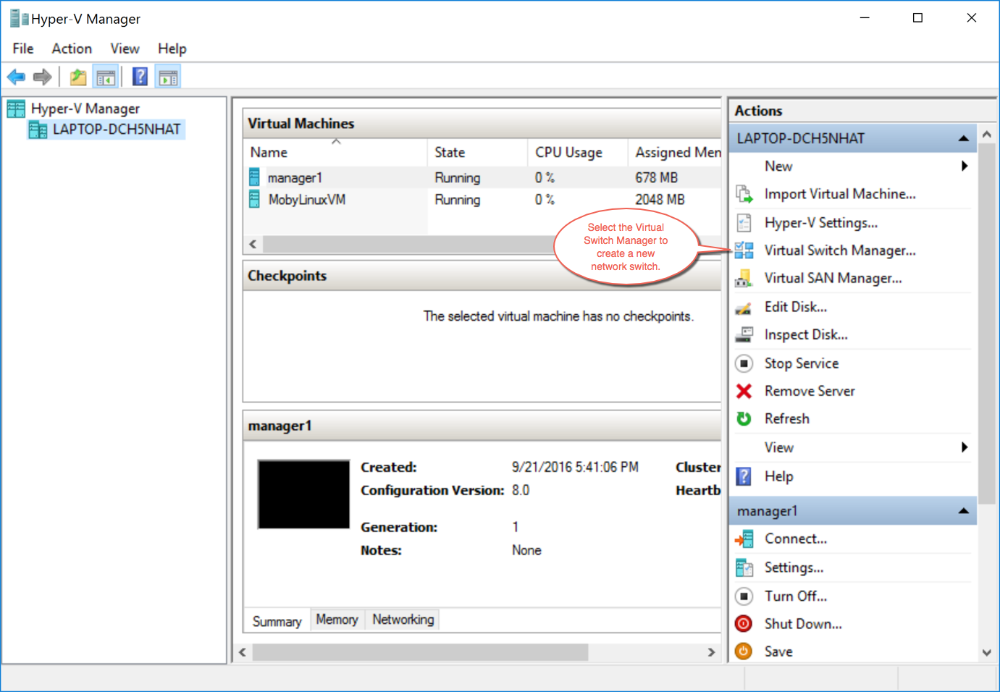
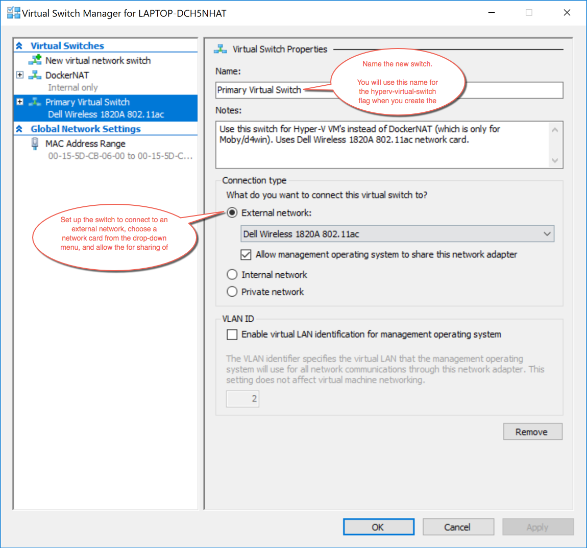

Creates a Boot2Docker virtual machine locally on your Windows machine
using Hyper-V.

Hyper-V must be enabled on your desktop system. Docker for Windows automatically
enables it upon install. See this article on the Microsoft developer network for
[instructions on how to manually enable
Hyper-V](https://msdn.microsoft.com/en-us/virtualization/hyperv_on_windows/quick_start/walkthrough_install).

> **Notes**:
>
> * You will need to use an Administrator level account to create and manage Hyper-V machines.
>
>* You will need an existing virtual switch to use the
> driver. Hyper-V can share an external network interface (aka
> bridging), see [this blog](http://blogs.technet.com/b/canitpro/archive/2014/03/11/step-by-step-enabling-hyper-v-for-use-on-windows-8-1.aspx).
> If you would like to use NAT, create an internal network, and use
> [Internet Connection  Sharing](http://www.packet6.com/allowing-windows-8-1-hyper-v-vm-to-work-with-wifi/).
>
> * This reference page includes an [example](hyper-v.md#example) that shows how to use an elevated (Administrator-level) PowerShell and how to create and use an external network switch.

## Usage

    $ docker-machine create --driver hyperv vm

## Options

-   `--hyperv-boot2docker-url`: The URL of the boot2docker ISO.
-   `--hyperv-virtual-switch`: Name of the virtual switch to use.
-   `--hyperv-disk-size`: Size of disk for the host in MB.
-   `--hyperv-memory`: Size of memory for the host in MB.
-   `--hyperv-cpu-count`: Number of CPUs for the host.
-   `--hyperv-static-macaddress`: Hyper-V network adapter's static MAC address.
-   `--hyperv-vlan-id`: Hyper-V network adapter's VLAN ID if any.

## Environment variables and default values

| CLI option                   | Environment variable       | Default                  |
| ---------------------------- | -------------------------- | ------------------------ |
| `--hyperv-boot2docker-url`   | `HYPERV_BOOT2DOCKER_URL`   | _Latest boot2docker url_ |
| `--hyperv-virtual-switch`    | `HYPERV_VIRTUAL_SWITCH`    | _first found_            |
| `--hyperv-disk-size`         | `HYPERV_DISK_SIZE`         | `20000`                  |
| `--hyperv-memory`            | `HYPERV_MEMORY`            | `1024`                   |
| `--hyperv-cpu-count`         | `HYPERV_CPU_COUNT`         | `1`                      |
| `--hyperv-static-macaddress` | `HYPERV_STATIC_MACADDRESS` | _undefined_              |
| `--hyperv-vlan-id`           | `HYPERV_VLAN_ID`           | _undefined_              |

## Example

#### 1. Make sure Hyper-V is enabled

  Hyper-V is automatically enabled on a Docker for Windows install. To enable it manually, see [instructions on how to manually enable Hyper-V](https://msdn.microsoft.com/en-us/virtualization/hyperv_on_windows/quick_start/walkthrough_install) on the Microsoft developer network.

#### 2. Set up a new external network switch (Optional)

> **Note**: If you already have a external network switch you can skip this setup and use that one.

Make sure you have Ethernet connectivity while you are doing this.

Open the **Hyper-V Manager**. (On Windows 10, just search for the Hyper-V Manager in the search field in the lower left search field.)

Select the Virtual Switch Manager on the left-side **Actions** panel.



Set up a new **external network switch** to use instead of DockerNAT network switch (for Moby), which is set up by default when you install Docker for Windows. (Or if you already have another network switch set up, you can use that one, but it must be an **external** switch.)

For this example, we created a virtual switch called `Primary Virtual Switch`.



#### 3. Reboot

  See [this issue on virtualbox: Hangs on Waiting for VM to start #986](https://github.com/docker/machine/issues/986).

  A reboot of your desktop system clears out any problems with the routing tables. Without a reboot first, `docker-machine create ...` might get hung up on `Waiting for VM to start`.

#### 4. Create the nodes with Docker Machine and the Microsoft Hyper-V driver

* Start an "elevated" PowerShell (i.e., running as administrator). To do this, search for PowerShell, right-click, and choose Run as administrator.

* Run the `docker-machine create` commands to create machines.

    For example, if you follow along with the [Swarm mode
tutorial](/engine/swarm/swarm-tutorial/index.md) which asks you to create [three
networked host
machines](/engine/swarm/swarm-tutorial/index.md#three-networked-host-machines),
you can create these swarm nodes: `manager1`, `worker1`, `worker2`.

* Use the Microsoft Hyper-V driver and reference the new virtual switch you created.

        docker-machine create -d hyperv --hyperv-virtual-switch "<NameOfVirtualSwitch>" <nameOfNode>

    Here is an example of creating `manager1` node:

      ```shell
      PS C:\WINDOWS\system32>  docker-machine create -d hyperv --hyperv-virtual-switch "Primary Virtual Switch" manager1
      Running pre-create checks...
      Creating machine...
      (manager1) Copying C:\Users\Vicky\.docker\machine\cache\boot2docker.iso to C:\Users\Vicky\.docker\machine\machines\manag
      er1\boot2docker.iso...
      (manager1) Creating SSH key...
      (manager1) Creating VM...
      (manager1) Using switch "Primary Virtual Switch"
      (manager1) Creating VHD
      (manager1) Starting VM...
      (manager1) Waiting for host to start...
      Waiting for machine to be running, this may take a few minutes...
      Detecting operating system of created instance...
      Waiting for SSH to be available...
      Detecting the provisioner...
      Provisioning with boot2docker...
      Copying certs to the local machine directory...
      Copying certs to the remote machine...
      Setting Docker configuration on the remote daemon...
      Checking connection to Docker...
      Docker is up and running!
      To see how to connect your Docker Client to the Docker Engine running on this virtual machine, run: C:\Program Files\Doc
      ker\Docker\Resources\bin\docker-machine.exe env manager1
      PS C:\WINDOWS\system32>
      ```

*   Use the same process, driver and network switch to create the other nodes.

    For our example, the commands will look like this:

    ```shell
    docker-machine create -d hyperv --hyperv-virtual-switch "Primary Virtual Switch" worker1
    docker-machine create -d hyperv --hyperv-virtual-switch "Primary Virtual Switch" worker2
    ```
