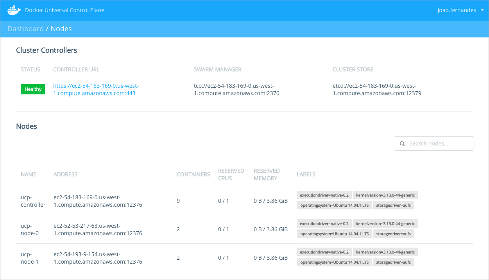
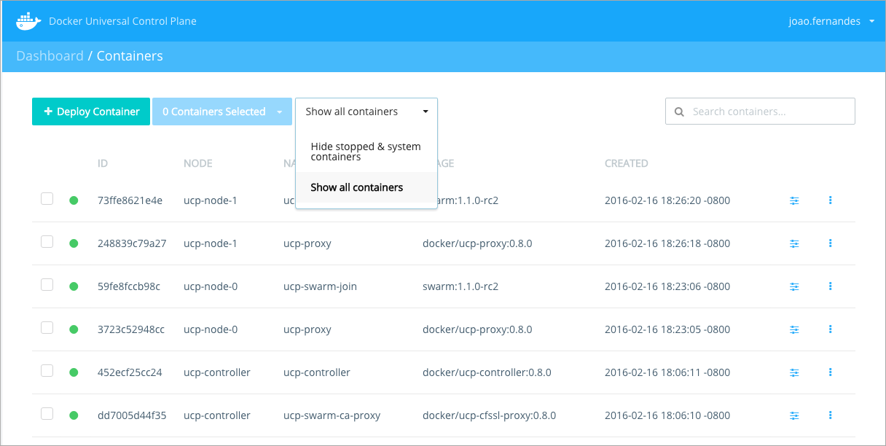
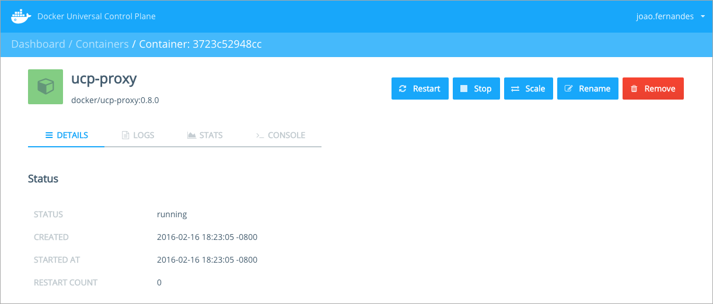

<!--[metadata]>
+++
title = "Monitor and troubleshoot UCP"
description = "Monitor your Docker Universal Control Plane installation, and learn how to troubleshoot it."
keywords = ["Docker, UCP, troubleshoot"]
[menu.main]
parent="mn_manage_ucp"
weight=-80
+++
<![end-metadata]-->

# Monitor and troubleshoot your UCP installation

This article gives you an overview of how to monitor your Docker UCP
installation. Here you'll also find the information you need to troubleshoot
if something goes wrong.

## Understand UCP

Docker UCP has several components:

* UCP controller node: the node that handles user requests,
* UCP replica nodes: replicas of the controller node that can take its place
if it fails,
* UCP nodes: the nodes that run your own containers.

[Learn more about the UCP architecture](../plan-production-install.md#ucp-architecture).


## Check the cluster status

To monitor your UCP installation, the first thing to check is the
**Dashboard** screen on the UCP web app.

In your web browser, navigate to the UCP web app. After logging in, you'll be
directed to the **Dashboard** screen, where you can check your UCP cluster
installation.


In this example, our cluster has 3 nodes.

Click the **nodes** card, or the **Nodes** menu option to navigate to see
more information about the controller, replicas, and nodes of your cluster.



You can also check the state of the components of the UCP cluster. On the
menu, navigate to **Containers**.

By default the Containers screen doesn't display system containers. On the
filter dropdown choose **Show all containers** to see all the UCP components.



You can see more information about these containers. On the right-hand side of
a container, **click the options knob** to see the container details.



In the container details page, you can see the status, resource consumption,
and logs of a specific container.


## Check the cluster status from the CLI
You can also check UCP status using the command line:

1. Make sure you've downloaded a client certificate bundle.

    UCP uses mutual TLS. So you need to have a client certificate bundle
    to interact with UCP from the command line.
    [Learn how to get a client bundle](../production-install.md#set-8-set-up-certificates-for-the-cli).

    If you don't have a client bundle, you'll need to login into the
    host directly.

2. In your terminal, navigate to the client bundle folder you downloaded.

2. Check the contents of the `env.sh` file

    This file sets the environment variables you need to connect to the UCP
    controller. If you're using Windows, use the `env.cmd` file instead.

    ```bash
    $ cat env.sh

    export DOCKER_TLS_VERIFY=1
    export DOCKER_CERT_PATH=$(pwd)
    export DOCKER_HOST=tcp://ec2-54-183-169-0.us-west-1.compute.amazonaws.com:443
    #
    # Bundle for user joao.fernandes
    # UCP Instance ID N2YI:APRI:EP3D:IT2A:S6FR:HHFD:NYPD:UVCL:KSPV:E3NR:TDAJ:7HOU
    #
    # This admin cert will also work directly against Swarm and the individual
    # engine proxies for troubleshooting.  After sourcing this env file, use
    # "docker info" to discover the location of Swarm managers and engines.
    # and use the --host option to override $DOCKER_HOST
    #
    # Run this command from within this directory to configure your shell:
    # eval $(<env.sh)
    ```

2. Follow the instructions on the `env.sh` file.

        $ eval $(<env.sh)

    After this, when using the `docker` command, the requests are sent
    to the UCP controller.

3. Use `docker version` and `docker info` to see the state of your cluster

    ```
    $ docker info

    Containers: 13
    Images: 24
    Role: primary
    Strategy: spread
    Filters: health, port, dependency, affinity, constraint
    Nodes: 3
     ucp-controller: ec2-54-183-169-0.us-west-1.compute.amazonaws.com:12376
      └ Status: Healthy
      └ Containers: 9
      └ Reserved CPUs: 0 / 1
    ----output snipped----
    ```

    If your client bundle is for a non-admin user, you won't have permissions
    to execute all docker commands.

## Use the CLI with admin client bundles
To protect your UCP cluster against unauthorized access, all components of the
cluster use mutual TLS.
That way, for two components to talk, both need to identify using certificates.

UCP has two different root CAs:

* One to issue certificates for cluster components
* Another to issue certificates for user bundles

All components of the cluster trust certificates signed by the first root CA.
Only the UCP controller trusts certificates signed by the second root CA.

This means that:

* Cluster components can communicate with each other, but won't accept
requests from other systems,
* Users need to download a certificate bundle to interact with the UCP
controller.
Even though that can make requests to the controller, they can't interact with
any other component.

To ensure admin users can troubleshoot all cluster components, their
client bundles are signed by the first root CA.
So if you have an admin user client bundle, you can execute the `docker`
command against the Swarm manager, or any Docker Engines on the cluster, using:

    $ docker -H <node_ip>:<engine_port> <command>

As an example:

```
$ eval $(<env.sh)
$ docker -H tcp://ec2-54-183-169-0.us-west-1.compute.amazonaws.com:12376 ps

CONTAINER ID        IMAGE                          COMMAND                  CREATED             STATUS              PORTS                                                                             NAMES
452ecf25cc24        docker/ucp-controller:0.8.0    "/bin/controller serv"   16 hours ago        Up 16 hours         0.0.0.0:443->8080/tcp                                                             ucp-controller
dd7005d44f35        docker/ucp-cfssl-proxy:0.8.0   "/bin/run"               16 hours ago        Up 16 hours         0.0.0.0:12381->12381/tcp                                                          ucp-swarm-ca-proxy
3862e9683ba2        docker/ucp-cfssl:0.8.0         "/bin/cfssl serve -ad"   16 hours ago        Up 16 hours         8888/tcp                                                                          ucp-swarm-ca
220ed108b835        docker/ucp-cfssl-proxy:0.8.0   "/bin/run"               16 hours ago        Up 16 hours         0.0.0.0:12382->12382/tcp, 12381/tcp                                               ucp-ca-proxy
b765417f71d0        docker/ucp-cfssl:0.8.0         "/bin/cfssl serve -ad"   16 hours ago        Up 16 hours         8888/tcp                                                                          ucp-ca
01ab8aa73012        swarm:1.1.0-rc2                "/swarm manage --tlsv"   16 hours ago        Up 16 hours         0.0.0.0:2376->2375/tcp                                                            ucp-swarm-manager
cb85fe3cf914        swarm:1.1.0-rc2                "/swarm join --discov"   16 hours ago        Up 16 hours         2375/tcp                                                                          ucp-swarm-join
9d468d8e6e48        docker/ucp-proxy:0.8.0         "/bin/run"               16 hours ago        Up 16 hours         0.0.0.0:12376->2376/tcp                                                           ucp-proxy
f488479212e1        docker/ucp-etcd:0.8.0          "/bin/etcd --data-dir"   16 hours ago        Up 16 hours         2380/tcp, 4001/tcp, 7001/tcp, 0.0.0.0:12380->12380/tcp, 0.0.0.0:12379->2379/tcp   ucp-kv

$ docker -H tcp://ec2-54-183-169-0.us-west-1.compute.amazonaws.com:12376 restart ucp-controller
```

## Review UCP logs on the CLI

With an admin client bundle, you can access the logs of any component of a
UCP installation. You use the `docker -H` option to run your commands against
the Swarm manager, or Docker engine directly.

As as example, to see the logs of the ucp controller:

```bash
# Populate the Docker environment variables to use the client bundle
$ eval $(<env.sh)

# Get information about the UCP cluster
$ docker info

Containers: 13
Images: 26
Role: primary
Strategy: spread
Filters: health, port, dependency, affinity, constraint
Nodes: 3
 ucp-controller: ec2-54-183-169-0.us-west-1.compute.amazonaws.com:12376
--- output snipped ---

# Check the containers that are running on the controller node
$ docker -H tcp://ec2-54-183-169-0.us-west-1.compute.amazonaws.com:12376 ps

CONTAINER ID        IMAGE                          COMMAND                  CREATED             STATUS              PORTS                          NAMES
452ecf25cc24        docker/ucp-controller:0.8.0    "/bin/controller serv"   42 hours ago        Up 42 hours         0.0.0.0:443->8080/tcp          ucp-controller
dd7005d44f35        docker/ucp-cfssl-proxy:0.8.0   "/bin/run"               42 hours ago        Up 42 hours         0.0.0.0:12381->12381/tcp       ucp-swarm-ca-proxy
--- output snipped ---

# Check the logs of the ucp-controller container
$ docker -H tcp://ec2-54-183-169-0.us-west-1.compute.amazonaws.com:12376 logs ucp-controller

{"level":"info","license_key":"unlicensed","msg":"builtin:Password based auth failure","remote_addr":"50.233.46.103:34706","time":"2016-02-18T20:48:56Z","type":"auth fail","username":"daniel"}
{"level":"info","license_key":"unlicensed","msg":"builtin:Password based auth failure","remote_addr":"50.233.46.103:34706","time":"2016-02-18T20:49:04Z","type":"auth fail","username":"daniel.mattews"}
--- output snipped ---
```

## Configure UCP logging

You can configure UCP for sending logs to a remote logging service:

1. Login into UCP with an administrator account
2. Navigate to the **Settings** page
3. Set the information about your logging server, and click
**Enable Remote Logging**


## Where to go next

* [Learn about the UCP architecture](../plan-production-install.md#ucp-architecture)
* [Get support](../support.md)
