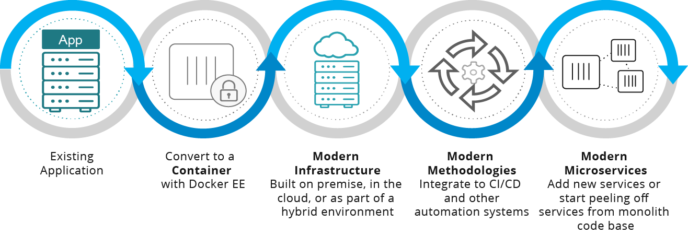

The Docker Modernize Traditional Applications (MTA) Program helps enterprises
make their existing legacy apps more secure, more efficient, and readily
portable to a hybrid cloud infrastructure. Here, we give a quick overview of MTA
concepts, and steps to migrate legacy apps and infrastructure to containerized
solutions.

Check out the [blog post introducing the Docker MTA program
here](https://blog.docker.com/2017/04/modernizing-traditional-apps-with-docker/){:
target="_blank" class="_"} to learn more.

## Working outline for this docset

* Overview of MTA and migration process

* Containerizing app components

* Infrastructure considerations

* Modern methodologies and automation

* Migrating microservices

* Stack migration guides

* Use cases

## The problem with legacy apps

IT organizations often spend 80% of their budget maintaining existing
applications and only 20% on new innovation. Enterprises have increasingly
disparate infrastructure landscapes with x86 servers, mainframe, and multiple
private and public clouds to manage. This fragmentation increases the pressure
on IT budgets, making it even harder to focus on innovation.

## How Docker solves the problem

Legacy apps don't have to define your capabilities. You can still move forward
on innovation goals, and bring modern behavior to your current apps without
changing a single line of code.

By containerizing the application without modifying source code, legacy apps can
be modernized to hybrid cloud portability, increased security and cost
efficiency.

- Efficient (optimize CapEx and OpEx costs, reduce the size of infrastructure by 77%)
- Portable (infrastructure for portability and independent apps, deployment frequency increases 13x or more)
- Secure (reduce risk and enforce new controls, MTTR for patching is 99% faster)

## MTA process overview

(Source for this is [Learn More]((Source for this is Learn More on how to
modernize apps with Docker EE from website)){: target="_blank" class="_"} on how
to modernize apps with Docker EE from website)

### Get Docker

Docker install platforms and overview is [here](http://docs.docker.com/engine/installation/).

### Set up your Docker Enterprise Edition (EE) with cloud templates

1.  Docker EE 30-day trial is [here](https://store.docker.com/editions/enterprise/docker-ee-trial?tab=description).

2.  Launch Docker EE

    - [Launch Docker EE on AWS](https://aws.amazon.com/marketplace/pp/B06XCFDF9K)

    - [Launch Docker EE on Azure](https://azuremarketplace.microsoft.com/en-us/marketplace/apps/docker.dockerdatacenter?tab=Overview)

    - Install [Docker for Mac](https://aws.amazon.com/marketplace/pp/B06XCFDF9K) or [Docker for Windows](https://docs.docker.com/docker-for-windows/install/)

### Port the application

1.  Select a.NET IIS for Windows Server or LAMP stack, Java or Tomcat for Linux. (It’s best to start with a single server app.)

2.  Run the appropriate Image2Docker tool for Windows Server or Linux to convert the existing app into a [Dockerfile](https://docs.docker.com/engine/reference/builder/).

    - Download [Image2Docker for Windows Server](https://github.com/docker/communitytools-image2docker-win)

    - Download [Image2Docker for Linux Server](https://github.com/docker/communitytools-image2docker-linux)

3.  Follow the instructions to build the image and run locally. Push the image to your Docker Trusted Registry.

4.  Build the image locally and push to your Docker Trusted Registry with Security Scanning activated.

### Run your app as a containerized service

TBD

## Where to go next

* [Containerizing app components](/mta/containerize.md)

* [Infrastructure considerations](/mta/infrastructure.md)

* [Modern methodologies and automation](/mta/methods.md)

* [Migrating microservices](/mta/migrate-services.md)

* [Stack migration guides](/mta/stack-guides.md)

* [Use cases](/mta/use-cases.md)

* [Reference architecture and best practices](arch-best-practices.md)
