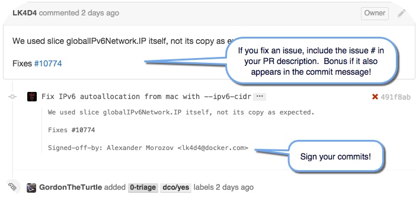

If you'd like to improve the code of any of Docker's projects, we would love to
have your contributions. All of our projects' code repositories are on
[Gitnub](https://github.com/docker){: target="_blank" class="_"}.

If you want to contribute to the `moby/moby` repository you should be familiar
with or interested in learning Go. If you know other languages, investigate our
other repositories&mdash;not all of them run on Go.

# Code contribution workflow

Below is the general workflow for contributing Docker code. If you are an
experienced open source contributor you may be familiar with this workflow. If
you are new or just need reminders, the steps below link to more detailed
documentation in Docker's project contribution guide.

1.  [Get the software](/opensource/project/software-required/){: target="_blank" class="_"}
    you need.

    This explains how to install a couple of tools used in our development
    environment. What you need (or don't need) might surprise you.

2.  [Configure Git and fork the repo](/opensource/project/set-up-git/){: target="_blank" class="_"}.

    Your Git configuration can make it easier for you to contribute.
    Configuration is especially key if you are new to contributing or to Docker.

3.  [Learn to work with the Docker development container](/opensource/project/set-up-dev-env/){: target="_blank" class="_"}.

    Docker developers run `docker` in `docker`. If you are a geek, this is a
    pretty cool experience.

4.  [Claim an issue](/opensource/workflow/find-an-issue/){: target="_blank" class="_"}.

    We created a [filter](http://goo.gl/Hsp2mk){: target="_blank" class="_"}
    listing all open and unclaimed issues for Docker.

5.  [Work on the issue](/opensource/workflow/work-issue/){: target="_blank" class="_"}.

    If you change or add code or docs to a project, you should test your changes
    as you work. This page explains
    [how to test in our development environment](/opensource/project/test-and-docs/){: target="_blank" class="_"}.

    Also, remember to always **sign your commits** as you work! To sign your
    commits, include the `-s` flag in your commit like this:

    ```bash
    $ git commit -s -m "Add commit with signature example"
    ```

    If you don't sign, [Gordon](https://twitter.com/gordontheturtle){: target="_blank" class="_"}
    will remind you!


6.	[Create a pull request](/opensource/workflow/create-pr){: target="_blank" class="_"}.

    If you make a change to fix an issue, add reference to the issue in the pull
    request. Here is an example of a perfect pull request with a good description,
    issue reference, and signature in the commit:

    

    We also have checklist that describes
    [what each pull request needs](FAQ.md#what-is-the-pre-pull-request-checklist).


7.  [Participate in the pull request](/opensource/workflow/review-pr/){: target="_blank" class="_"}
    until all feedback has been addressed and it's ready to merge!
