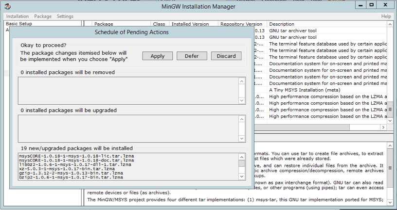
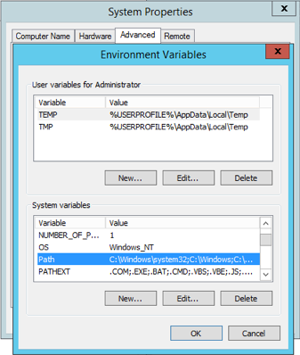
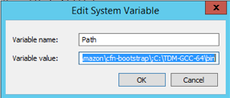

<!--[metadata]>
+++
title = "Set up for development on Windows"
description = "How to set up a server to test Docker Windows client"
keywords = ["development, inception, container, image Dockerfile, dependencies, Go, artifacts,  windows"]
[menu.main]
parent = "smn_engine_contrib"
weight=3
+++
<![end-metadata]-->

# Get the required software for Windows

This page explains how to get the software you need to use a  a Windows Server
2012 or Windows 8 machine for Docker development. Before you begin contributing
you must have:

- a GitHub account
- Git for Windows (msysGit)
- TDM-GCC, a compiler suite for Windows
- MinGW (tar and xz)
- Go language

> **Note**: This installation procedure refers to the `C:\` drive. If you system's main drive
is `D:\` you'll need to substitute that in where appropriate in these
instructions.

## Task 1. Get a GitHub account

To contribute to the Docker project, you will need a <a
href="https://github.com" target="_blank">GitHub account</a>. A free account is
fine. All the Docker project repositories are public and visible to everyone.

You should also have some experience using both the GitHub application and `git`
on the command line.

## Task 2. Install Git for Windows

Git for Windows includes several tools including msysGit, which is a build
environment. The environment contains the tools you need for development such as
Git and a Git Bash shell.

1. Browse to the [Git for Windows](https://msysgit.github.io/) download page.

2. Click **Download**.

	Windows prompts you to save the file to your machine.

3. Run the saved file.

	The system displays the **Git Setup** wizard.

4. Click the **Next** button to move through the wizard and accept all the defaults.

5. Click **Finish** when you are done.

## Task 3. Install TDM-GCC

TDM-GCC is a compiler suite for Windows. You'll use this suite to compile the
Docker Go code as you develop.

1. Browse to
   [tdm-gcc download page](http://tdm-gcc.tdragon.net/download).

2. Click on the latest 64-bit version of the package.

	Windows prompts you to save the file to your machine

3. Set up the suite by running the downloaded file.

	The system opens the **TDM-GCC Setup** wizard.

4. Click **Create**.

5. Click the **Next** button to move through the wizard and accept all the defaults.

6. Click **Finish** when you are done.

## Task 4. Install MinGW (tar and xz)

MinGW is a minimalist port of the GNU Compiler Collection (GCC). In this
procedure, you first download and install the MinGW installation manager. Then,
you use the manager to install the `tar` and `xz` tools from the collection.

1. Browse to MinGW
   [SourceForge](http://sourceforge.net/projects/mingw/).

2. Click **Download**.

	 Windows prompts you to save the file to your machine

3. Run the downloaded file.

   The system opens the **MinGW Installation Manager Setup Tool**

4. Choose **Install**  install the MinGW Installation Manager.

5. Press **Continue**.

	The system installs and then opens the MinGW Installation Manager.

6. Press **Continue** after the install completes to open the manager.

7. Select **All Packages > MSYS Base System** from the left hand menu.

	The system displays the available packages.

8. Click on the the **msys-tar bin** package and choose **Mark for Installation**.

9. Click on the **msys-xz bin** package and choose **Mark for Installation**.

10. Select **Installation > Apply Changes**, to install the selected packages.

	The system displays the **Schedule of Pending Actions Dialog**.

    

11. Press **Apply**

	MingGW installs the packages for you.

12. Close the dialog and the MinGW Installation Manager.

## Task 5. Set up your environment variables

You'll need to add the compiler to your `Path` environment variable.

1. Open the **Control Panel**.

2. Choose **System and Security > System**.

3. Click the **Advanced system settings** link in the sidebar.

	The system opens the **System Properties** dialog.

3. Select the **Advanced** tab.

4. Click **Environment Variables**.

	The system opens the **Environment Variables dialog** dialog.

5. Locate the **System variables** area and scroll to the **Path**
   variable.

    

6. Click **Edit** to edit the variable (you can also double-click it).

	The system opens the **Edit System Variable** dialog.

7. Make sure the `Path` includes `C:\TDM-GCC64\bin`

	 

	 If you don't see `C:\TDM-GCC64\bin`, add it.

8. Press **OK** to close this dialog.

9. Press **OK** twice to close out of the remaining dialogs.

## Install Go and cross-compile it

In this section, you install the Go language. Then, you build the source so that it can cross-compile for `linux/amd64` architectures.

1. Open [Go Language download](http://golang.org/dl/) page in your browser.

2. Locate and click the latest `.msi` installer.

	The system prompts you to save the file.

3. Run the installer.

	The system opens the **Go Programming Language Setup** dialog.

4. Select all the defaults to install.

5. Press **Finish** to close the installation dialog.

6. Start a command prompt.

7. Change to the Go `src` directory.

		cd c:\Go\src

8. Set the following Go variables

		c:\Go\src> set GOOS=linux
		c:\Go\src> set GOARCH=amd64

9. Compile the source.

		c:\Go\src> make.bat

	Compiling the source also adds a number of variables to your Windows environment.

## Task 6. Get the Docker repository

In this step, you start a Git `bash` terminal and get the Docker source code
from GitHub.

1. Locate the **Git Bash** program and start it.

	Recall that **Git Bash** came with the Git for Windows installation.  **Git
	Bash** just as it sounds allows you to run a Bash terminal on Windows.

	

2. Change to the root directory.

		$ cd /c/

3. Make a `gopath` directory.

		$ mkdir gopath

4. Go get the `docker/docker` repository.

		$ go.exe get github.com/docker/docker package github.com/docker/docker
        imports github.com/docker/docker
        imports github.com/docker/docker: no buildable Go source files in C:\gopath\src\github.com\docker\docker

	In the next steps, you create environment variables for you Go paths.

5. Open the **Control Panel** on your system.

6. Choose **System and Security > System**.

7. Click the **Advanced system settings** link in the sidebar.

	The system opens the **System Properties** dialog.

8. Select the **Advanced** tab.

9. Click **Environment Variables**.

	The system opens the **Environment Variables dialog** dialog.

10. Locate the **System variables** area and scroll to the **Path**
   variable.

11. Click **New**.

	Now you are going to create some new variables. These paths you'll create in the next procedure; but you can set them now.

12. Enter `GOPATH` for the **Variable Name**.

13. For the **Variable Value** enter the following:

		C:\gopath;C:\gopath\src\github.com\docker\docker\vendor

14. Press **OK** to close this dialog.

	The system adds `GOPATH` to the list of **System Variables**.

15. Press **OK** twice to close out of the remaining dialogs.

## Where to go next

In the next section, you'll [learn how to set up and configure Git for
contributing to Docker](set-up-git.md).
